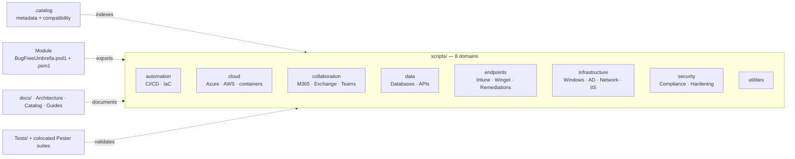
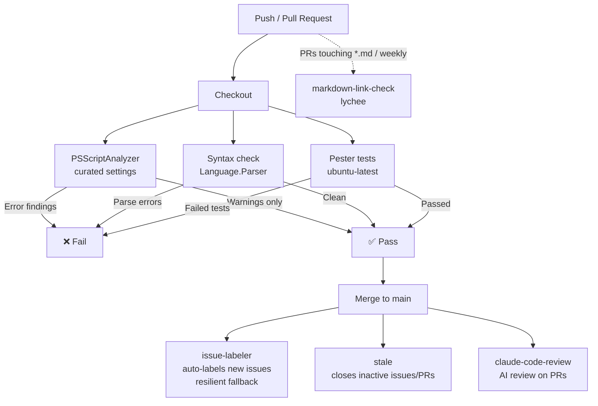
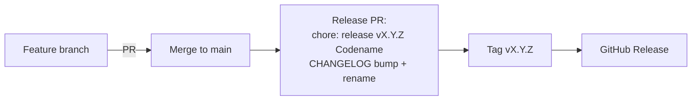
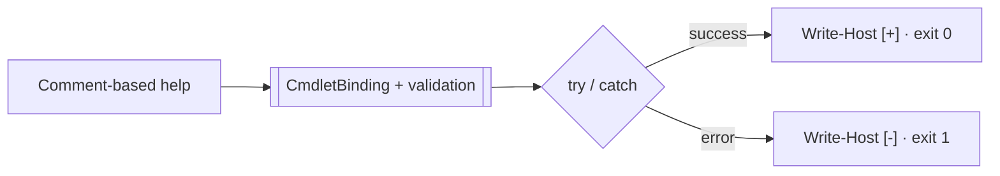
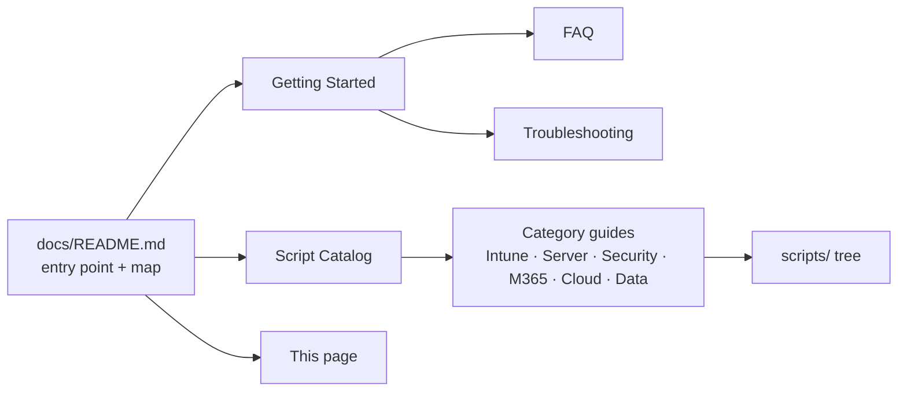

# 🏗️ Bug-Free Umbrella — Architecture

> How the repo is organized, how it's built, and how it ships. 357 PowerShell scripts, 8 technology domains, one umbrella. 🌂

**Applies to:** v5.0.0 "Hurricane" (staged, unreleased; latest tagged: v4.4.0 "Nimbus") · **Last verified:** 2026-08-23

---

## 1. Overview

Bug-Free Umbrella is a collection of **357 PowerShell scripts** for enterprise IT management: endpoint management (Intune/Winget), server administration, security compliance, M365, cloud (Azure/AWS), databases, and CI/CD automation.

- **PowerShell:** developed on PowerShell 7 (5.1-compatible where noted)
- **Style:** enforced by PSScriptAnalyzer + a CI gate (see [§3 CI/CD](#3-cicd-pipeline))
- **Docs:** in-repo, under `docs/` (this page is part of the docs tree)
- **License:** Apache 2.0

## 2. Repository Layout

```text
bug-free-umbrella/
├── scripts/                  # 357 PowerShell scripts, organized by domain
│   ├── automation/           #   CI/CD pipelines, Infrastructure as Code
│   ├── cloud/                #   Azure (incl. AVD), AWS, containers
│   ├── collaboration/        #   M365, Exchange, Teams, SharePoint
│   ├── data/                 #   Databases, APIs
│   ├── endpoints/            #   Intune, Winget, proactive remediations, device health
│   ├── infrastructure/       #   Windows servers, AD, network, virtualization, IIS
│   ├── security/             #   Compliance frameworks, hardening, monitoring
│   ├── utilities/            #   General-purpose toolbox
│   └── .catalog/             #   Machine-readable script metadata + compatibility matrix
├── docs/                     # All documentation (this tree) — single source of truth
├── examples/                 # End-to-end workflow examples (onboarding, incident response, …)
├── Tests/                    # Pester 5 test suites (plus tests colocated with scripts)
├── templates/                # Script templates (e.g. Intune app detection)
└── .github/                  # Issue/PR templates, workflows, CODEOWNERS
```



## 3. CI/CD Pipeline

Every push/PR runs three gating jobs (`validate-powershell.yml` — PSSA + syntax + Pester); supporting workflows keep the repo tidy and docs healthy.



| Workflow | Trigger | Role |
|---|---|---|
| `validate-powershell.yml` | PRs + pushes to main | **Gating:** PSSA (fails on Error) + syntax check + **Pester tests** (fails on test failures; coverage informational) |
| `issue-labeler.yml` | Issue open/edit | Auto-applies 48 technology/type/priority labels (resilient: bulk → per-label fallback → auto-create missing) |
| `markdown-link-check.yml` | PRs touching `*.md`, push to main (`*.md`), weekly, manual | Checks markdown links via lychee (`fail: false` — warns on broken links, tolerates 429) |
| `stale.yml` | Daily | Marks/closes inactive issues (60d) and PRs (30d) |
| `claude.yml` | `@claude` mentions | AI assistance on issues/PRs |
| `claude-code-review.yml` | PR open/sync | AI code review comments |

> **Note:** Pester tests run both locally (`Invoke-Pester` via `Tests/Pester.Config.psd1`) and in CI (`test` job in `validate-powershell.yml`). Coverage is enabled but not gating — low coverage does not fail the pipeline.
## 4. Release Process

Releases are CHANGELOG-driven with weather-themed codenames — the version lives only in `CHANGELOG.md`.



| Codename | Release Type | Meaning |
|---|---|---|
| ☔ Drizzle | Patch | Bug fixes, minor improvements |
| 🌧️ Shower | Minor | New scripts, small features |
| ⛈️ Thunderstorm | Major | Significant expansions |
| 🌪️ Hurricane | Breaking | Major overhauls |
| 🌈 Rainbow | Quality | Polish, documentation, testing |

## 5. Script Conventions

Every script follows a strict contract (enforced by PSScriptAnalyzer settings + CI):

- **Header:** comment-based help (`.SYNOPSIS` presence is CI-gated) — `Get-Help .\Script.ps1 -Detailed` must work
- **Functions:** `[CmdletBinding()]`, approved verbs (`Get-Verb`), `SupportsShouldProcess` + `-WhatIf` for state-changing scripts
- **Errors:** `$ErrorActionPreference = 'Stop'`, `try/catch` with `Write-Host "[-] ..."` (red) / `"[+]"` (green) / `"[!]"` (yellow) / `"[*]"` (cyan) messaging
- **Exit codes:** `0` success, `1` failure
- **Formatting:** 4-space indent, CRLF + UTF-8 BOM, ≤120 chars/line, no trailing whitespace
- **Credentials:** never hardcoded — env vars, Key Vault, or secure prompts



## 6. Testing

- **Pester 5.5.0+**, config in `Tests/Pester.Config.psd1`
- Main suites under `Tests/` (per-category folders); additional suites colocated next to the scripts they test
- Run locally: `Invoke-Pester -Configuration (New-PesterConfiguration -Hashtable (Import-PowerShellDataFile ./Tests/Pester.Config.psd1))`

## 7. Documentation Architecture

Docs live **in the repository** — no external wiki (retired 2026-08-08). Benefits: versioned with code, PR-reviewable, link-checked by review, impossible to silently drift.

`docs/Module.md` is auto-generated from the manifest + catalog (see `tools/Build-Docs.ps1`);
it is the PSGallery-facing reference and is validated in CI via `Build-Docs.ps1 -Validate`.

Module loads 357 wrappers via Build-Module, version from CHANGELOG, PSSA 0


- **`docs/README.md`** — entry point, documentation map, by-domain index
- **`docs/Script-Catalog.md`** — full index of all scripts with paths
- **Category guides** — one page per domain (Intune, Server Management, Security, M365, Cloud…)
- **`docs/ARCHITECTURE.md`** — this page
- **Per-category `README.md` files** under `scripts/` — directory-level docs next to the code they describe

## 8. Community Files

| File | Purpose |
|---|---|
| [CONTRIBUTING.md](../CONTRIBUTING.md) | How to contribute (issues, PRs, coding standards) |
| [GOVERNANCE.md](../GOVERNANCE.md) | Project governance, solo-maintainer model |
| [SECURITY.md](../SECURITY.md) | Vulnerability reporting policy |
| [SUPPORT.md](../SUPPORT.md) | Getting help, response-time expectations |
| [CODE_OF_CONDUCT.md](../CODE_OF_CONDUCT.md) | Community standards |
| [WARP.md](../WARP.md) | Working practices for AI-assisted contributors |
| [CHANGELOG.md](../CHANGELOG.md) | Full version history with codenames |
