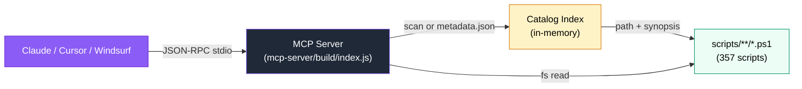

# 🤖 MCP Server — AI-Native Script Discovery

> Expose all 357 PowerShell scripts as [Model Context Protocol](https://modelcontextprotocol.io) tools. Search, preview, and validate scripts directly from Claude Desktop, Cursor, or Windsurf.

---

## Overview

The `mcp-server/` directory ships a lightweight Node.js MCP server that indexes every script under `scripts/` and exposes it over stdio. Claude (or any MCP-compatible host) can discover the right script without browsing the file tree.

**What you get:**

- 5 tools for search / preview / validation
- 1 resource (`catalog://scripts`) — full catalog as JSON
- 1 prompt (`find-script`) — guided task-to-script workflow
- Zero external services — everything runs locally via `node`

---

## Architecture



**Startup flow:**

1. Resolve `scriptsRoot` relative to `mcp-server/` (handles both `src/` and `build/` layouts).
2. Try `scripts/.catalog/metadata.json` if it exists and contains a non-empty `scripts` array.
3. Fallback: recursive filesystem scan for `**/*.ps1`, parsing `.SYNOPSIS` from the first 50 lines of each file.
4. Build an in-memory array of `{ path, name, category, subcategory, synopsis, fullRelativeDir }`.
5. Connect `StdioServerTransport` and register tools / resources / prompts.

All logging goes to **stderr** — stdout is reserved for MCP transport.

---

## Tool Reference

| Tool | Description | Input | Output |
|------|-------------|-------|--------|
| `search_scripts` | Fuzzy search by name / synopsis / category | `query` (string, required), `category`? (domain), `limit`? (1–50, default 10) | Array of `{ path, name, category, subcategory, synopsis }` |
| `get_script` | Full script content + help | `path` (repo-relative, required) | `{ path, name, synopsis, lineCount, helpBlock, preview (200 lines), truncated, totalLines }` |
| `list_categories` | All 8 domains + subcategories with counts | — | `{ totalScripts, totalDomains, domains: [{ domain, count, subcategories }] }` |
| `get_script_help` | Comment-based help (`<# ... #>`) | `path` (required) | `{ path, help }` or `{ help: null, message }` |
| `validate_script` | PSScriptAnalyzer-lite checks | `path` (required) | `{ passed, checks, issues, summary }` |

### Input / Output Examples

**search_scripts:**

```json
// Request
{ "query": "Intune compliance", "category": "endpoints", "limit": 5 }

// Response (text content = JSON)
[
  {
    "path": "scripts/endpoints/intune/reporting/Get-DeviceComplianceReport.ps1",
    "name": "Get-DeviceComplianceReport",
    "category": "endpoints",
    "subcategory": "intune",
    "synopsis": "Generates a compliance report for Intune-managed devices."
  }
]
```

**get_script:**

```json
{ "path": "scripts/infrastructure/windows/monitoring/Monitor-ServerHealth.ps1" }
// → { "synopsis": "...", "preview": "<first 200 lines>", "helpBlock": "<# ... #>", "truncated": true }
```

**validate_script:**

```json
{ "path": "scripts/security/hardening/Invoke-SecurityComplianceScan.ps1" }
// → { "passed": true, "checks": { "hasSynopsis": true, "hasCmdletBinding": true, ... }, "issues": [], "summary": "✅ All basic checks passed." }
```

**Error handling:** if `path` does not exist or escapes the repo root, the tool returns `isError: true` with `Error: Script not found: ...`.

---

## Setup

### Prerequisites

- Node.js 18+ (`node -v`)
- `npm` or `pnpm`

### Build

```bash
cd mcp-server
npm install
npm run build
```

Artifacts go to `mcp-server/build/`. The `files` field in `package.json` ensures only `build/` is published.

### Claude Desktop

Edit `claude_desktop_config.json`:

- **macOS:** `~/Library/Application Support/Claude/claude_desktop_config.json`
- **Windows:** `%APPDATA%\Claude\claude_desktop_config.json`
- **Linux:** `~/.config/Claude/claude_desktop_config.json`

```json
{
  "mcpServers": {
    "bug-free-umbrella": {
      "command": "node",
      "args": ["/absolute/path/to/bug-free-umbrella/mcp-server/build/index.js"]
    }
  }
}
```

Replace `/absolute/path/to/...` with the real repo path.

### Cursor

Create or edit `.cursor/mcp.json` in your workspace (or `~/.cursor/mcp.json` globally):

```json
{
  "mcpServers": {
    "bug-free-umbrella": {
      "command": "node",
      "args": ["/absolute/path/to/bug-free-umbrella/mcp-server/build/index.js"]
    }
  }
}
```

### Windsurf

Create or edit `~/.codeium/windsurf/mcp_config.json`:

```json
{
  "mcpServers": {
    "bug-free-umbrella": {
      "command": "node",
      "args": ["/absolute/path/to/bug-free-umbrella/mcp-server/build/index.js"]
    }
  }
}
```

Restart the host application after saving the config.

---

## Development

### Project Layout

```
mcp-server/
├── package.json          # Node 18+, type module, bin, dependencies
├── tsconfig.json         # ES2022, NodeNext, outDir build, strict
├── .gitignore            # node_modules, build
├── README.md             # Quick start + badges
└── src/
    ├── index.ts          # Server, catalog index, all 5 tools, resource, prompt
    └── tools/
        ├── search.ts
        ├── get_script.ts
        ├── list_categories.ts
        ├── get_script_help.ts
        └── validate_script.ts
```

### Scripts

```bash
npm run build   # tsc → build/
npm run start   # node build/index.js
npm run dev     # tsx src/index.ts (no build, hot reload)
```

### Adding a New Tool

1. Define a `zod` schema near the top of `src/index.ts`:

   ```ts
   const MyToolSchema = z.object({ foo: z.string() });
   ```

2. Implement a handler:

   ```ts
   function handleMyTool(args: unknown) {
     const { foo } = MyToolSchema.parse(args);
     return { result: foo };
   }
   ```

3. Register in `ListToolsRequestSchema` (add to the `tools` array) and in `CallToolRequestSchema` (add a `case "my_tool"` branch).

4. Build and verify:

   ```bash
   npm run build
   npx @modelcontextprotocol/inspector node build/index.js
   ```

### Catalog Refresh

The catalog is built **once at startup**. After adding or renaming scripts, restart the MCP host (or the inspector) to re-index. If `scripts/.catalog/metadata.json` is present, it takes precedence over the filesystem scan.

---

## Troubleshooting

| Symptom | Cause | Fix |
|---------|-------|-----|
| `Error: Cannot find module` on `node build/index.js` | Not built or wrong Node version | `node -v` must be ≥18; run `npm install && npm run build` |
| Claude shows “MCP server failed to start” | Wrong path in `claude_desktop_config.json` | Use an **absolute** path; verify `node build/index.js` works from a shell |
| `Script not found` for a path that exists | Repo-relative path required | Use `scripts/...` from repo root, not an absolute or `mcp-server/...` path |
| Empty search results | Catalog out of date or query too narrow | Restart the server; try a broader `query` without `category` filter |
| `stdout` logs breaking MCP | Logger wrote to stdout | All logs in this server use `console.error` (stderr) — never log to stdout |
| Inspector shows 0 tools | Build is stale | `npm run build` then re-launch inspector |

**Still stuck?** Open an issue at [Carme99/bug-free-umbrella/issues](https://github.com/Carme99/bug-free-umbrella/issues) with your Node version, OS, and the stderr log (`2> /tmp/mcp.log`).

---

## Related Docs

- [Script Catalog](Script-Catalog.md) — browse all 357 scripts by domain
- [Getting Started](Getting-Started.md) — first-time setup for scripts
- [Architecture](ARCHITECTURE.md) — repo layout and design
- [mcp-server/README.md](../mcp-server/README.md) — quick start, badges, verification

```

