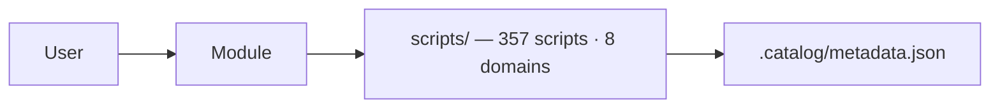

<!-- AUTO-GENERATED — do not edit — run pwsh -File tools/Build-Docs.ps1 -->

# 📦 BugFreeUmbrella Module

> Installable PowerShell module — 357 functions across 8 domains. Auto-generated from
> `src/BugFreeUmbrella/BugFreeUmbrella.psd1` + `scripts/.catalog/metadata.json`.
> Do not edit by hand — run `pwsh -File tools/Build-Docs.ps1`.


## Installation

```powershell
Install-Module BugFreeUmbrella -Scope CurrentUser
Import-Module  BugFreeUmbrella
Get-Command -Module BugFreeUmbrella | Measure-Object  # → 357
```

## Quick Usage

```powershell
Import-Module BugFreeUmbrella

# Discover by category (8 top-level domains)
Get-BUCommand -Category cloud          # alias: Get-BUScript
Get-BUCommand -Category endpoints      # 243 functions

# Search by name/synopsis
Find-BUCommand -SearchText "BitLocker"

# Interactive launcher (Out-GridView with Read-Host fallback on non-Windows)
Invoke-Umbrella -Interactive
```

```powershell
# One-liner: Import-Module BugFreeUmbrella; Get-BUCommand -Category cloud
```

## Publishing (maintainers)

```powershell
# One-time: set PSGallery API key (never commit)
$env:PSGALLERY_API_KEY = Read-Host -AsSecureString "PSGallery API key"

# Publish — version comes from CHANGELOG.md via src/BugFreeUmbrella/BugFreeUmbrella.psd1
Publish-Module -Path ./src/BugFreeUmbrella -NuGetApiKey $env:PSGALLERY_API_KEY -Verbose
```

## Architecture




PSSA 0 — generator and module pass PSScriptAnalyzer with 0 findings.

## Function Reference

> 357 functions grouped by top-level domain. Synopsis truncated to 120 characters.

### automation — 6 functions

| Name | Category | Synopsis | Path |
|------|----------|----------|------|
| Analyze-BuildPerformance | automation/cicd | Analyzes build performance trends and identifies bottlenecks. | [scripts/automation/cicd/Analyze-BuildPerformance.ps1](../scripts/automation/cicd/Analyze-BuildPerformance.ps1) |
| Monitor-AzureDevOpsPipelines | automation/cicd | Monitors Azure DevOps pipeline health, performance, and failures. | [scripts/automation/cicd/Monitor-AzureDevOpsPipelines.ps1](../scripts/automation/cicd/Monitor-AzureDevOpsPipelines.ps1) |
| Monitor-GitHubActions | automation/cicd | Monitors GitHub Actions workflow health and performance. | [scripts/automation/cicd/Monitor-GitHubActions.ps1](../scripts/automation/cicd/Monitor-GitHubActions.ps1) |
| Monitor-GitLabCI | automation/cicd | Monitors GitLab CI/CD pipeline health and performance. | [scripts/automation/cicd/Monitor-GitLabCI.ps1](../scripts/automation/cicd/Monitor-GitLabCI.ps1) |
| Test-BicepTemplates | automation/iac | Validates and tests Azure Bicep templates for best practices and security. | [scripts/automation/iac/Test-BicepTemplates.ps1](../scripts/automation/iac/Test-BicepTemplates.ps1) |
| Test-TerraformConfiguration | automation/iac | Validates Terraform configurations for syntax, security, and best practices. | [scripts/automation/iac/Test-TerraformConfiguration.ps1](../scripts/automation/iac/Test-TerraformConfiguration.ps1) |

### cloud — 16 functions

| Name | Category | Synopsis | Path |
|------|----------|----------|------|
| Get-AWSResourceInventory | cloud/aws/core | AWS cloud resource inventory and health monitoring. | [scripts/cloud/aws/core/Get-AWSResourceInventory.ps1](../scripts/cloud/aws/core/Get-AWSResourceInventory.ps1) |
| Get-AzureResourceHealth | cloud/azure/core | Azure cloud resource health check. | [scripts/cloud/azure/core/Get-AzureResourceHealth.ps1](../scripts/cloud/azure/core/Get-AzureResourceHealth.ps1) |
| Get-DockerHealthCheck | cloud/containers | Comprehensive Docker environment health check. | [scripts/cloud/containers/Get-DockerHealthCheck.ps1](../scripts/cloud/containers/Get-DockerHealthCheck.ps1) |
| Get-KubernetesHealthCheck | cloud/containers | Kubernetes cluster health check and diagnostics. | [scripts/cloud/containers/Get-KubernetesHealthCheck.ps1](../scripts/cloud/containers/Get-KubernetesHealthCheck.ps1) |
| Get-VMBackupCompliance | cloud/azure/compute/Azure-VirtualMachines | Monitors Azure VM backup status and compliance with backup policies. | [scripts/cloud/azure/compute/Azure-VirtualMachines/Get-VMBackupCompliance.ps1](../scripts/cloud/azure/compute/Azure-VirtualMachines/Get-VMBackupCompliance.ps1) |
| Get-VMSecurityConfig | cloud/azure/compute/Azure-VirtualMachines | Audits Azure VM security configuration and compliance. | [scripts/cloud/azure/compute/Azure-VirtualMachines/Get-VMSecurityConfig.ps1](../scripts/cloud/azure/compute/Azure-VirtualMachines/Get-VMSecurityConfig.ps1) |
| Install-TeamsAVD | cloud/azure/avd | Installs or updates Microsoft Teams and WebView2 for Azure Virtual Desktop (AVD) gold images. | [scripts/cloud/azure/avd/Install-TeamsAVD.ps1](../scripts/cloud/azure/avd/Install-TeamsAVD.ps1) |
| Install-TeamsAVD.Tests | cloud/azure/avd | Pester test suite for the Install-TeamsAVD.ps1 script. | [scripts/cloud/azure/avd/Install-TeamsAVD.Tests.ps1](../scripts/cloud/azure/avd/Install-TeamsAVD.Tests.ps1) |
| Monitor-AzureKeyVaults | cloud/azure/keyvault/Azure-KeyVault | Monitors Azure Key Vault security, compliance, and secret expiration. | [scripts/cloud/azure/keyvault/Azure-KeyVault/Monitor-AzureKeyVaults.ps1](../scripts/cloud/azure/keyvault/Azure-KeyVault/Monitor-AzureKeyVaults.ps1) |
| Monitor-AzureResources | cloud/azure/core | Comprehensive Azure resource health and cost monitoring across subscriptions. | [scripts/cloud/azure/core/Monitor-AzureResources.ps1](../scripts/cloud/azure/core/Monitor-AzureResources.ps1) |
| New-AzureComputeGalleryImage | cloud/azure/avd | Creates a cloned virtual machine and an Azure Compute Gallery (ACG) image version from a gold VM. | [scripts/cloud/azure/avd/New-AzureComputeGalleryImage.ps1](../scripts/cloud/azure/avd/New-AzureComputeGalleryImage.ps1) |
| Optimize-AzureVMs | cloud/azure/compute/Azure-VirtualMachines | Analyzes and optimizes Azure Virtual Machine configurations for cost and performance. | [scripts/cloud/azure/compute/Azure-VirtualMachines/Optimize-AzureVMs.ps1](../scripts/cloud/azure/compute/Azure-VirtualMachines/Optimize-AzureVMs.ps1) |
| Optimize-DockerCleanup | cloud/containers | Clean up Docker resources and optimize storage. | [scripts/cloud/containers/Optimize-DockerCleanup.ps1](../scripts/cloud/containers/Optimize-DockerCleanup.ps1) |
| Remove-SysprepBlockers | cloud/azure/avd | Detect and remove applications that block Windows Sysprep. | [scripts/cloud/azure/avd/Remove-SysprepBlockers.ps1](../scripts/cloud/azure/avd/Remove-SysprepBlockers.ps1) |
| removeUSlangpack | cloud/azure/avd | Removes US English (en-US) language packs from Windows 11 24H2. | [scripts/cloud/azure/avd/removeUSlangpack.ps1](../scripts/cloud/azure/avd/removeUSlangpack.ps1) |
| Update-M365Apps | cloud/azure/avd | M365 Apps Update Manager | [scripts/cloud/azure/avd/Update-M365Apps.ps1](../scripts/cloud/azure/avd/Update-M365Apps.ps1) |

### collaboration — 24 functions

| Name | Category | Synopsis | Path |
|------|----------|----------|------|
| Get-AzureADGuestAudit | collaboration/microsoft365/azure-ad | Audits Azure AD (Entra ID) guest users for security and compliance. | [scripts/collaboration/microsoft365/azure-ad/Get-AzureADGuestAudit.ps1](../scripts/collaboration/microsoft365/azure-ad/Get-AzureADGuestAudit.ps1) |
| Get-AzureADLicenseReport | collaboration/microsoft365/azure-ad | Generates Azure AD (Entra ID) license assignment and usage report. | [scripts/collaboration/microsoft365/azure-ad/Get-AzureADLicenseReport.ps1](../scripts/collaboration/microsoft365/azure-ad/Get-AzureADLicenseReport.ps1) |
| Get-DefenderO365ThreatReport | collaboration/microsoft365/defender-office365 | Generates comprehensive Microsoft Defender for Office 365 threat reports. | [scripts/collaboration/microsoft365/defender-office365/Get-DefenderO365ThreatReport.ps1](../scripts/collaboration/microsoft365/defender-office365/Get-DefenderO365ThreatReport.ps1) |
| Get-DistributionListAudit | collaboration/microsoft365/exchange-online | Comprehensive distribution list and group audit for Exchange Online. | [scripts/collaboration/microsoft365/exchange-online/Get-DistributionListAudit.ps1](../scripts/collaboration/microsoft365/exchange-online/Get-DistributionListAudit.ps1) |
| Get-ExchangeServerHealth | collaboration/email/exchange-server | Exchange Server health check and monitoring. | [scripts/collaboration/email/exchange-server/Get-ExchangeServerHealth.ps1](../scripts/collaboration/email/exchange-server/Get-ExchangeServerHealth.ps1) |
| Get-M365UserInfo | collaboration/microsoft365 | Comprehensive M365 user information and management toolkit. | [scripts/collaboration/microsoft365/Get-M365UserInfo.ps1](../scripts/collaboration/microsoft365/Get-M365UserInfo.ps1) |
| Get-MailboxHealth | collaboration/microsoft365/exchange-online | Generates comprehensive Exchange Online mailbox health and usage report. | [scripts/collaboration/microsoft365/exchange-online/Get-MailboxHealth.ps1](../scripts/collaboration/microsoft365/exchange-online/Get-MailboxHealth.ps1) |
| Get-MailFlowAnalysis | collaboration/microsoft365/exchange-online | Analyzes Exchange Online mail flow health, routing, and delivery issues. | [scripts/collaboration/microsoft365/exchange-online/Get-MailFlowAnalysis.ps1](../scripts/collaboration/microsoft365/exchange-online/Get-MailFlowAnalysis.ps1) |
| Get-OneDriveUsageReport | collaboration/microsoft365/sharepoint-onedrive | Generates OneDrive for Business usage and storage report. | [scripts/collaboration/microsoft365/sharepoint-onedrive/Get-OneDriveUsageReport.ps1](../scripts/collaboration/microsoft365/sharepoint-onedrive/Get-OneDriveUsageReport.ps1) |
| Get-PowerPlatformGovernance | collaboration/microsoft365/power-platform | Comprehensive Power Platform governance and compliance reporting. | [scripts/collaboration/microsoft365/power-platform/Get-PowerPlatformGovernance.ps1](../scripts/collaboration/microsoft365/power-platform/Get-PowerPlatformGovernance.ps1) |
| Get-SharedMailboxReport | collaboration/microsoft365/exchange-online | Audits Exchange Online shared mailboxes for usage, permissions, and compliance. | [scripts/collaboration/microsoft365/exchange-online/Get-SharedMailboxReport.ps1](../scripts/collaboration/microsoft365/exchange-online/Get-SharedMailboxReport.ps1) |
| Get-TeamsReport | collaboration/microsoft365/teams | Generates comprehensive Microsoft Teams usage and compliance report. | [scripts/collaboration/microsoft365/teams/Get-TeamsReport.ps1](../scripts/collaboration/microsoft365/teams/Get-TeamsReport.ps1) |
| Get-UserMailboxPermissions | collaboration/microsoft365/exchange-online | Displays all mailbox permissions and delegates for a specific user. | [scripts/collaboration/microsoft365/exchange-online/Get-UserMailboxPermissions.ps1](../scripts/collaboration/microsoft365/exchange-online/Get-UserMailboxPermissions.ps1) |
| Get-UserMailRules | collaboration/microsoft365/exchange-online | Displays all email forwarding rules and inbox rules for a specific user. | [scripts/collaboration/microsoft365/exchange-online/Get-UserMailRules.ps1](../scripts/collaboration/microsoft365/exchange-online/Get-UserMailRules.ps1) |
| Manage-QuarantinedEmails | collaboration/microsoft365/exchange-online | Interactive tool for managing quarantined emails for a specific M365 user. | [scripts/collaboration/microsoft365/exchange-online/Manage-QuarantinedEmails.ps1](../scripts/collaboration/microsoft365/exchange-online/Manage-QuarantinedEmails.ps1) |
| Manage-QuarantinedEmails.Tests | collaboration/microsoft365/exchange-online | Pester test suite for the Manage-QuarantinedEmails.ps1 script. | [scripts/collaboration/microsoft365/exchange-online/Manage-QuarantinedEmails.Tests.ps1](../scripts/collaboration/microsoft365/exchange-online/Manage-QuarantinedEmails.Tests.ps1) |
| Set-MailboxRegionalSettings | collaboration/microsoft365/exchange-online | Checks and configures Exchange Online mailbox regional and calendar settings. | [scripts/collaboration/microsoft365/exchange-online/Set-MailboxRegionalSettings.ps1](../scripts/collaboration/microsoft365/exchange-online/Set-MailboxRegionalSettings.ps1) |
| Set-OneDriveRegionalSettings | collaboration/microsoft365/sharepoint-onedrive | Checks and configures OneDrive personal site regional settings. | [scripts/collaboration/microsoft365/sharepoint-onedrive/Set-OneDriveRegionalSettings.ps1](../scripts/collaboration/microsoft365/sharepoint-onedrive/Set-OneDriveRegionalSettings.ps1) |
| Set-OrganizationDefaults | collaboration/microsoft365/azure-ad | Audits and configures the organization-wide PreferredLanguage setting in Microsoft 365. | [scripts/collaboration/microsoft365/azure-ad/Set-OrganizationDefaults.ps1](../scripts/collaboration/microsoft365/azure-ad/Set-OrganizationDefaults.ps1) |
| Set-PowerPlatformRegionalSettings | collaboration/microsoft365/power-platform | Checks and configures Power Platform environment regional settings. | [scripts/collaboration/microsoft365/power-platform/Set-PowerPlatformRegionalSettings.ps1](../scripts/collaboration/microsoft365/power-platform/Set-PowerPlatformRegionalSettings.ps1) |
| Set-SiteRegionalSettings | collaboration/microsoft365/sharepoint-onedrive | Checks and configures SharePoint Online site collection regional settings. | [scripts/collaboration/microsoft365/sharepoint-onedrive/Set-SiteRegionalSettings.ps1](../scripts/collaboration/microsoft365/sharepoint-onedrive/Set-SiteRegionalSettings.ps1) |
| Set-TeamsRegionalSettings | collaboration/microsoft365/teams | Checks and configures Microsoft Teams regional settings for users. | [scripts/collaboration/microsoft365/teams/Set-TeamsRegionalSettings.ps1](../scripts/collaboration/microsoft365/teams/Set-TeamsRegionalSettings.ps1) |
| Set-UserLanguageSettings | collaboration/microsoft365/azure-ad | Checks and configures Microsoft 365 user language and region settings. | [scripts/collaboration/microsoft365/azure-ad/Set-UserLanguageSettings.ps1](../scripts/collaboration/microsoft365/azure-ad/Set-UserLanguageSettings.ps1) |
| Update-M365Apps | collaboration/microsoft365/office-apps | M365 Apps Update Manager | [scripts/collaboration/microsoft365/office-apps/Update-M365Apps.ps1](../scripts/collaboration/microsoft365/office-apps/Update-M365Apps.ps1) |

### data — 6 functions

| Name | Category | Synopsis | Path |
|------|----------|----------|------|
| Get-MySQLHealth | data/databases | MySQL database server health monitoring. | [scripts/data/databases/Get-MySQLHealth.ps1](../scripts/data/databases/Get-MySQLHealth.ps1) |
| Get-PostgreSQLHealth | data/databases | PostgreSQL database server health monitoring. | [scripts/data/databases/Get-PostgreSQLHealth.ps1](../scripts/data/databases/Get-PostgreSQLHealth.ps1) |
| Get-SQLServerHealth | data/databases | Performs comprehensive health check of SQL Server instances. | [scripts/data/databases/Get-SQLServerHealth.ps1](../scripts/data/databases/Get-SQLServerHealth.ps1) |
| Monitor-AzureAPIManagement | data/api | Monitors Azure API Management service health, performance, and API analytics. | [scripts/data/api/Monitor-AzureAPIManagement.ps1](../scripts/data/api/Monitor-AzureAPIManagement.ps1) |
| Monitor-MongoDBHealth | data/databases | Generates a MongoDB health monitoring template (does not perform live monitoring). | [scripts/data/databases/Monitor-MongoDBHealth.ps1](../scripts/data/databases/Monitor-MongoDBHealth.ps1) |
| Test-APIHealth | data/api | Tests API endpoint health, performance, and compliance. | [scripts/data/api/Test-APIHealth.ps1](../scripts/data/api/Test-APIHealth.ps1) |

### endpoints — 243 functions

| Name | Category | Synopsis | Path |
|------|----------|----------|------|
| _generate-winget-scripts | endpoints/remediation/winget | Helper script to generate winget update script pairs (detect/remediate) for new applications. | [scripts/endpoints/remediation/winget/_generate-winget-scripts.ps1](../scripts/endpoints/remediation/winget/_generate-winget-scripts.ps1) |
| Add-LenovoFriendlyModelNames | endpoints/intune/maintenance | Adds Lenovo friendly model names to Intune device Notes and Entra ID device extension attributes. | [scripts/endpoints/intune/maintenance/Add-LenovoFriendlyModelNames.ps1](../scripts/endpoints/intune/maintenance/Add-LenovoFriendlyModelNames.ps1) |
| AP_Detection | endpoints/devices/autopatch/V2 | Detect Windows Update policy drift (Autopatch V2) | [scripts/endpoints/devices/autopatch/V2/AP_Detection.ps1](../scripts/endpoints/devices/autopatch/V2/AP_Detection.ps1) |
| AP_Remediation | endpoints/devices/autopatch/V2 | Remediate Windows Update policy drift (Autopatch V2) | [scripts/endpoints/devices/autopatch/V2/AP_Remediation.ps1](../scripts/endpoints/devices/autopatch/V2/AP_Remediation.ps1) |
| BlockAMDDriver | endpoints/devices/drivers | Block the AMD Radeon driver via DeviceInstallation policy | [scripts/endpoints/devices/drivers/BlockAMDDriver.ps1](../scripts/endpoints/devices/drivers/BlockAMDDriver.ps1) |
| Compare-ConfigurationDrift | endpoints/intune/maintenance | Detects configuration drift in Intune policies and settings. | [scripts/endpoints/intune/maintenance/Compare-ConfigurationDrift.ps1](../scripts/endpoints/intune/maintenance/Compare-ConfigurationDrift.ps1) |
| detect | endpoints/devices/adobe-rum | Detect Adobe Creative Cloud app updates via Remote Update Manager | [scripts/endpoints/devices/adobe-rum/detect.ps1](../scripts/endpoints/devices/adobe-rum/detect.ps1) |
| detect | endpoints/remediation/winget/_templates | Winget update detection template | [scripts/endpoints/remediation/winget/_templates/detect.ps1](../scripts/endpoints/remediation/winget/_templates/detect.ps1) |
| detect | endpoints/devices/uptime | Detect if the device has not been restarted for 4 or more days | [scripts/endpoints/devices/uptime/detect.ps1](../scripts/endpoints/devices/uptime/detect.ps1) |
| detect | endpoints/devices/sccm | Detect if the SCCM client is installed | [scripts/endpoints/devices/sccm/detect.ps1](../scripts/endpoints/devices/sccm/detect.ps1) |
| detect | endpoints/devices/drivers | Detect if the AMD Radeon driver block is applied | [scripts/endpoints/devices/drivers/detect.ps1](../scripts/endpoints/devices/drivers/detect.ps1) |
| detect | endpoints/devices/autopatch/V5 | Detect Windows Update policy drift (Autopatch V5) | [scripts/endpoints/devices/autopatch/V5/detect.ps1](../scripts/endpoints/devices/autopatch/V5/detect.ps1) |
| detect | endpoints/devices/autopatch/V4 | Detect Windows Update policy drift (Autopatch V4) | [scripts/endpoints/devices/autopatch/V4/detect.ps1](../scripts/endpoints/devices/autopatch/V4/detect.ps1) |
| detect | endpoints/devices/autopatch/V3 | Detect Windows Update policy drift (Autopatch V3) | [scripts/endpoints/devices/autopatch/V3/detect.ps1](../scripts/endpoints/devices/autopatch/V3/detect.ps1) |
| detect | endpoints/devices/proactive-remediations/Check-ApplicationCrashes | — | [scripts/endpoints/devices/proactive-remediations/Check-ApplicationCrashes/detect.ps1](../scripts/endpoints/devices/proactive-remediations/Check-ApplicationCrashes/detect.ps1) |
| Detect | endpoints/devices/autopatch/V1/DisableWindowsUpdateAccess | Detect the NoAutoUpdate Windows Update policy (DisableWindowsUpdateAccess pair) | [scripts/endpoints/devices/autopatch/V1/DisableWindowsUpdateAccess/Detect.ps1](../scripts/endpoints/devices/autopatch/V1/DisableWindowsUpdateAccess/Detect.ps1) |
| Detect | endpoints/devices/autopatch/V1/WUServer | Detect the WUServer Windows Update policy | [scripts/endpoints/devices/autopatch/V1/WUServer/Detect.ps1](../scripts/endpoints/devices/autopatch/V1/WUServer/Detect.ps1) |
| Detect | endpoints/devices/autopatch/V1/UseWUServer | Detect the UseWUServer Windows Update policy | [scripts/endpoints/devices/autopatch/V1/UseWUServer/Detect.ps1](../scripts/endpoints/devices/autopatch/V1/UseWUServer/Detect.ps1) |
| Detect | endpoints/devices/autopatch/V1/DoNotConnectToWindowsUpdateInternetLocations | Detect the DoNotConnectToWindowsUpdateInternetLocations Windows Update policy | [scripts/endpoints/devices/autopatch/V1/DoNotConnectToWindowsUpdateInternetLocations/Detect.ps1](../scripts/endpoints/devices/autopatch/V1/DoNotConnectToWindowsUpdateInternetLocations/Detect.ps1) |
| Detect | endpoints/devices/autopatch/V1/NoAutoUpdate | Detect the NoAutoUpdate Windows Update policy | [scripts/endpoints/devices/autopatch/V1/NoAutoUpdate/Detect.ps1](../scripts/endpoints/devices/autopatch/V1/NoAutoUpdate/Detect.ps1) |
| Detect_BitLockerKeyBackup | endpoints/devices/bitlocker | Verifies the Azure AD and Domain join status of a device. | [scripts/endpoints/devices/bitlocker/Detect_BitLockerKeyBackup.ps1](../scripts/endpoints/devices/bitlocker/Detect_BitLockerKeyBackup.ps1) |
| detect_v1_legacy | endpoints/remediation/winget/_templates | Legacy winget update detection template (V1) | [scripts/endpoints/remediation/winget/_templates/detect_v1_legacy.ps1](../scripts/endpoints/remediation/winget/_templates/detect_v1_legacy.ps1) |
| detect_v2 | endpoints/remediation/winget/_templates | Winget update detection script for Intune Proactive Remediations. | [scripts/endpoints/remediation/winget/_templates/detect_v2.ps1](../scripts/endpoints/remediation/winget/_templates/detect_v2.ps1) |
| detect_v3 | endpoints/remediation/winget/_templates | Enhanced winget update detection script for Intune Proactive Remediations (V3). | [scripts/endpoints/remediation/winget/_templates/detect_v3.ps1](../scripts/endpoints/remediation/winget/_templates/detect_v3.ps1) |
| Export-IntuneConfiguration | endpoints/intune/maintenance | Exports Intune configuration for backup or migration. | [scripts/endpoints/intune/maintenance/Export-IntuneConfiguration.ps1](../scripts/endpoints/intune/maintenance/Export-IntuneConfiguration.ps1) |
| Export-WingetPackageList | endpoints/intune/deployment | Exports installed winget packages from Intune-managed devices. | [scripts/endpoints/intune/deployment/Export-WingetPackageList.ps1](../scripts/endpoints/intune/deployment/Export-WingetPackageList.ps1) |
| Find-PolicyConflicts | endpoints/intune/maintenance | Detects conflicting configuration policies in Intune. | [scripts/endpoints/intune/maintenance/Find-PolicyConflicts.ps1](../scripts/endpoints/intune/maintenance/Find-PolicyConflicts.ps1) |
| Find-StaleDevices | endpoints/intune/maintenance | Finds and optionally removes stale devices from Intune that haven't synced in X days. | [scripts/endpoints/intune/maintenance/Find-StaleDevices.ps1](../scripts/endpoints/intune/maintenance/Find-StaleDevices.ps1) |
| Fix_BitLockerKeyBackup | endpoints/devices/bitlocker | Used to backup BitLocker recovery key to Azure Active Directory (AAD). | [scripts/endpoints/devices/bitlocker/Fix_BitLockerKeyBackup.ps1](../scripts/endpoints/devices/bitlocker/Fix_BitLockerKeyBackup.ps1) |
| Get-AppInstallationStatus | endpoints/intune/reporting | Checks installation status of a specific application across all Intune-managed devices. | [scripts/endpoints/intune/reporting/Get-AppInstallationStatus.ps1](../scripts/endpoints/intune/reporting/Get-AppInstallationStatus.ps1) |
| Get-AppInstallErrorReport | endpoints/intune/reporting | Detailed analysis of application installation failures. | [scripts/endpoints/intune/reporting/Get-AppInstallErrorReport.ps1](../scripts/endpoints/intune/reporting/Get-AppInstallErrorReport.ps1) |
| Get-AutopilotDeploymentReport | endpoints/intune/reporting | Tracks Windows Autopilot deployment status and failures. | [scripts/endpoints/intune/reporting/Get-AutopilotDeploymentReport.ps1](../scripts/endpoints/intune/reporting/Get-AutopilotDeploymentReport.ps1) |
| Get-BitLockerStatus | endpoints/intune/reporting | Audits BitLocker encryption status across all Windows devices in Intune. | [scripts/endpoints/intune/reporting/Get-BitLockerStatus.ps1](../scripts/endpoints/intune/reporting/Get-BitLockerStatus.ps1) |
| Get-DeviceComplianceReport | endpoints/intune/reporting | Exports all non-compliant devices from Intune with detailed compliance reasons. | [scripts/endpoints/intune/reporting/Get-DeviceComplianceReport.ps1](../scripts/endpoints/intune/reporting/Get-DeviceComplianceReport.ps1) |
| Get-DeviceGroupMembership | endpoints/intune/reporting | Audits device group memberships in Azure AD/Intune. | [scripts/endpoints/intune/reporting/Get-DeviceGroupMembership.ps1](../scripts/endpoints/intune/reporting/Get-DeviceGroupMembership.ps1) |
| Get-DeviceHealthScore | endpoints/intune/reporting | Generates a comprehensive device health score report. | [scripts/endpoints/intune/reporting/Get-DeviceHealthScore.ps1](../scripts/endpoints/intune/reporting/Get-DeviceHealthScore.ps1) |
| Get-IntuneDevicePrimaryUsers | endpoints/intune/reporting | Resolves Intune Primary Users and friendly hardware specs for one or more devices. | [scripts/endpoints/intune/reporting/Get-IntuneDevicePrimaryUsers.ps1](../scripts/endpoints/intune/reporting/Get-IntuneDevicePrimaryUsers.ps1) |
| Get-PolicyAssignmentReport | endpoints/intune/reporting | Generates a comprehensive policy assignment report for Intune. | [scripts/endpoints/intune/reporting/Get-PolicyAssignmentReport.ps1](../scripts/endpoints/intune/reporting/Get-PolicyAssignmentReport.ps1) |
| Get-UserDeviceAffinity | endpoints/intune/reporting | Generates a user-device affinity report for Intune. | [scripts/endpoints/intune/reporting/Get-UserDeviceAffinity.ps1](../scripts/endpoints/intune/reporting/Get-UserDeviceAffinity.ps1) |
| Get-WindowsUpdateCompliance | endpoints/intune/reporting | Generates a Defender protection state report for Windows devices, including AutoPatch status. | [scripts/endpoints/intune/reporting/Get-WindowsUpdateCompliance.ps1](../scripts/endpoints/intune/reporting/Get-WindowsUpdateCompliance.ps1) |
| Get-WingetUpdateCompliance | endpoints/intune/reporting | TEMPLATE: winget-managed application update compliance report (SAMPLE DATA). | [scripts/endpoints/intune/reporting/Get-WingetUpdateCompliance.ps1](../scripts/endpoints/intune/reporting/Get-WingetUpdateCompliance.ps1) |
| Invoke-DeviceBulkActions | endpoints/intune/maintenance | Performs bulk actions on Intune-managed devices. | [scripts/endpoints/intune/maintenance/Invoke-DeviceBulkActions.ps1](../scripts/endpoints/intune/maintenance/Invoke-DeviceBulkActions.ps1) |
| Invoke-RemediationCheckApplicationCrashes | endpoints/remediation/system | Provides recommendations for application crash issues. | [scripts/endpoints/remediation/system/Invoke-RemediationCheckApplicationCrashes.ps1](../scripts/endpoints/remediation/system/Invoke-RemediationCheckApplicationCrashes.ps1) |
| Invoke-RemediationCheckBatteryHealth | endpoints/remediation/system | Reports battery health degradation. | [scripts/endpoints/remediation/system/Invoke-RemediationCheckBatteryHealth.ps1](../scripts/endpoints/remediation/system/Invoke-RemediationCheckBatteryHealth.ps1) |
| Invoke-RemediationCheckBootPerformance | endpoints/remediation/system | Optimizes boot performance by managing startup programs. | [scripts/endpoints/remediation/system/Invoke-RemediationCheckBootPerformance.ps1](../scripts/endpoints/remediation/system/Invoke-RemediationCheckBootPerformance.ps1) |
| Invoke-RemediationCheckDefenderHealthStatus | endpoints/remediation/security | Remediates Windows Defender health issues. | [scripts/endpoints/remediation/security/Invoke-RemediationCheckDefenderHealthStatus.ps1](../scripts/endpoints/remediation/security/Invoke-RemediationCheckDefenderHealthStatus.ps1) |
| Invoke-RemediationCheckDeviceHealthScore | endpoints/remediation/system | Provides comprehensive health improvement plan. | [scripts/endpoints/remediation/system/Invoke-RemediationCheckDeviceHealthScore.ps1](../scripts/endpoints/remediation/system/Invoke-RemediationCheckDeviceHealthScore.ps1) |
| Invoke-RemediationCheckDeviceUptime | endpoints/remediation/system | Notifies users about required system reboots. | [scripts/endpoints/remediation/system/Invoke-RemediationCheckDeviceUptime.ps1](../scripts/endpoints/remediation/system/Invoke-RemediationCheckDeviceUptime.ps1) |
| Invoke-RemediationCheckDiskHealth | endpoints/remediation/system | Attempts to remediate disk health issues. | [scripts/endpoints/remediation/system/Invoke-RemediationCheckDiskHealth.ps1](../scripts/endpoints/remediation/system/Invoke-RemediationCheckDiskHealth.ps1) |
| Invoke-RemediationCheckHardwareErrors | endpoints/remediation/system | Provides critical hardware failure guidance. | [scripts/endpoints/remediation/system/Invoke-RemediationCheckHardwareErrors.ps1](../scripts/endpoints/remediation/system/Invoke-RemediationCheckHardwareErrors.ps1) |
| Invoke-RemediationCheckLocalAdminAccounts | endpoints/remediation/security | Remediates unauthorized local administrator accounts. | [scripts/endpoints/remediation/security/Invoke-RemediationCheckLocalAdminAccounts.ps1](../scripts/endpoints/remediation/security/Invoke-RemediationCheckLocalAdminAccounts.ps1) |
| Invoke-RemediationCheckMemoryDiagnostics | endpoints/remediation/system | Schedules Windows Memory Diagnostic on next reboot. | [scripts/endpoints/remediation/system/Invoke-RemediationCheckMemoryDiagnostics.ps1](../scripts/endpoints/remediation/system/Invoke-RemediationCheckMemoryDiagnostics.ps1) |
| Invoke-RemediationCheckMicrosoftStoreAppsHealth | endpoints/remediation/system | Repairs Microsoft Store apps registration issues. | [scripts/endpoints/remediation/system/Invoke-RemediationCheckMicrosoftStoreAppsHealth.ps1](../scripts/endpoints/remediation/system/Invoke-RemediationCheckMicrosoftStoreAppsHealth.ps1) |
| Invoke-RemediationCheckOutdatedCriticalApps | endpoints/remediation/security | Remediates outdated critical applications using winget. | [scripts/endpoints/remediation/security/Invoke-RemediationCheckOutdatedCriticalApps.ps1](../scripts/endpoints/remediation/security/Invoke-RemediationCheckOutdatedCriticalApps.ps1) |
| Invoke-RemediationCheckOutdatedCriticalAppsPriorityOnly | endpoints/remediation/security | Remediates ONLY priority/security-critical applications using winget. | [scripts/endpoints/remediation/security/Invoke-RemediationCheckOutdatedCriticalAppsPriorityOnly.ps1](../scripts/endpoints/remediation/security/Invoke-RemediationCheckOutdatedCriticalAppsPriorityOnly.ps1) |
| Invoke-RemediationCheckPageFileConfiguration | endpoints/remediation/system | Configures page file to system-managed. | [scripts/endpoints/remediation/system/Invoke-RemediationCheckPageFileConfiguration.ps1](../scripts/endpoints/remediation/system/Invoke-RemediationCheckPageFileConfiguration.ps1) |
| Invoke-RemediationCheckSecurityBaseline | endpoints/remediation/security | Remediate security baseline drift | [scripts/endpoints/remediation/security/Invoke-RemediationCheckSecurityBaseline.ps1](../scripts/endpoints/remediation/security/Invoke-RemediationCheckSecurityBaseline.ps1) |
| Invoke-RemediationCheckServiceFailures | endpoints/remediation/system | Attempts to restart failed critical services. | [scripts/endpoints/remediation/system/Invoke-RemediationCheckServiceFailures.ps1](../scripts/endpoints/remediation/system/Invoke-RemediationCheckServiceFailures.ps1) |
| Invoke-RemediationCheckSharedFolders | endpoints/remediation/network | Removes unauthorized network shares. | [scripts/endpoints/remediation/network/Invoke-RemediationCheckSharedFolders.ps1](../scripts/endpoints/remediation/network/Invoke-RemediationCheckSharedFolders.ps1) |
| Invoke-RemediationCheckSystemEventErrors | endpoints/remediation/system | Provides guidance for critical system errors. | [scripts/endpoints/remediation/system/Invoke-RemediationCheckSystemEventErrors.ps1](../scripts/endpoints/remediation/system/Invoke-RemediationCheckSystemEventErrors.ps1) |
| Invoke-RemediationCheckSystemStabilityIndex | endpoints/remediation/system | Provides stability improvement recommendations. | [scripts/endpoints/remediation/system/Invoke-RemediationCheckSystemStabilityIndex.ps1](../scripts/endpoints/remediation/system/Invoke-RemediationCheckSystemStabilityIndex.ps1) |
| Invoke-RemediationCheckTPMStatus | endpoints/remediation/security | Attempts to remediate TPM issues. | [scripts/endpoints/remediation/security/Invoke-RemediationCheckTPMStatus.ps1](../scripts/endpoints/remediation/security/Invoke-RemediationCheckTPMStatus.ps1) |
| Invoke-RemediationCheckUnexpectedReboots | endpoints/remediation/system | Logs unexpected reboot information for IT analysis. | [scripts/endpoints/remediation/system/Invoke-RemediationCheckUnexpectedReboots.ps1](../scripts/endpoints/remediation/system/Invoke-RemediationCheckUnexpectedReboots.ps1) |
| Invoke-RemediationCheckWindowsActivationGracePeriod | endpoints/remediation/system | Attempts to reactivate Windows before grace period expires. | [scripts/endpoints/remediation/system/Invoke-RemediationCheckWindowsActivationGracePeriod.ps1](../scripts/endpoints/remediation/system/Invoke-RemediationCheckWindowsActivationGracePeriod.ps1) |
| Invoke-RemediationFixBitLockerNotEscrowedKeys | endpoints/remediation/security | Backup BitLocker recovery keys to Azure AD | [scripts/endpoints/remediation/security/Invoke-RemediationFixBitLockerNotEscrowedKeys.ps1](../scripts/endpoints/remediation/security/Invoke-RemediationFixBitLockerNotEscrowedKeys.ps1) |
| Invoke-RemediationFixBrokenShortcuts | endpoints/remediation/system | Removes broken shortcuts from Desktop and Start Menu. | [scripts/endpoints/remediation/system/Invoke-RemediationFixBrokenShortcuts.ps1](../scripts/endpoints/remediation/system/Invoke-RemediationFixBrokenShortcuts.ps1) |
| Invoke-RemediationFixCertificateExpiry | endpoints/remediation/security | Removes expired certificates. | [scripts/endpoints/remediation/security/Invoke-RemediationFixCertificateExpiry.ps1](../scripts/endpoints/remediation/security/Invoke-RemediationFixCertificateExpiry.ps1) |
| Invoke-RemediationFixCredentialManager | endpoints/remediation/system | Removes stale or orphaned credentials. | [scripts/endpoints/remediation/system/Invoke-RemediationFixCredentialManager.ps1](../scripts/endpoints/remediation/system/Invoke-RemediationFixCredentialManager.ps1) |
| Invoke-RemediationFixDiskSpace | endpoints/remediation/system | Remediate low disk space by cleaning temporary files | [scripts/endpoints/remediation/system/Invoke-RemediationFixDiskSpace.ps1](../scripts/endpoints/remediation/system/Invoke-RemediationFixDiskSpace.ps1) |
| Invoke-RemediationFixDNSCache | endpoints/remediation/network | Flushes DNS cache and resets DNS client to resolve connectivity issues. | [scripts/endpoints/remediation/network/Invoke-RemediationFixDNSCache.ps1](../scripts/endpoints/remediation/network/Invoke-RemediationFixDNSCache.ps1) |
| Invoke-RemediationFixEdgeCacheSize | endpoints/remediation/system | Clears bloated Microsoft Edge browser cache. | [scripts/endpoints/remediation/system/Invoke-RemediationFixEdgeCacheSize.ps1](../scripts/endpoints/remediation/system/Invoke-RemediationFixEdgeCacheSize.ps1) |
| Invoke-RemediationFixEventLogSize | endpoints/remediation/system | Clears bloated Windows Event Logs. | [scripts/endpoints/remediation/system/Invoke-RemediationFixEventLogSize.ps1](../scripts/endpoints/remediation/system/Invoke-RemediationFixEventLogSize.ps1) |
| Invoke-RemediationFixNetworkAdapterPowerManagement | endpoints/remediation/network | Disables power management on network adapters. | [scripts/endpoints/remediation/network/Invoke-RemediationFixNetworkAdapterPowerManagement.ps1](../scripts/endpoints/remediation/network/Invoke-RemediationFixNetworkAdapterPowerManagement.ps1) |
| Invoke-RemediationFixOneDriveKnownFolderMove | endpoints/remediation/system | Remediates OneDrive Known Folder Move issues. | [scripts/endpoints/remediation/system/Invoke-RemediationFixOneDriveKnownFolderMove.ps1](../scripts/endpoints/remediation/system/Invoke-RemediationFixOneDriveKnownFolderMove.ps1) |
| Invoke-RemediationFixOutdatedDrivers | endpoints/remediation/system | Installs available driver updates. | [scripts/endpoints/remediation/system/Invoke-RemediationFixOutdatedDrivers.ps1](../scripts/endpoints/remediation/system/Invoke-RemediationFixOutdatedDrivers.ps1) |
| Invoke-RemediationFixPowerShellExecutionPolicy | endpoints/remediation/security | Sets PowerShell execution policy to RemoteSigned. | [scripts/endpoints/remediation/security/Invoke-RemediationFixPowerShellExecutionPolicy.ps1](../scripts/endpoints/remediation/security/Invoke-RemediationFixPowerShellExecutionPolicy.ps1) |
| Invoke-RemediationFixPrintSpooler | endpoints/remediation/system | Remediates Print Spooler service issues. | [scripts/endpoints/remediation/system/Invoke-RemediationFixPrintSpooler.ps1](../scripts/endpoints/remediation/system/Invoke-RemediationFixPrintSpooler.ps1) |
| Invoke-RemediationFixSMBv1Protocol | endpoints/remediation/network | Disables SMBv1 protocol. | [scripts/endpoints/remediation/network/Invoke-RemediationFixSMBv1Protocol.ps1](../scripts/endpoints/remediation/network/Invoke-RemediationFixSMBv1Protocol.ps1) |
| Invoke-RemediationFixStaleProfiles | endpoints/remediation/system | Remove stale user profiles to free disk space | [scripts/endpoints/remediation/system/Invoke-RemediationFixStaleProfiles.ps1](../scripts/endpoints/remediation/system/Invoke-RemediationFixStaleProfiles.ps1) |
| Invoke-RemediationFixStartMenuLayout | endpoints/remediation/system | Repairs corrupted Start Menu layout. | [scripts/endpoints/remediation/system/Invoke-RemediationFixStartMenuLayout.ps1](../scripts/endpoints/remediation/system/Invoke-RemediationFixStartMenuLayout.ps1) |
| Invoke-RemediationFixSystemFileCorruption | endpoints/remediation/system | Repairs Windows system file corruption. | [scripts/endpoints/remediation/system/Invoke-RemediationFixSystemFileCorruption.ps1](../scripts/endpoints/remediation/system/Invoke-RemediationFixSystemFileCorruption.ps1) |
| Invoke-RemediationFixTaskSchedulerCorruption | endpoints/remediation/system | Remediates Task Scheduler corruption. | [scripts/endpoints/remediation/system/Invoke-RemediationFixTaskSchedulerCorruption.ps1](../scripts/endpoints/remediation/system/Invoke-RemediationFixTaskSchedulerCorruption.ps1) |
| Invoke-RemediationFixTeamsCache | endpoints/remediation/system | Remediates Microsoft Teams cache issues. | [scripts/endpoints/remediation/system/Invoke-RemediationFixTeamsCache.ps1](../scripts/endpoints/remediation/system/Invoke-RemediationFixTeamsCache.ps1) |
| Invoke-RemediationFixTempFiles | endpoints/remediation/system | Clean temp files older than 7 days | [scripts/endpoints/remediation/system/Invoke-RemediationFixTempFiles.ps1](../scripts/endpoints/remediation/system/Invoke-RemediationFixTempFiles.ps1) |
| Invoke-RemediationFixTimeSync | endpoints/remediation/system | Remediates time synchronization issues. | [scripts/endpoints/remediation/system/Invoke-RemediationFixTimeSync.ps1](../scripts/endpoints/remediation/system/Invoke-RemediationFixTimeSync.ps1) |
| Invoke-RemediationFixWindowsLicenseActivation | endpoints/remediation/system | Attempts to activate Windows. | [scripts/endpoints/remediation/system/Invoke-RemediationFixWindowsLicenseActivation.ps1](../scripts/endpoints/remediation/system/Invoke-RemediationFixWindowsLicenseActivation.ps1) |
| Invoke-RemediationFixWindowsPerformanceRecorder | endpoints/remediation/system | Stops stuck Windows Performance Recorder sessions. | [scripts/endpoints/remediation/system/Invoke-RemediationFixWindowsPerformanceRecorder.ps1](../scripts/endpoints/remediation/system/Invoke-RemediationFixWindowsPerformanceRecorder.ps1) |
| Invoke-RemediationFixWindowsSearch | endpoints/remediation/system | Remediates Windows Search service issues. | [scripts/endpoints/remediation/system/Invoke-RemediationFixWindowsSearch.ps1](../scripts/endpoints/remediation/system/Invoke-RemediationFixWindowsSearch.ps1) |
| Invoke-RemediationFixWindowsStoreLicensing | endpoints/remediation/system | Repairs Windows Store licensing issues. | [scripts/endpoints/remediation/system/Invoke-RemediationFixWindowsStoreLicensing.ps1](../scripts/endpoints/remediation/system/Invoke-RemediationFixWindowsStoreLicensing.ps1) |
| Invoke-RemediationFixWindowsUpdateRebootPending | endpoints/remediation/system | Schedules a restart to clear a stuck Windows Update reboot-pending state. | [scripts/endpoints/remediation/system/Invoke-RemediationFixWindowsUpdateRebootPending.ps1](../scripts/endpoints/remediation/system/Invoke-RemediationFixWindowsUpdateRebootPending.ps1) |
| Invoke-RemediationFixWindowsUpdateStuck | endpoints/remediation/system | Reset Windows Update components | [scripts/endpoints/remediation/system/Invoke-RemediationFixWindowsUpdateStuck.ps1](../scripts/endpoints/remediation/system/Invoke-RemediationFixWindowsUpdateStuck.ps1) |
| Invoke-RemediationKeyboardLayout | endpoints/remediation/system | Remediate the keyboard layout to UK English | [scripts/endpoints/remediation/system/Invoke-RemediationKeyboardLayout.ps1](../scripts/endpoints/remediation/system/Invoke-RemediationKeyboardLayout.ps1) |
| Invoke-RemediationLanguagePackAudit | endpoints/remediation/system | Remove unnecessary OS language packs | [scripts/endpoints/remediation/system/Invoke-RemediationLanguagePackAudit.ps1](../scripts/endpoints/remediation/system/Invoke-RemediationLanguagePackAudit.ps1) |
| Invoke-RemediationRegionLanguageSettings | endpoints/remediation/system | Remediate regional settings to UK standards | [scripts/endpoints/remediation/system/Invoke-RemediationRegionLanguageSettings.ps1](../scripts/endpoints/remediation/system/Invoke-RemediationRegionLanguageSettings.ps1) |
| Invoke-Winget1Password | endpoints/remediation/winget/security/1Password | Remediation script for AgileBits 1Password via winget (V3) with retry logic and logging (V3). | [scripts/endpoints/remediation/winget/security/1Password/Invoke-Winget1Password.ps1](../scripts/endpoints/remediation/winget/security/1Password/Invoke-Winget1Password.ps1) |
| Invoke-WingetAdobeReader32bit | endpoints/remediation/winget/productivity/AdobeReader32bit | Standard update script for Adobe Acrobat Reader 32-bit (V3). | [scripts/endpoints/remediation/winget/productivity/AdobeReader32bit/Invoke-WingetAdobeReader32bit.ps1](../scripts/endpoints/remediation/winget/productivity/AdobeReader32bit/Invoke-WingetAdobeReader32bit.ps1) |
| Invoke-WingetAdobeReader64bit | endpoints/remediation/winget/productivity/AdobeReader64bit | Standard update script for Adobe Acrobat Reader 64-bit (V3). | [scripts/endpoints/remediation/winget/productivity/AdobeReader64bit/Invoke-WingetAdobeReader64bit.ps1](../scripts/endpoints/remediation/winget/productivity/AdobeReader64bit/Invoke-WingetAdobeReader64bit.ps1) |
| Invoke-WingetAzureCLI | endpoints/remediation/winget/development/AzureCLI | Standard update script for Azure CLI (V3). | [scripts/endpoints/remediation/winget/development/AzureCLI/Invoke-WingetAzureCLI.ps1](../scripts/endpoints/remediation/winget/development/AzureCLI/Invoke-WingetAzureCLI.ps1) |
| Invoke-WingetCpp2008Redist | endpoints/remediation/winget/runtimes/Cpp2008Redist | Standard update script for C++ 2008 Redist (V3). | [scripts/endpoints/remediation/winget/runtimes/Cpp2008Redist/Invoke-WingetCpp2008Redist.ps1](../scripts/endpoints/remediation/winget/runtimes/Cpp2008Redist/Invoke-WingetCpp2008Redist.ps1) |
| Invoke-WingetCpp2010Redist | endpoints/remediation/winget/runtimes/Cpp2010Redist | Standard update script for Microsoft.VCRedist.2010.x86 (V3). | [scripts/endpoints/remediation/winget/runtimes/Cpp2010Redist/Invoke-WingetCpp2010Redist.ps1](../scripts/endpoints/remediation/winget/runtimes/Cpp2010Redist/Invoke-WingetCpp2010Redist.ps1) |
| Invoke-WingetCpp2012Redist | endpoints/remediation/winget/runtimes/Cpp2012Redist | Standard update script for Microsoft.VCRedist.2012.x64 (V3). | [scripts/endpoints/remediation/winget/runtimes/Cpp2012Redist/Invoke-WingetCpp2012Redist.ps1](../scripts/endpoints/remediation/winget/runtimes/Cpp2012Redist/Invoke-WingetCpp2012Redist.ps1) |
| Invoke-WingetCpp2013RedistX64 | endpoints/remediation/winget/runtimes/Cpp2013Redist-x64 | Standard update script for Microsoft.VCRedist.2013.x64 (V3). | [scripts/endpoints/remediation/winget/runtimes/Cpp2013Redist-x64/Invoke-WingetCpp2013RedistX64.ps1](../scripts/endpoints/remediation/winget/runtimes/Cpp2013Redist-x64/Invoke-WingetCpp2013RedistX64.ps1) |
| Invoke-WingetCpp2013RedistX86 | endpoints/remediation/winget/runtimes/Cpp2013Redist-x86 | Standard update script for Microsoft.VCRedist.2013.x86 (V3). | [scripts/endpoints/remediation/winget/runtimes/Cpp2013Redist-x86/Invoke-WingetCpp2013RedistX86.ps1](../scripts/endpoints/remediation/winget/runtimes/Cpp2013Redist-x86/Invoke-WingetCpp2013RedistX86.ps1) |
| Invoke-WingetCpp20152019RedistX64 | endpoints/remediation/winget/runtimes/Cpp2015-2019Redist-x64 | Standard update script for Microsoft.VCRedist.2015+.x86 (V3). | [scripts/endpoints/remediation/winget/runtimes/Cpp2015-2019Redist-x64/Invoke-WingetCpp20152019RedistX64.ps1](../scripts/endpoints/remediation/winget/runtimes/Cpp2015-2019Redist-x64/Invoke-WingetCpp20152019RedistX64.ps1) |
| Invoke-WingetCpp20152019RedistX86 | endpoints/remediation/winget/runtimes/Cpp2015-2019Redist-x86 | Standard update script for Microsoft.VCRedist.2015+.x64 (V3). | [scripts/endpoints/remediation/winget/runtimes/Cpp2015-2019Redist-x86/Invoke-WingetCpp20152019RedistX86.ps1](../scripts/endpoints/remediation/winget/runtimes/Cpp2015-2019Redist-x86/Invoke-WingetCpp20152019RedistX86.ps1) |
| Invoke-WingetDiscord | endpoints/remediation/winget/communication/Discord | Enhanced force close winget update script with user notification and retry logic (V3). | [scripts/endpoints/remediation/winget/communication/Discord/Invoke-WingetDiscord.ps1](../scripts/endpoints/remediation/winget/communication/Discord/Invoke-WingetDiscord.ps1) |
| Invoke-WingetEdgeWebView2 | endpoints/remediation/winget/runtimes/EdgeWebView2 | Standard update script for Edge WebView2 (V3). | [scripts/endpoints/remediation/winget/runtimes/EdgeWebView2/Invoke-WingetEdgeWebView2.ps1](../scripts/endpoints/remediation/winget/runtimes/EdgeWebView2/Invoke-WingetEdgeWebView2.ps1) |
| Invoke-WingetFirefox | endpoints/remediation/winget/browsers/Firefox | Standard update script for Mozilla Firefox (V3). | [scripts/endpoints/remediation/winget/browsers/Firefox/Invoke-WingetFirefox.ps1](../scripts/endpoints/remediation/winget/browsers/Firefox/Invoke-WingetFirefox.ps1) |
| Invoke-WingetGit | endpoints/remediation/winget/development/Git | Force close update for Git (V3). | [scripts/endpoints/remediation/winget/development/Git/Invoke-WingetGit.ps1](../scripts/endpoints/remediation/winget/development/Git/Invoke-WingetGit.ps1) |
| Invoke-WingetGoogleChrome | endpoints/remediation/winget/browsers/GoogleChrome | Standard update script for Google Chrome (V3). | [scripts/endpoints/remediation/winget/browsers/GoogleChrome/Invoke-WingetGoogleChrome.ps1](../scripts/endpoints/remediation/winget/browsers/GoogleChrome/Invoke-WingetGoogleChrome.ps1) |
| Invoke-WingetLenovoDockManager | endpoints/remediation/winget/vendor-specific/LenovoDockManager | Standard update script for Lenovo Dock Manager (V3). | [scripts/endpoints/remediation/winget/vendor-specific/LenovoDockManager/Invoke-WingetLenovoDockManager.ps1](../scripts/endpoints/remediation/winget/vendor-specific/LenovoDockManager/Invoke-WingetLenovoDockManager.ps1) |
| Invoke-WingetLenovoSystemUpdate | endpoints/remediation/winget/vendor-specific/LenovoSystemUpdate | Standard update script for Lenovo System Update (V3). | [scripts/endpoints/remediation/winget/vendor-specific/LenovoSystemUpdate/Invoke-WingetLenovoSystemUpdate.ps1](../scripts/endpoints/remediation/winget/vendor-specific/LenovoSystemUpdate/Invoke-WingetLenovoSystemUpdate.ps1) |
| Invoke-WingetMicrosoftTeams | endpoints/remediation/winget/productivity/MicrosoftTeams | Enhanced force close winget update script with user notification and retry logic (V3). | [scripts/endpoints/remediation/winget/productivity/MicrosoftTeams/Invoke-WingetMicrosoftTeams.ps1](../scripts/endpoints/remediation/winget/productivity/MicrosoftTeams/Invoke-WingetMicrosoftTeams.ps1) |
| Invoke-WingetNotepadPlusPlus | endpoints/remediation/winget/productivity/NotepadPlusPlus | Standard update script for NotePad++ (V3). | [scripts/endpoints/remediation/winget/productivity/NotepadPlusPlus/Invoke-WingetNotepadPlusPlus.ps1](../scripts/endpoints/remediation/winget/productivity/NotepadPlusPlus/Invoke-WingetNotepadPlusPlus.ps1) |
| Invoke-WingetOBS | endpoints/remediation/winget/media/OBS | Standard update script for OBS Studio (V3). | [scripts/endpoints/remediation/winget/media/OBS/Invoke-WingetOBS.ps1](../scripts/endpoints/remediation/winget/media/OBS/Invoke-WingetOBS.ps1) |
| Invoke-WingetOhMyPosh | endpoints/remediation/winget/development/OhMyPosh | Standard update script for Oh My Posh (V3). | [scripts/endpoints/remediation/winget/development/OhMyPosh/Invoke-WingetOhMyPosh.ps1](../scripts/endpoints/remediation/winget/development/OhMyPosh/Invoke-WingetOhMyPosh.ps1) |
| Invoke-WingetPowerShell7MaintenanceWindow | endpoints/remediation/winget/development/PowerShell7 | Maintenance window winget update script that only runs during specified hours (V3). | [scripts/endpoints/remediation/winget/development/PowerShell7/Invoke-WingetPowerShell7MaintenanceWindow.ps1](../scripts/endpoints/remediation/winget/development/PowerShell7/Invoke-WingetPowerShell7MaintenanceWindow.ps1) |
| Invoke-WingetRemoteDesktop | endpoints/remediation/winget/productivity/RemoteDesktop | Standard update script for Microsoft Remote Desktop (V3). | [scripts/endpoints/remediation/winget/productivity/RemoteDesktop/Invoke-WingetRemoteDesktop.ps1](../scripts/endpoints/remediation/winget/productivity/RemoteDesktop/Invoke-WingetRemoteDesktop.ps1) |
| Invoke-WingetSevenZip | endpoints/remediation/winget/utilities/SevenZip | Enhanced force close winget update script with user notification and retry logic (V3). | [scripts/endpoints/remediation/winget/utilities/SevenZip/Invoke-WingetSevenZip.ps1](../scripts/endpoints/remediation/winget/utilities/SevenZip/Invoke-WingetSevenZip.ps1) |
| Invoke-WingetSlack | endpoints/remediation/winget/communication/Slack | Enhanced force close winget update script with user notification and retry logic (V3). | [scripts/endpoints/remediation/winget/communication/Slack/Invoke-WingetSlack.ps1](../scripts/endpoints/remediation/winget/communication/Slack/Invoke-WingetSlack.ps1) |
| Invoke-WingetSSMS | endpoints/remediation/winget/development/SSMS | Standard update script for SQL Server Management Studio (V3). | [scripts/endpoints/remediation/winget/development/SSMS/Invoke-WingetSSMS.ps1](../scripts/endpoints/remediation/winget/development/SSMS/Invoke-WingetSSMS.ps1) |
| Invoke-WingetTeamViewerFull | endpoints/remediation/winget/remote-access/TeamViewerFull | Standard update script for TeamViewer Full (V3). | [scripts/endpoints/remediation/winget/remote-access/TeamViewerFull/Invoke-WingetTeamViewerFull.ps1](../scripts/endpoints/remediation/winget/remote-access/TeamViewerFull/Invoke-WingetTeamViewerFull.ps1) |
| Invoke-WingetTeamViewerFullForceClose | endpoints/remediation/winget/remote-access/TeamViewerFull | Standard update script for TeamViewer Full (V3). | [scripts/endpoints/remediation/winget/remote-access/TeamViewerFull/Invoke-WingetTeamViewerFullForceClose.ps1](../scripts/endpoints/remediation/winget/remote-access/TeamViewerFull/Invoke-WingetTeamViewerFullForceClose.ps1) |
| Invoke-WingetTeamViewerHost | endpoints/remediation/winget/remote-access/TeamViewerHost | Standard update script for TeamViewer Host (V3). | [scripts/endpoints/remediation/winget/remote-access/TeamViewerHost/Invoke-WingetTeamViewerHost.ps1](../scripts/endpoints/remediation/winget/remote-access/TeamViewerHost/Invoke-WingetTeamViewerHost.ps1) |
| Invoke-WingetVisualStudioCode | endpoints/remediation/winget/development/VisualStudioCode | Standard update script for Visual Studio Code (V3). | [scripts/endpoints/remediation/winget/development/VisualStudioCode/Invoke-WingetVisualStudioCode.ps1](../scripts/endpoints/remediation/winget/development/VisualStudioCode/Invoke-WingetVisualStudioCode.ps1) |
| Invoke-WingetVisualStudioPro2019 | endpoints/remediation/winget/development/VisualStudioPro2019 | Standard update script for Visual Studio Professional 2019 (V3). | [scripts/endpoints/remediation/winget/development/VisualStudioPro2019/Invoke-WingetVisualStudioPro2019.ps1](../scripts/endpoints/remediation/winget/development/VisualStudioPro2019/Invoke-WingetVisualStudioPro2019.ps1) |
| Invoke-WingetVisualStudioPro2022 | endpoints/remediation/winget/development/VisualStudioPro2022 | Standard update script for Visual Studio Professional 2022 (V3). | [scripts/endpoints/remediation/winget/development/VisualStudioPro2022/Invoke-WingetVisualStudioPro2022.ps1](../scripts/endpoints/remediation/winget/development/VisualStudioPro2022/Invoke-WingetVisualStudioPro2022.ps1) |
| Invoke-WingetVLCMediaPlayer | endpoints/remediation/winget/media/VLCMediaPlayer | Standard update script for VLC Media Player (V3). | [scripts/endpoints/remediation/winget/media/VLCMediaPlayer/Invoke-WingetVLCMediaPlayer.ps1](../scripts/endpoints/remediation/winget/media/VLCMediaPlayer/Invoke-WingetVLCMediaPlayer.ps1) |
| Invoke-WingetWinSCP | endpoints/remediation/winget/remote-access/WinSCP | Standard update script for WinSCP (V3). | [scripts/endpoints/remediation/winget/remote-access/WinSCP/Invoke-WingetWinSCP.ps1](../scripts/endpoints/remediation/winget/remote-access/WinSCP/Invoke-WingetWinSCP.ps1) |
| Invoke-WingetZoom | endpoints/remediation/winget/media/Zoom | Standard update script for Zoomies (V3). | [scripts/endpoints/remediation/winget/media/Zoom/Invoke-WingetZoom.ps1](../scripts/endpoints/remediation/winget/media/Zoom/Invoke-WingetZoom.ps1) |
| New-BulkWingetUpdater | endpoints/intune/deployment | Universal winget package updater that works for ANY application. | [scripts/endpoints/intune/deployment/New-BulkWingetUpdater.ps1](../scripts/endpoints/intune/deployment/New-BulkWingetUpdater.ps1) |
| New-IntuneWinPackage | endpoints/intune/deployment | Bulk converts installers to .intunewin format for Intune deployment. | [scripts/endpoints/intune/deployment/New-IntuneWinPackage.ps1](../scripts/endpoints/intune/deployment/New-IntuneWinPackage.ps1) |
| New-Win32AppTemplate | endpoints/intune/deployment | Generates a Win32 app deployment template with all necessary files and documentation. | [scripts/endpoints/intune/deployment/New-Win32AppTemplate.ps1](../scripts/endpoints/intune/deployment/New-Win32AppTemplate.ps1) |
| New-WingetRemediationScript | endpoints/intune/deployment | Generates Intune Proactive Remediation scripts for Winget package updates. | [scripts/endpoints/intune/deployment/New-WingetRemediationScript.ps1](../scripts/endpoints/intune/deployment/New-WingetRemediationScript.ps1) |
| New-WingetSourceConfig | endpoints/intune/deployment | Configures custom winget sources for enterprise environments. | [scripts/endpoints/intune/deployment/New-WingetSourceConfig.ps1](../scripts/endpoints/intune/deployment/New-WingetSourceConfig.ps1) |
| remediate | endpoints/remediation/winget/_templates | Winget update remediation template | [scripts/endpoints/remediation/winget/_templates/remediate.ps1](../scripts/endpoints/remediation/winget/_templates/remediate.ps1) |
| Remediate | endpoints/devices/autopatch/V1/UseWUServer | Remove the UseWUServer Windows Update policy | [scripts/endpoints/devices/autopatch/V1/UseWUServer/Remediate.ps1](../scripts/endpoints/devices/autopatch/V1/UseWUServer/Remediate.ps1) |
| remediate | endpoints/devices/adobe-rum | Remediate Adobe Creative Cloud app updates via Remote Update Manager | [scripts/endpoints/devices/adobe-rum/remediate.ps1](../scripts/endpoints/devices/adobe-rum/remediate.ps1) |
| remediate | endpoints/devices/autopatch/V4 | Remediate Windows Update policy drift (Autopatch V4) | [scripts/endpoints/devices/autopatch/V4/remediate.ps1](../scripts/endpoints/devices/autopatch/V4/remediate.ps1) |
| remediate | endpoints/devices/autopatch/V3 | Remediate Windows Update policy drift (Autopatch V3) | [scripts/endpoints/devices/autopatch/V3/remediate.ps1](../scripts/endpoints/devices/autopatch/V3/remediate.ps1) |
| Remediate | endpoints/devices/autopatch/V1/DisableWindowsUpdateAccess | Remove the NoAutoUpdate Windows Update policy (DisableWindowsUpdateAccess pair) | [scripts/endpoints/devices/autopatch/V1/DisableWindowsUpdateAccess/Remediate.ps1](../scripts/endpoints/devices/autopatch/V1/DisableWindowsUpdateAccess/Remediate.ps1) |
| remediate | endpoints/devices/autopatch/V5 | Remediate Windows Update policy drift (Autopatch V5) | [scripts/endpoints/devices/autopatch/V5/remediate.ps1](../scripts/endpoints/devices/autopatch/V5/remediate.ps1) |
| Remediate | endpoints/devices/autopatch/V1/NoAutoUpdate | Remove the NoAutoUpdate Windows Update policy | [scripts/endpoints/devices/autopatch/V1/NoAutoUpdate/Remediate.ps1](../scripts/endpoints/devices/autopatch/V1/NoAutoUpdate/Remediate.ps1) |
| remediate | endpoints/devices/drivers | Apply the AMD Radeon driver block | [scripts/endpoints/devices/drivers/remediate.ps1](../scripts/endpoints/devices/drivers/remediate.ps1) |
| remediate | endpoints/devices/sccm | Remediation script for the SCCM client Proactive Remediation. | [scripts/endpoints/devices/sccm/remediate.ps1](../scripts/endpoints/devices/sccm/remediate.ps1) |
| Remediate | endpoints/devices/autopatch/V1/WUServer | Remove the WUServer Windows Update policy | [scripts/endpoints/devices/autopatch/V1/WUServer/Remediate.ps1](../scripts/endpoints/devices/autopatch/V1/WUServer/Remediate.ps1) |
| Remediate | endpoints/devices/autopatch/V1/DoNotConnectToWindowsUpdateInternetLocations | Remove the DoNotConnectToWindowsUpdateInternetLocations Windows Update policy | [scripts/endpoints/devices/autopatch/V1/DoNotConnectToWindowsUpdateInternetLocations/Remediate.ps1](../scripts/endpoints/devices/autopatch/V1/DoNotConnectToWindowsUpdateInternetLocations/Remediate.ps1) |
| remediate | endpoints/devices/uptime | Deploy the restart notification script and scheduled task | [scripts/endpoints/devices/uptime/remediate.ps1](../scripts/endpoints/devices/uptime/remediate.ps1) |
| remediate_v1_legacy | endpoints/remediation/winget/_templates | Legacy winget update remediation template (V1) | [scripts/endpoints/remediation/winget/_templates/remediate_v1_legacy.ps1](../scripts/endpoints/remediation/winget/_templates/remediate_v1_legacy.ps1) |
| remediate_v2_force_close | endpoints/remediation/winget/_templates | Force close winget update script that automatically closes the app before updating. | [scripts/endpoints/remediation/winget/_templates/remediate_v2_force_close.ps1](../scripts/endpoints/remediation/winget/_templates/remediate_v2_force_close.ps1) |
| remediate_v2_standard | endpoints/remediation/winget/_templates | Standard winget update script that waits for app to close before updating. | [scripts/endpoints/remediation/winget/_templates/remediate_v2_standard.ps1](../scripts/endpoints/remediation/winget/_templates/remediate_v2_standard.ps1) |
| remediate_v3_force_close | endpoints/remediation/winget/_templates | Enhanced force close winget update script with user notification and retry logic (V3). | [scripts/endpoints/remediation/winget/_templates/remediate_v3_force_close.ps1](../scripts/endpoints/remediation/winget/_templates/remediate_v3_force_close.ps1) |
| remediate_v3_maintenance_window | endpoints/remediation/winget/_templates | Maintenance window winget update script that only runs during specified hours (V3). | [scripts/endpoints/remediation/winget/_templates/remediate_v3_maintenance_window.ps1](../scripts/endpoints/remediation/winget/_templates/remediate_v3_maintenance_window.ps1) |
| remediate_v3_standard | endpoints/remediation/winget/_templates | Enhanced standard winget update script with retry logic and logging (V3). | [scripts/endpoints/remediation/winget/_templates/remediate_v3_standard.ps1](../scripts/endpoints/remediation/winget/_templates/remediate_v3_standard.ps1) |
| Test-IntuneConnectivity | endpoints/intune/maintenance | Tests connectivity to all required Intune service endpoints. | [scripts/endpoints/intune/maintenance/Test-IntuneConnectivity.ps1](../scripts/endpoints/intune/maintenance/Test-IntuneConnectivity.ps1) |
| Test-IntuneConnectivity.Tests | endpoints/intune/maintenance | Pester tests for Test-IntuneConnectivity.ps1. | [scripts/endpoints/intune/maintenance/Test-IntuneConnectivity.Tests.ps1](../scripts/endpoints/intune/maintenance/Test-IntuneConnectivity.Tests.ps1) |
| Test-RemediationCheckApplicationCrashes | endpoints/remediation/system | Monitors application crashes and hangs. | [scripts/endpoints/remediation/system/Test-RemediationCheckApplicationCrashes.ps1](../scripts/endpoints/remediation/system/Test-RemediationCheckApplicationCrashes.ps1) |
| Test-RemediationCheckBatteryHealth | endpoints/remediation/system | Checks laptop battery health and capacity degradation. | [scripts/endpoints/remediation/system/Test-RemediationCheckBatteryHealth.ps1](../scripts/endpoints/remediation/system/Test-RemediationCheckBatteryHealth.ps1) |
| Test-RemediationCheckBootPerformance | endpoints/remediation/system | Monitors Windows boot performance and startup time. | [scripts/endpoints/remediation/system/Test-RemediationCheckBootPerformance.ps1](../scripts/endpoints/remediation/system/Test-RemediationCheckBootPerformance.ps1) |
| Test-RemediationCheckDefenderHealthStatus | endpoints/remediation/security | Detects if Windows Defender is healthy and properly configured. | [scripts/endpoints/remediation/security/Test-RemediationCheckDefenderHealthStatus.ps1](../scripts/endpoints/remediation/security/Test-RemediationCheckDefenderHealthStatus.ps1) |
| Test-RemediationCheckDeviceHealthScore | endpoints/remediation/system | Calculates comprehensive device health score for reporting. | [scripts/endpoints/remediation/system/Test-RemediationCheckDeviceHealthScore.ps1](../scripts/endpoints/remediation/system/Test-RemediationCheckDeviceHealthScore.ps1) |
| Test-RemediationCheckDeviceUptime | endpoints/remediation/system | Monitors device uptime and recommends reboots for devices up too long. | [scripts/endpoints/remediation/system/Test-RemediationCheckDeviceUptime.ps1](../scripts/endpoints/remediation/system/Test-RemediationCheckDeviceUptime.ps1) |
| Test-RemediationCheckDiskHealth | endpoints/remediation/system | Detects disk health issues. | [scripts/endpoints/remediation/system/Test-RemediationCheckDiskHealth.ps1](../scripts/endpoints/remediation/system/Test-RemediationCheckDiskHealth.ps1) |
| Test-RemediationCheckHardwareErrors | endpoints/remediation/system | Monitors hardware errors and failures. | [scripts/endpoints/remediation/system/Test-RemediationCheckHardwareErrors.ps1](../scripts/endpoints/remediation/system/Test-RemediationCheckHardwareErrors.ps1) |
| Test-RemediationCheckLocalAdminAccounts | endpoints/remediation/security | Detects unauthorized local administrator accounts. | [scripts/endpoints/remediation/security/Test-RemediationCheckLocalAdminAccounts.ps1](../scripts/endpoints/remediation/security/Test-RemediationCheckLocalAdminAccounts.ps1) |
| Test-RemediationCheckMemoryDiagnostics | endpoints/remediation/system | Checks for memory errors in event logs. | [scripts/endpoints/remediation/system/Test-RemediationCheckMemoryDiagnostics.ps1](../scripts/endpoints/remediation/system/Test-RemediationCheckMemoryDiagnostics.ps1) |
| Test-RemediationCheckMicrosoftStoreAppsHealth | endpoints/remediation/system | Detects Microsoft Store apps registration issues. | [scripts/endpoints/remediation/system/Test-RemediationCheckMicrosoftStoreAppsHealth.ps1](../scripts/endpoints/remediation/system/Test-RemediationCheckMicrosoftStoreAppsHealth.ps1) |
| Test-RemediationCheckOutdatedCriticalApps | endpoints/remediation/security | Detects outdated critical applications using winget. | [scripts/endpoints/remediation/security/Test-RemediationCheckOutdatedCriticalApps.ps1](../scripts/endpoints/remediation/security/Test-RemediationCheckOutdatedCriticalApps.ps1) |
| Test-RemediationCheckPageFileConfiguration | endpoints/remediation/system | Checks page file configuration. | [scripts/endpoints/remediation/system/Test-RemediationCheckPageFileConfiguration.ps1](../scripts/endpoints/remediation/system/Test-RemediationCheckPageFileConfiguration.ps1) |
| Test-RemediationCheckSecurityBaseline | endpoints/remediation/security | Detect security baseline drift | [scripts/endpoints/remediation/security/Test-RemediationCheckSecurityBaseline.ps1](../scripts/endpoints/remediation/security/Test-RemediationCheckSecurityBaseline.ps1) |
| Test-RemediationCheckServiceFailures | endpoints/remediation/system | Monitors Windows service failures and crashes. | [scripts/endpoints/remediation/system/Test-RemediationCheckServiceFailures.ps1](../scripts/endpoints/remediation/system/Test-RemediationCheckServiceFailures.ps1) |
| Test-RemediationCheckSharedFolders | endpoints/remediation/network | Detects unauthorized network shares on the device. | [scripts/endpoints/remediation/network/Test-RemediationCheckSharedFolders.ps1](../scripts/endpoints/remediation/network/Test-RemediationCheckSharedFolders.ps1) |
| Test-RemediationCheckSystemEventErrors | endpoints/remediation/system | Monitors critical system event log errors. | [scripts/endpoints/remediation/system/Test-RemediationCheckSystemEventErrors.ps1](../scripts/endpoints/remediation/system/Test-RemediationCheckSystemEventErrors.ps1) |
| Test-RemediationCheckSystemStabilityIndex | endpoints/remediation/system | Checks Windows Reliability Monitor stability index score. | [scripts/endpoints/remediation/system/Test-RemediationCheckSystemStabilityIndex.ps1](../scripts/endpoints/remediation/system/Test-RemediationCheckSystemStabilityIndex.ps1) |
| Test-RemediationCheckTPMStatus | endpoints/remediation/security | Detects TPM (Trusted Platform Module) issues. | [scripts/endpoints/remediation/security/Test-RemediationCheckTPMStatus.ps1](../scripts/endpoints/remediation/security/Test-RemediationCheckTPMStatus.ps1) |
| Test-RemediationCheckUnexpectedReboots | endpoints/remediation/system | Detects unexpected system reboots and crashes. | [scripts/endpoints/remediation/system/Test-RemediationCheckUnexpectedReboots.ps1](../scripts/endpoints/remediation/system/Test-RemediationCheckUnexpectedReboots.ps1) |
| Test-RemediationCheckWindowsActivationGracePeriod | endpoints/remediation/system | Checks Windows activation grace period status. | [scripts/endpoints/remediation/system/Test-RemediationCheckWindowsActivationGracePeriod.ps1](../scripts/endpoints/remediation/system/Test-RemediationCheckWindowsActivationGracePeriod.ps1) |
| Test-RemediationFixBitLockerNotEscrowedKeys | endpoints/remediation/security | Detect BitLocker volumes missing a recovery password protector | [scripts/endpoints/remediation/security/Test-RemediationFixBitLockerNotEscrowedKeys.ps1](../scripts/endpoints/remediation/security/Test-RemediationFixBitLockerNotEscrowedKeys.ps1) |
| Test-RemediationFixBrokenShortcuts | endpoints/remediation/system | Detects broken shortcuts on Desktop and Start Menu. | [scripts/endpoints/remediation/system/Test-RemediationFixBrokenShortcuts.ps1](../scripts/endpoints/remediation/system/Test-RemediationFixBrokenShortcuts.ps1) |
| Test-RemediationFixCertificateExpiry | endpoints/remediation/security | Detects expired or expiring certificates. | [scripts/endpoints/remediation/security/Test-RemediationFixCertificateExpiry.ps1](../scripts/endpoints/remediation/security/Test-RemediationFixCertificateExpiry.ps1) |
| Test-RemediationFixCredentialManager | endpoints/remediation/system | Detects stale or orphaned credentials in Windows Credential Manager. | [scripts/endpoints/remediation/system/Test-RemediationFixCredentialManager.ps1](../scripts/endpoints/remediation/system/Test-RemediationFixCredentialManager.ps1) |
| Test-RemediationFixDiskSpace | endpoints/remediation/system | Detect low disk space on fixed drives | [scripts/endpoints/remediation/system/Test-RemediationFixDiskSpace.ps1](../scripts/endpoints/remediation/system/Test-RemediationFixDiskSpace.ps1) |
| Test-RemediationFixDNSCache | endpoints/remediation/network | Detects DNS resolution issues by testing connectivity to common domains. | [scripts/endpoints/remediation/network/Test-RemediationFixDNSCache.ps1](../scripts/endpoints/remediation/network/Test-RemediationFixDNSCache.ps1) |
| Test-RemediationFixEdgeCacheSize | endpoints/remediation/system | Detects bloated Microsoft Edge browser cache. | [scripts/endpoints/remediation/system/Test-RemediationFixEdgeCacheSize.ps1](../scripts/endpoints/remediation/system/Test-RemediationFixEdgeCacheSize.ps1) |
| Test-RemediationFixEventLogSize | endpoints/remediation/system | Detects bloated Windows Event Logs. | [scripts/endpoints/remediation/system/Test-RemediationFixEventLogSize.ps1](../scripts/endpoints/remediation/system/Test-RemediationFixEventLogSize.ps1) |
| Test-RemediationFixNetworkAdapterPowerManagement | endpoints/remediation/network | Detects network adapters with problematic power management settings. | [scripts/endpoints/remediation/network/Test-RemediationFixNetworkAdapterPowerManagement.ps1](../scripts/endpoints/remediation/network/Test-RemediationFixNetworkAdapterPowerManagement.ps1) |
| Test-RemediationFixOneDriveKnownFolderMove | endpoints/remediation/system | Detects OneDrive Known Folder Move (KFM) issues. | [scripts/endpoints/remediation/system/Test-RemediationFixOneDriveKnownFolderMove.ps1](../scripts/endpoints/remediation/system/Test-RemediationFixOneDriveKnownFolderMove.ps1) |
| Test-RemediationFixOutdatedDrivers | endpoints/remediation/system | Detects outdated or missing critical drivers. | [scripts/endpoints/remediation/system/Test-RemediationFixOutdatedDrivers.ps1](../scripts/endpoints/remediation/system/Test-RemediationFixOutdatedDrivers.ps1) |
| Test-RemediationFixPowerShellExecutionPolicy | endpoints/remediation/security | Detects improper PowerShell execution policy settings. | [scripts/endpoints/remediation/security/Test-RemediationFixPowerShellExecutionPolicy.ps1](../scripts/endpoints/remediation/security/Test-RemediationFixPowerShellExecutionPolicy.ps1) |
| Test-RemediationFixPrintSpooler | endpoints/remediation/system | Detects issues with the Print Spooler service. | [scripts/endpoints/remediation/system/Test-RemediationFixPrintSpooler.ps1](../scripts/endpoints/remediation/system/Test-RemediationFixPrintSpooler.ps1) |
| Test-RemediationFixSMBv1Protocol | endpoints/remediation/network | Detects if SMBv1 protocol is enabled. | [scripts/endpoints/remediation/network/Test-RemediationFixSMBv1Protocol.ps1](../scripts/endpoints/remediation/network/Test-RemediationFixSMBv1Protocol.ps1) |
| Test-RemediationFixStaleProfiles | endpoints/remediation/system | Detect stale user profiles not used recently | [scripts/endpoints/remediation/system/Test-RemediationFixStaleProfiles.ps1](../scripts/endpoints/remediation/system/Test-RemediationFixStaleProfiles.ps1) |
| Test-RemediationFixStartMenuLayout | endpoints/remediation/system | Detects corrupted Start Menu layout. | [scripts/endpoints/remediation/system/Test-RemediationFixStartMenuLayout.ps1](../scripts/endpoints/remediation/system/Test-RemediationFixStartMenuLayout.ps1) |
| Test-RemediationFixSystemFileCorruption | endpoints/remediation/system | Detects Windows system file corruption. | [scripts/endpoints/remediation/system/Test-RemediationFixSystemFileCorruption.ps1](../scripts/endpoints/remediation/system/Test-RemediationFixSystemFileCorruption.ps1) |
| Test-RemediationFixTaskSchedulerCorruption | endpoints/remediation/system | Detects Task Scheduler corruption or service issues. | [scripts/endpoints/remediation/system/Test-RemediationFixTaskSchedulerCorruption.ps1](../scripts/endpoints/remediation/system/Test-RemediationFixTaskSchedulerCorruption.ps1) |
| Test-RemediationFixTeamsCache | endpoints/remediation/system | Detects Microsoft Teams cache issues. | [scripts/endpoints/remediation/system/Test-RemediationFixTeamsCache.ps1](../scripts/endpoints/remediation/system/Test-RemediationFixTeamsCache.ps1) |
| Test-RemediationFixTempFiles | endpoints/remediation/system | Detect excessive temp files | [scripts/endpoints/remediation/system/Test-RemediationFixTempFiles.ps1](../scripts/endpoints/remediation/system/Test-RemediationFixTempFiles.ps1) |
| Test-RemediationFixTimeSync | endpoints/remediation/system | Detects time synchronization issues on Windows devices. | [scripts/endpoints/remediation/system/Test-RemediationFixTimeSync.ps1](../scripts/endpoints/remediation/system/Test-RemediationFixTimeSync.ps1) |
| Test-RemediationFixWindowsLicenseActivation | endpoints/remediation/system | Detects Windows license activation issues. | [scripts/endpoints/remediation/system/Test-RemediationFixWindowsLicenseActivation.ps1](../scripts/endpoints/remediation/system/Test-RemediationFixWindowsLicenseActivation.ps1) |
| Test-RemediationFixWindowsPerformanceRecorder | endpoints/remediation/system | Detects stuck Windows Performance Recorder (WPR) or ETW sessions. | [scripts/endpoints/remediation/system/Test-RemediationFixWindowsPerformanceRecorder.ps1](../scripts/endpoints/remediation/system/Test-RemediationFixWindowsPerformanceRecorder.ps1) |
| Test-RemediationFixWindowsSearch | endpoints/remediation/system | Detects issues with Windows Search service. | [scripts/endpoints/remediation/system/Test-RemediationFixWindowsSearch.ps1](../scripts/endpoints/remediation/system/Test-RemediationFixWindowsSearch.ps1) |
| Test-RemediationFixWindowsStoreLicensing | endpoints/remediation/system | Detects Windows Store app licensing issues. | [scripts/endpoints/remediation/system/Test-RemediationFixWindowsStoreLicensing.ps1](../scripts/endpoints/remediation/system/Test-RemediationFixWindowsStoreLicensing.ps1) |
| Test-RemediationFixWindowsUpdateRebootPending | endpoints/remediation/system | Detects stuck "reboot pending" state for Windows Update. | [scripts/endpoints/remediation/system/Test-RemediationFixWindowsUpdateRebootPending.ps1](../scripts/endpoints/remediation/system/Test-RemediationFixWindowsUpdateRebootPending.ps1) |
| Test-RemediationFixWindowsUpdateStuck | endpoints/remediation/system | Detect Windows Update stuck for more than 7 days | [scripts/endpoints/remediation/system/Test-RemediationFixWindowsUpdateStuck.ps1](../scripts/endpoints/remediation/system/Test-RemediationFixWindowsUpdateStuck.ps1) |
| Test-RemediationKeyboardLayout | endpoints/remediation/system | Detect if a UK keyboard layout is the primary input method | [scripts/endpoints/remediation/system/Test-RemediationKeyboardLayout.ps1](../scripts/endpoints/remediation/system/Test-RemediationKeyboardLayout.ps1) |
| Test-RemediationLanguagePackAudit | endpoints/remediation/system | Detect unnecessary OS language packs | [scripts/endpoints/remediation/system/Test-RemediationLanguagePackAudit.ps1](../scripts/endpoints/remediation/system/Test-RemediationLanguagePackAudit.ps1) |
| Test-RemediationRegionLanguageSettings | endpoints/remediation/system | Detect if regional settings match UK standards | [scripts/endpoints/remediation/system/Test-RemediationRegionLanguageSettings.ps1](../scripts/endpoints/remediation/system/Test-RemediationRegionLanguageSettings.ps1) |
| Test-Winget1Password | endpoints/remediation/winget/security/1Password | Enhanced winget update detection script for Intune Proactive Remediations (V3). | [scripts/endpoints/remediation/winget/security/1Password/Test-Winget1Password.ps1](../scripts/endpoints/remediation/winget/security/1Password/Test-Winget1Password.ps1) |
| Test-WingetAdobeReader32bit | endpoints/remediation/winget/productivity/AdobeReader32bit | Enhanced winget update detection script for Intune Proactive Remediations (V3). | [scripts/endpoints/remediation/winget/productivity/AdobeReader32bit/Test-WingetAdobeReader32bit.ps1](../scripts/endpoints/remediation/winget/productivity/AdobeReader32bit/Test-WingetAdobeReader32bit.ps1) |
| Test-WingetAdobeReader64bit | endpoints/remediation/winget/productivity/AdobeReader64bit | Winget update detection script for Adobe Acrobat Reader 64-bit (V3). | [scripts/endpoints/remediation/winget/productivity/AdobeReader64bit/Test-WingetAdobeReader64bit.ps1](../scripts/endpoints/remediation/winget/productivity/AdobeReader64bit/Test-WingetAdobeReader64bit.ps1) |
| Test-WingetAzureCLI | endpoints/remediation/winget/development/AzureCLI | Winget update detection script for Azure CLI (V3). | [scripts/endpoints/remediation/winget/development/AzureCLI/Test-WingetAzureCLI.ps1](../scripts/endpoints/remediation/winget/development/AzureCLI/Test-WingetAzureCLI.ps1) |
| Test-WingetCpp2008Redist | endpoints/remediation/winget/runtimes/Cpp2008Redist | Winget update detection script for C++ 2008 Redist (V3). | [scripts/endpoints/remediation/winget/runtimes/Cpp2008Redist/Test-WingetCpp2008Redist.ps1](../scripts/endpoints/remediation/winget/runtimes/Cpp2008Redist/Test-WingetCpp2008Redist.ps1) |
| Test-WingetCpp2010Redist | endpoints/remediation/winget/runtimes/Cpp2010Redist | Winget update detection script for Microsoft.VCRedist.2010.x86 (V3). | [scripts/endpoints/remediation/winget/runtimes/Cpp2010Redist/Test-WingetCpp2010Redist.ps1](../scripts/endpoints/remediation/winget/runtimes/Cpp2010Redist/Test-WingetCpp2010Redist.ps1) |
| Test-WingetCpp2012Redist | endpoints/remediation/winget/runtimes/Cpp2012Redist | Winget update detection script for Microsoft.VCRedist.2012.x64 (V3). | [scripts/endpoints/remediation/winget/runtimes/Cpp2012Redist/Test-WingetCpp2012Redist.ps1](../scripts/endpoints/remediation/winget/runtimes/Cpp2012Redist/Test-WingetCpp2012Redist.ps1) |
| Test-WingetCpp2013RedistX64 | endpoints/remediation/winget/runtimes/Cpp2013Redist-x64 | Winget update detection script for Microsoft.VCRedist.2013.x64 (V3). | [scripts/endpoints/remediation/winget/runtimes/Cpp2013Redist-x64/Test-WingetCpp2013RedistX64.ps1](../scripts/endpoints/remediation/winget/runtimes/Cpp2013Redist-x64/Test-WingetCpp2013RedistX64.ps1) |
| Test-WingetCpp2013RedistX86 | endpoints/remediation/winget/runtimes/Cpp2013Redist-x86 | Winget update detection script for Microsoft.VCRedist.2013.x86 (V3). | [scripts/endpoints/remediation/winget/runtimes/Cpp2013Redist-x86/Test-WingetCpp2013RedistX86.ps1](../scripts/endpoints/remediation/winget/runtimes/Cpp2013Redist-x86/Test-WingetCpp2013RedistX86.ps1) |
| Test-WingetCpp20152019RedistX64 | endpoints/remediation/winget/runtimes/Cpp2015-2019Redist-x64 | Winget update detection script for Microsoft.VCRedist.2015+.x86 (V3). | [scripts/endpoints/remediation/winget/runtimes/Cpp2015-2019Redist-x64/Test-WingetCpp20152019RedistX64.ps1](../scripts/endpoints/remediation/winget/runtimes/Cpp2015-2019Redist-x64/Test-WingetCpp20152019RedistX64.ps1) |
| Test-WingetCpp20152019RedistX86 | endpoints/remediation/winget/runtimes/Cpp2015-2019Redist-x86 | Winget update detection script for Microsoft.VCRedist.2015+.x64 (V3). | [scripts/endpoints/remediation/winget/runtimes/Cpp2015-2019Redist-x86/Test-WingetCpp20152019RedistX86.ps1](../scripts/endpoints/remediation/winget/runtimes/Cpp2015-2019Redist-x86/Test-WingetCpp20152019RedistX86.ps1) |
| Test-WingetDiscord | endpoints/remediation/winget/communication/Discord | Enhanced winget update detection script for Intune Proactive Remediations (V3). | [scripts/endpoints/remediation/winget/communication/Discord/Test-WingetDiscord.ps1](../scripts/endpoints/remediation/winget/communication/Discord/Test-WingetDiscord.ps1) |
| Test-WingetEdgeWebView2 | endpoints/remediation/winget/runtimes/EdgeWebView2 | Winget update detection script for Edge WebView2 (V3). | [scripts/endpoints/remediation/winget/runtimes/EdgeWebView2/Test-WingetEdgeWebView2.ps1](../scripts/endpoints/remediation/winget/runtimes/EdgeWebView2/Test-WingetEdgeWebView2.ps1) |
| Test-WingetFirefox | endpoints/remediation/winget/browsers/Firefox | Winget update detection script for Mozilla Firefox (V3). | [scripts/endpoints/remediation/winget/browsers/Firefox/Test-WingetFirefox.ps1](../scripts/endpoints/remediation/winget/browsers/Firefox/Test-WingetFirefox.ps1) |
| Test-WingetGit | endpoints/remediation/winget/development/Git | Winget update detection for Git (V3). | [scripts/endpoints/remediation/winget/development/Git/Test-WingetGit.ps1](../scripts/endpoints/remediation/winget/development/Git/Test-WingetGit.ps1) |
| Test-WingetGoogleChrome | endpoints/remediation/winget/browsers/GoogleChrome | Winget update detection script for Google Chrome (V3). | [scripts/endpoints/remediation/winget/browsers/GoogleChrome/Test-WingetGoogleChrome.ps1](../scripts/endpoints/remediation/winget/browsers/GoogleChrome/Test-WingetGoogleChrome.ps1) |
| Test-WingetLenovoDockManager | endpoints/remediation/winget/vendor-specific/LenovoDockManager | Winget update detection script for Lenovo Dock Manager (V3). | [scripts/endpoints/remediation/winget/vendor-specific/LenovoDockManager/Test-WingetLenovoDockManager.ps1](../scripts/endpoints/remediation/winget/vendor-specific/LenovoDockManager/Test-WingetLenovoDockManager.ps1) |
| Test-WingetLenovoSystemUpdate | endpoints/remediation/winget/vendor-specific/LenovoSystemUpdate | Winget update detection script for Lenovo System Update (V3). | [scripts/endpoints/remediation/winget/vendor-specific/LenovoSystemUpdate/Test-WingetLenovoSystemUpdate.ps1](../scripts/endpoints/remediation/winget/vendor-specific/LenovoSystemUpdate/Test-WingetLenovoSystemUpdate.ps1) |
| Test-WingetMicrosoftTeams | endpoints/remediation/winget/productivity/MicrosoftTeams | Enhanced winget update detection script for Intune Proactive Remediations (V3). | [scripts/endpoints/remediation/winget/productivity/MicrosoftTeams/Test-WingetMicrosoftTeams.ps1](../scripts/endpoints/remediation/winget/productivity/MicrosoftTeams/Test-WingetMicrosoftTeams.ps1) |
| Test-WingetNotepadPlusPlus | endpoints/remediation/winget/productivity/NotepadPlusPlus | Winget update detection script for NotePad++ (V3). | [scripts/endpoints/remediation/winget/productivity/NotepadPlusPlus/Test-WingetNotepadPlusPlus.ps1](../scripts/endpoints/remediation/winget/productivity/NotepadPlusPlus/Test-WingetNotepadPlusPlus.ps1) |
| Test-WingetOBS | endpoints/remediation/winget/media/OBS | Winget update detection script for OBS Studio (V3). | [scripts/endpoints/remediation/winget/media/OBS/Test-WingetOBS.ps1](../scripts/endpoints/remediation/winget/media/OBS/Test-WingetOBS.ps1) |
| Test-WingetOhMyPosh | endpoints/remediation/winget/development/OhMyPosh | Winget update detection script for Oh My Posh (V3). | [scripts/endpoints/remediation/winget/development/OhMyPosh/Test-WingetOhMyPosh.ps1](../scripts/endpoints/remediation/winget/development/OhMyPosh/Test-WingetOhMyPosh.ps1) |
| Test-WingetPowerShell7 | endpoints/remediation/winget/development/PowerShell7 | Winget update detection for PowerShell 7 (V3). | [scripts/endpoints/remediation/winget/development/PowerShell7/Test-WingetPowerShell7.ps1](../scripts/endpoints/remediation/winget/development/PowerShell7/Test-WingetPowerShell7.ps1) |
| Test-WingetRemoteDesktop | endpoints/remediation/winget/productivity/RemoteDesktop | Winget update detection script for Microsoft Remote Desktop (V3). | [scripts/endpoints/remediation/winget/productivity/RemoteDesktop/Test-WingetRemoteDesktop.ps1](../scripts/endpoints/remediation/winget/productivity/RemoteDesktop/Test-WingetRemoteDesktop.ps1) |
| Test-WingetSevenZip | endpoints/remediation/winget/utilities/SevenZip | Enhanced winget update detection script for Intune Proactive Remediations (V3). | [scripts/endpoints/remediation/winget/utilities/SevenZip/Test-WingetSevenZip.ps1](../scripts/endpoints/remediation/winget/utilities/SevenZip/Test-WingetSevenZip.ps1) |
| Test-WingetSlack | endpoints/remediation/winget/communication/Slack | Enhanced winget update detection script for Intune Proactive Remediations (V3). | [scripts/endpoints/remediation/winget/communication/Slack/Test-WingetSlack.ps1](../scripts/endpoints/remediation/winget/communication/Slack/Test-WingetSlack.ps1) |
| Test-WingetSSMS | endpoints/remediation/winget/development/SSMS | Winget update detection script for SQL Server Management Studio (V3). | [scripts/endpoints/remediation/winget/development/SSMS/Test-WingetSSMS.ps1](../scripts/endpoints/remediation/winget/development/SSMS/Test-WingetSSMS.ps1) |
| Test-WingetTeamViewerFull | endpoints/remediation/winget/remote-access/TeamViewerFull | Winget update detection script for TeamViewer Full (V3). | [scripts/endpoints/remediation/winget/remote-access/TeamViewerFull/Test-WingetTeamViewerFull.ps1](../scripts/endpoints/remediation/winget/remote-access/TeamViewerFull/Test-WingetTeamViewerFull.ps1) |
| Test-WingetTeamViewerHost | endpoints/remediation/winget/remote-access/TeamViewerHost | Winget update detection script for TeamViewer Host (V3). | [scripts/endpoints/remediation/winget/remote-access/TeamViewerHost/Test-WingetTeamViewerHost.ps1](../scripts/endpoints/remediation/winget/remote-access/TeamViewerHost/Test-WingetTeamViewerHost.ps1) |
| Test-WingetVisualStudioCode | endpoints/remediation/winget/development/VisualStudioCode | Winget update detection script for Visual Studio Code (V3). | [scripts/endpoints/remediation/winget/development/VisualStudioCode/Test-WingetVisualStudioCode.ps1](../scripts/endpoints/remediation/winget/development/VisualStudioCode/Test-WingetVisualStudioCode.ps1) |
| Test-WingetVisualStudioPro2019 | endpoints/remediation/winget/development/VisualStudioPro2019 | Winget update detection script for Visual Studio Professional 2019 (V3). | [scripts/endpoints/remediation/winget/development/VisualStudioPro2019/Test-WingetVisualStudioPro2019.ps1](../scripts/endpoints/remediation/winget/development/VisualStudioPro2019/Test-WingetVisualStudioPro2019.ps1) |
| Test-WingetVisualStudioPro2022 | endpoints/remediation/winget/development/VisualStudioPro2022 | Winget update detection script for Visual Studio Professional 2022 (V3). | [scripts/endpoints/remediation/winget/development/VisualStudioPro2022/Test-WingetVisualStudioPro2022.ps1](../scripts/endpoints/remediation/winget/development/VisualStudioPro2022/Test-WingetVisualStudioPro2022.ps1) |
| Test-WingetVLCMediaPlayer | endpoints/remediation/winget/media/VLCMediaPlayer | Winget update detection script for VLC Media Player (V3). | [scripts/endpoints/remediation/winget/media/VLCMediaPlayer/Test-WingetVLCMediaPlayer.ps1](../scripts/endpoints/remediation/winget/media/VLCMediaPlayer/Test-WingetVLCMediaPlayer.ps1) |
| Test-WingetWinSCP | endpoints/remediation/winget/remote-access/WinSCP | Winget update detection script for WinSCP (V3). | [scripts/endpoints/remediation/winget/remote-access/WinSCP/Test-WingetWinSCP.ps1](../scripts/endpoints/remediation/winget/remote-access/WinSCP/Test-WingetWinSCP.ps1) |
| Test-WingetZoom | endpoints/remediation/winget/media/Zoom | Winget update detection script for Zoomies (V3). | [scripts/endpoints/remediation/winget/media/Zoom/Test-WingetZoom.ps1](../scripts/endpoints/remediation/winget/media/Zoom/Test-WingetZoom.ps1) |
| UnblockAMDDriver | endpoints/devices/drivers | Remove the AMD Radeon driver block | [scripts/endpoints/devices/drivers/UnblockAMDDriver.ps1](../scripts/endpoints/devices/drivers/UnblockAMDDriver.ps1) |

### infrastructure — 42 functions

| Name | Category | Synopsis | Path |
|------|----------|----------|------|
| Backup-GroupPolicies | infrastructure/windows/group-policy | Backs up all Group Policy Objects in the domain to a specified location. | [scripts/infrastructure/windows/group-policy/Backup-GroupPolicies.ps1](../scripts/infrastructure/windows/group-policy/Backup-GroupPolicies.ps1) |
| Backup-IISConfiguration | infrastructure/web/iis | Backup and restore IIS configuration. | [scripts/infrastructure/web/iis/Backup-IISConfiguration.ps1](../scripts/infrastructure/web/iis/Backup-IISConfiguration.ps1) |
| Check-SystemIntegrity | infrastructure/windows/system | Performs comprehensive system integrity checks on Windows Server 2016-2022. | [scripts/infrastructure/windows/system/Check-SystemIntegrity.ps1](../scripts/infrastructure/windows/system/Check-SystemIntegrity.ps1) |
| Find-GPOConflicts | infrastructure/windows/group-policy | Identifies potential Group Policy conflicts and issues. | [scripts/infrastructure/windows/group-policy/Find-GPOConflicts.ps1](../scripts/infrastructure/windows/group-policy/Find-GPOConflicts.ps1) |
| Find-InactiveADComputers | infrastructure/windows/active-directory | Identifies and reports inactive computer accounts in Active Directory. | [scripts/infrastructure/windows/active-directory/Find-InactiveADComputers.ps1](../scripts/infrastructure/windows/active-directory/Find-InactiveADComputers.ps1) |
| Get-ADHealthCheck | infrastructure/windows/active-directory | Comprehensive Active Directory health check for domain controllers. | [scripts/infrastructure/windows/active-directory/Get-ADHealthCheck.ps1](../scripts/infrastructure/windows/active-directory/Get-ADHealthCheck.ps1) |
| Get-ADUserAudit | infrastructure/windows/active-directory | Performs comprehensive audit of Active Directory user accounts. | [scripts/infrastructure/windows/active-directory/Get-ADUserAudit.ps1](../scripts/infrastructure/windows/active-directory/Get-ADUserAudit.ps1) |
| Get-BackupStatus | infrastructure/windows/backup-recovery | Verifies Windows Server Backup status and configuration. | [scripts/infrastructure/windows/backup-recovery/Get-BackupStatus.ps1](../scripts/infrastructure/windows/backup-recovery/Get-BackupStatus.ps1) |
| Get-DiskReport | infrastructure/windows/storage | Generates comprehensive disk usage report and suggests cleanup targets for Windows Server 2016-2022. | [scripts/infrastructure/windows/storage/Get-DiskReport.ps1](../scripts/infrastructure/windows/storage/Get-DiskReport.ps1) |
| Get-EventLogReport | infrastructure/windows/monitoring | Parses and analyzes Windows event logs for critical errors and security events. | [scripts/infrastructure/windows/monitoring/Get-EventLogReport.ps1](../scripts/infrastructure/windows/monitoring/Get-EventLogReport.ps1) |
| Get-FirewallRulesReport | infrastructure/windows/network | Documents and exports Windows Firewall rules for Windows Server 2016-2022. | [scripts/infrastructure/windows/network/Get-FirewallRulesReport.ps1](../scripts/infrastructure/windows/network/Get-FirewallRulesReport.ps1) |
| Get-GPOReport | infrastructure/windows/group-policy | Generates comprehensive Group Policy Object (GPO) reports for domain analysis. | [scripts/infrastructure/windows/group-policy/Get-GPOReport.ps1](../scripts/infrastructure/windows/group-policy/Get-GPOReport.ps1) |
| Get-HyperVHealth | infrastructure/virtualization | Performs comprehensive health check of Hyper-V host and virtual machines. | [scripts/infrastructure/virtualization/Get-HyperVHealth.ps1](../scripts/infrastructure/virtualization/Get-HyperVHealth.ps1) |
| Get-IISHealthCheck | infrastructure/web/iis | Comprehensive IIS health check and configuration audit. | [scripts/infrastructure/web/iis/Get-IISHealthCheck.ps1](../scripts/infrastructure/web/iis/Get-IISHealthCheck.ps1) |
| Get-IISLogAnalyzer | infrastructure/web/iis | Advanced IIS log file analysis and reporting. | [scripts/infrastructure/web/iis/Get-IISLogAnalyzer.ps1](../scripts/infrastructure/web/iis/Get-IISLogAnalyzer.ps1) |
| Get-InactiveUserReport | infrastructure/windows/user-management | Identifies and reports on inactive Active Directory user accounts. | [scripts/infrastructure/windows/user-management/Get-InactiveUserReport.ps1](../scripts/infrastructure/windows/user-management/Get-InactiveUserReport.ps1) |
| Get-LargeFilesReport | infrastructure/windows/storage | Identifies and reports large files consuming disk space on Windows Server. | [scripts/infrastructure/windows/storage/Get-LargeFilesReport.ps1](../scripts/infrastructure/windows/storage/Get-LargeFilesReport.ps1) |
| Get-NetworkConfiguration | infrastructure/windows/network | Documents complete network configuration for Windows Server 2016-2022. | [scripts/infrastructure/windows/network/Get-NetworkConfiguration.ps1](../scripts/infrastructure/windows/network/Get-NetworkConfiguration.ps1) |
| Get-PerformanceReport | infrastructure/windows/monitoring | Generates comprehensive performance metrics and bottleneck analysis for Windows Server. | [scripts/infrastructure/windows/monitoring/Get-PerformanceReport.ps1](../scripts/infrastructure/windows/monitoring/Get-PerformanceReport.ps1) |
| Get-PrintServerHealth | infrastructure/print | Monitors print server health and identifies printing issues. | [scripts/infrastructure/print/Get-PrintServerHealth.ps1](../scripts/infrastructure/print/Get-PrintServerHealth.ps1) |
| Get-SecurityEventAudit | infrastructure/windows/security | Analyzes Windows Security Event logs for suspicious activities and security incidents. | [scripts/infrastructure/windows/security/Get-SecurityEventAudit.ps1](../scripts/infrastructure/windows/security/Get-SecurityEventAudit.ps1) |
| Get-ServiceAccountAudit | infrastructure/windows/active-directory | Audits service accounts in Active Directory for security and compliance. | [scripts/infrastructure/windows/active-directory/Get-ServiceAccountAudit.ps1](../scripts/infrastructure/windows/active-directory/Get-ServiceAccountAudit.ps1) |
| Get-UserAccessReport | infrastructure/windows/user-management | Generates comprehensive user access and permissions report. | [scripts/infrastructure/windows/user-management/Get-UserAccessReport.ps1](../scripts/infrastructure/windows/user-management/Get-UserAccessReport.ps1) |
| Get-UserLockoutReport | infrastructure/windows/user-management | Reports on user account lockouts and analyzes lockout sources. | [scripts/infrastructure/windows/user-management/Get-UserLockoutReport.ps1](../scripts/infrastructure/windows/user-management/Get-UserLockoutReport.ps1) |
| Get-VMwareHealth | infrastructure/virtualization | VMware vSphere/ESXi health monitoring. | [scripts/infrastructure/virtualization/Get-VMwareHealth.ps1](../scripts/infrastructure/virtualization/Get-VMwareHealth.ps1) |
| Manage-FirewallRules | infrastructure/windows/security | Audits and manages Windows Firewall rules with security compliance checks. | [scripts/infrastructure/windows/security/Manage-FirewallRules.ps1](../scripts/infrastructure/windows/security/Manage-FirewallRules.ps1) |
| Manage-RestorePoints | infrastructure/windows/backup-recovery | Manages system restore points on Windows servers and workstations. | [scripts/infrastructure/windows/backup-recovery/Manage-RestorePoints.ps1](../scripts/infrastructure/windows/backup-recovery/Manage-RestorePoints.ps1) |
| Monitor-ServerHealth | infrastructure/windows/monitoring | Comprehensive real-time health monitoring for Windows Server 2016-2022 with optional advanced features. | [scripts/infrastructure/windows/monitoring/Monitor-ServerHealth.ps1](../scripts/infrastructure/windows/monitoring/Monitor-ServerHealth.ps1) |
| New-WeeklyRebootSchedule | infrastructure/windows/system | Creates a scheduled task to reboot Windows Server on a weekly basis. | [scripts/infrastructure/windows/system/New-WeeklyRebootSchedule.ps1](../scripts/infrastructure/windows/system/New-WeeklyRebootSchedule.ps1) |
| Optimize-IISConfiguration | infrastructure/web/iis | Optimize IIS configuration for performance and security. | [scripts/infrastructure/web/iis/Optimize-IISConfiguration.ps1](../scripts/infrastructure/web/iis/Optimize-IISConfiguration.ps1) |
| Optimize-ServerStorage | infrastructure/windows/storage | Automated disk cleanup and optimization for Windows Server 2016-2022. | [scripts/infrastructure/windows/storage/Optimize-ServerStorage.ps1](../scripts/infrastructure/windows/storage/Optimize-ServerStorage.ps1) |
| Optimize-WsusServer | infrastructure/windows/system | Comprehensive Windows Server Update Services (WSUS) optimization and maintenance script. | [scripts/infrastructure/windows/system/Optimize-WsusServer.ps1](../scripts/infrastructure/windows/system/Optimize-WsusServer.ps1) |
| Remove-USLanguagePack | infrastructure/windows/system | Removes US English (en-US) language packs from Windows Server 2016-2022. | [scripts/infrastructure/windows/system/Remove-USLanguagePack.ps1](../scripts/infrastructure/windows/system/Remove-USLanguagePack.ps1) |
| Reset-NetworkStack | infrastructure/network | Resets Windows network stack to resolve connectivity issues. | [scripts/infrastructure/network/Reset-NetworkStack.ps1](../scripts/infrastructure/network/Reset-NetworkStack.ps1) |
| Reset-WindowsUpdate | infrastructure/windows/system | Resets Windows Update components to resolve update issues on Windows Server 2016-2022. | [scripts/infrastructure/windows/system/Reset-WindowsUpdate.ps1](../scripts/infrastructure/windows/system/Reset-WindowsUpdate.ps1) |
| Set-EnglishUKRegion | infrastructure/windows/system | Configures Windows Server to use English (UK) regional settings system-wide. | [scripts/infrastructure/windows/system/Set-EnglishUKRegion.ps1](../scripts/infrastructure/windows/system/Set-EnglishUKRegion.ps1) |
| Test-BackupIntegrity | infrastructure/windows/backup-recovery | Tests integrity and validity of Windows Server Backup archives. | [scripts/infrastructure/windows/backup-recovery/Test-BackupIntegrity.ps1](../scripts/infrastructure/windows/backup-recovery/Test-BackupIntegrity.ps1) |
| Test-CertificateExpiration | infrastructure/windows/security | Monitors SSL/TLS certificate expiration for local and remote certificates. | [scripts/infrastructure/windows/security/Test-CertificateExpiration.ps1](../scripts/infrastructure/windows/security/Test-CertificateExpiration.ps1) |
| Test-NetworkConnectivity | infrastructure/network | Comprehensive network connectivity and troubleshooting script. | [scripts/infrastructure/network/Test-NetworkConnectivity.ps1](../scripts/infrastructure/network/Test-NetworkConnectivity.ps1) |
| Test-NetworkDiagnostics | infrastructure/network | Performs comprehensive network diagnostics and troubleshooting. | [scripts/infrastructure/network/Test-NetworkDiagnostics.ps1](../scripts/infrastructure/network/Test-NetworkDiagnostics.ps1) |
| Test-ServerConnectivity | infrastructure/windows/network | Tests network connectivity to remote servers including ping, port checks, and DNS resolution. | [scripts/infrastructure/windows/network/Test-ServerConnectivity.ps1](../scripts/infrastructure/windows/network/Test-ServerConnectivity.ps1) |
| Test-ServerHardening | infrastructure/windows/security | Checks Windows Server security hardening compliance against industry best practices. | [scripts/infrastructure/windows/security/Test-ServerHardening.ps1](../scripts/infrastructure/windows/security/Test-ServerHardening.ps1) |

### security — 16 functions

| Name | Category | Synopsis | Path |
|------|----------|----------|------|
| Get-AntivirusStatus | security/compliance/frameworks | Checks the status of antivirus and endpoint protection on Windows devices. | [scripts/security/compliance/frameworks/Get-AntivirusStatus.ps1](../scripts/security/compliance/frameworks/Get-AntivirusStatus.ps1) |
| Get-BatteryHealth | security/monitoring | Monitors laptop battery health and generates detailed battery reports. | [scripts/security/monitoring/Get-BatteryHealth.ps1](../scripts/security/monitoring/Get-BatteryHealth.ps1) |
| Get-ExpiredCertificates | security/compliance/frameworks | Finds expired or expiring certificates in all certificate stores. | [scripts/security/compliance/frameworks/Get-ExpiredCertificates.ps1](../scripts/security/compliance/frameworks/Get-ExpiredCertificates.ps1) |
| Get-FailedLoginReport | security/compliance/frameworks | Analyzes security event logs for failed login attempts and suspicious activity. | [scripts/security/compliance/frameworks/Get-FailedLoginReport.ps1](../scripts/security/compliance/frameworks/Get-FailedLoginReport.ps1) |
| Get-LocalAdminAudit | security/compliance/frameworks | Audits local administrator accounts on the system. | [scripts/security/compliance/frameworks/Get-LocalAdminAudit.ps1](../scripts/security/compliance/frameworks/Get-LocalAdminAudit.ps1) |
| Get-MDEDeviceHealth | security/compliance/defender-endpoint | Comprehensive Microsoft Defender for Endpoint device health and security monitoring. | [scripts/security/compliance/defender-endpoint/Get-MDEDeviceHealth.ps1](../scripts/security/compliance/defender-endpoint/Get-MDEDeviceHealth.ps1) |
| Get-OpenPortScan | security/compliance/frameworks | Scans for open network ports and identifies associated processes. | [scripts/security/compliance/frameworks/Get-OpenPortScan.ps1](../scripts/security/compliance/frameworks/Get-OpenPortScan.ps1) |
| Get-PerformanceTrends | security/monitoring | Monitors system performance trends over time and identifies anomalies. | [scripts/security/monitoring/Get-PerformanceTrends.ps1](../scripts/security/monitoring/Get-PerformanceTrends.ps1) |
| Get-SecurityBaseline | security/compliance/frameworks | Verifies system security settings against industry-standard baselines. | [scripts/security/compliance/frameworks/Get-SecurityBaseline.ps1](../scripts/security/compliance/frameworks/Get-SecurityBaseline.ps1) |
| Get-SoftwareLicenseCompliance | security/compliance/frameworks | Audits installed software and checks license compliance status. | [scripts/security/compliance/frameworks/Get-SoftwareLicenseCompliance.ps1](../scripts/security/compliance/frameworks/Get-SoftwareLicenseCompliance.ps1) |
| Get-SystemHealthCheck | security/monitoring | Performs a comprehensive system health check on Windows devices. | [scripts/security/monitoring/Get-SystemHealthCheck.ps1](../scripts/security/monitoring/Get-SystemHealthCheck.ps1) |
| Get-SystemResourceTrends | security/monitoring | Samples current system resource utilization (CPU, memory, disk). | [scripts/security/monitoring/Get-SystemResourceTrends.ps1](../scripts/security/monitoring/Get-SystemResourceTrends.ps1) |
| Get-USBDeviceAudit | security/compliance/frameworks | Audits USB device connections and usage on Windows devices. | [scripts/security/compliance/frameworks/Get-USBDeviceAudit.ps1](../scripts/security/compliance/frameworks/Get-USBDeviceAudit.ps1) |
| Invoke-SecurityComplianceScan | security/hardening | Performs comprehensive security compliance scanning against industry frameworks. | [scripts/security/hardening/Invoke-SecurityComplianceScan.ps1](../scripts/security/hardening/Invoke-SecurityComplianceScan.ps1) |
| Test-CISBenchmark | security/compliance/frameworks | CIS Benchmark compliance testing for Windows Server. | [scripts/security/compliance/frameworks/Test-CISBenchmark.ps1](../scripts/security/compliance/frameworks/Test-CISBenchmark.ps1) |
| Test-SecurityFeatures | security/compliance/frameworks | Tests modern Windows security features and configurations. | [scripts/security/compliance/frameworks/Test-SecurityFeatures.ps1](../scripts/security/compliance/frameworks/Test-SecurityFeatures.ps1) |

### utilities — 5 functions

| Name | Category | Synopsis | Path |
|------|----------|----------|------|
| Get-SoftwareInventory | utilities | Generates comprehensive software inventory report for Windows systems. | [scripts/utilities/Get-SoftwareInventory.ps1](../scripts/utilities/Get-SoftwareInventory.ps1) |
| Optimize-WindowsServices | utilities | Optimizes Windows service startup types for better performance and security. | [scripts/utilities/Optimize-WindowsServices.ps1](../scripts/utilities/Optimize-WindowsServices.ps1) |
| Sync-UserGroupToPrimaryDeviceGroup | utilities | Syncs users' primary Intune devices from a user group to a device group. | [scripts/utilities/Sync-UserGroupToPrimaryDeviceGroup.ps1](../scripts/utilities/Sync-UserGroupToPrimaryDeviceGroup.ps1) |
| Update-AllAppsWinget | utilities | Updates all installed applications using winget in system context. | [scripts/utilities/Update-AllAppsWinget.ps1](../scripts/utilities/Update-AllAppsWinget.ps1) |
| Update-DotNetRuntimes | utilities | Enterprise .NET runtime maintenance tool with interactive menu and full automation. v2.5 - Production-ready with… | [scripts/utilities/Update-DotNetRuntimes.ps1](../scripts/utilities/Update-DotNetRuntimes.ps1) |

*Generated from scripts/.catalog/metadata.json (2026-08-20T22:03:06Z) — do not edit. Run `pwsh -File tools/Build-Docs.ps1` to regenerate.*
