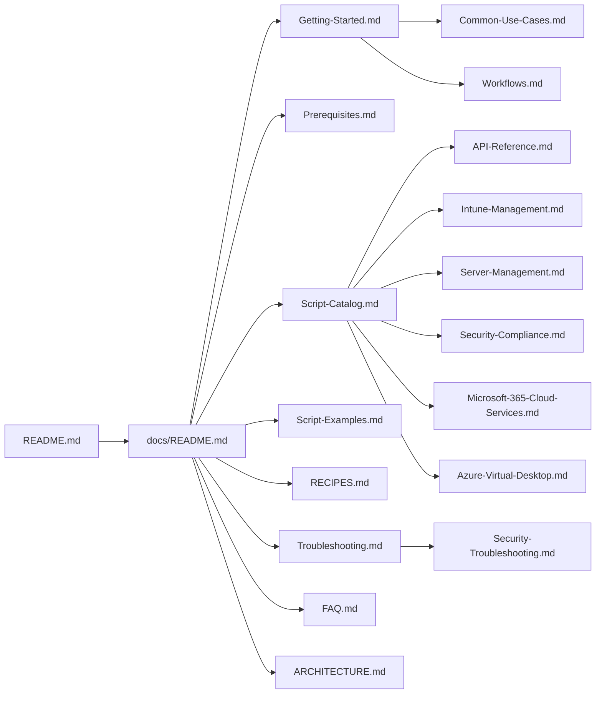

# 📚 Bug-Free Umbrella Documentation

> The complete guide to the repo: **358 PowerShell scripts** for enterprise IT automation — Intune, M365, servers, security, cloud, and everything in between.

Documentation lives **with the code** — every page here is versioned, PR-reviewable, and travels with its release. No separate wiki to go stale. 🌂

**Current release:** [v4.3.0 "Zephyr" 🌈](../CHANGELOG.md) · **Docs consolidated:** 2026-08-08

---

## 🗺️ Documentation Map

## 🚀 Start Here

| If you want to... | Read |
|---|---|
| 🆕 **Get started from scratch** | [Getting-Started.md](Getting-Started.md) |
| ⚙️ **Know what you need installed** | [Prerequisites.md](Prerequisites.md) |
| 🔍 **Find a specific script** | [Script-Catalog.md](Script-Catalog.md) |
| 🧪 **See scripts in action** | [Script-Examples.md](Script-Examples.md) |
| ⚡ **Grab copy-paste commands** | [RECIPES.md](RECIPES.md) — 80+ ready-to-run recipes |
| 🎯 **Solve a specific problem** | [Common-Use-Cases.md](Common-Use-Cases.md) |
| 🏗️ **Understand how it all fits together** | [ARCHITECTURE.md](ARCHITECTURE.md) |

## 📂 By Technology Domain

| Domain | What's Inside | Category Docs |
|---|---|---|
| 📱 **endpoints/** | Intune, Winget, proactive remediations, device health | [Intune-Management.md](Intune-Management.md) · [Intune-Sync-Guide.md](Intune-Sync-Guide.md) · [Winget-Updates.md](Winget-Updates.md) · [Proactive-Remediations.md](Proactive-Remediations.md) |
| 🖥️ **infrastructure/** | Windows servers, AD, network, virtualization, IIS | [Server-Management.md](Server-Management.md) · [Backup-and-Disaster-Recovery.md](Backup-and-Disaster-Recovery.md) |
| 🔒 **security/** | CIS/NIST compliance, hardening, monitoring | [Security-Compliance.md](Security-Compliance.md) · [Security-Troubleshooting.md](Security-Troubleshooting.md) |
| 👥 **collaboration/** | M365, Exchange, Teams, SharePoint | [Microsoft-365-Cloud-Services.md](Microsoft-365-Cloud-Services.md) |
| ☁️ **cloud/** | Azure, AVD, AWS, containers | [Azure-Virtual-Desktop.md](Azure-Virtual-Desktop.md) · [Azure-Compute-Gallery-Image-Builder.md](Azure-Compute-Gallery-Image-Builder.md) · [AWS-Guide.md](AWS-Guide.md) |
| 🗄️ **data/** | Databases, APIs | [Database-Administration.md](Database-Administration.md) · [API-Reference.md](API-Reference.md) |
| ⚙️ **automation/** | CI/CD, IaC | [Workflows.md](Workflows.md) · [Integration-Patterns.md](Integration-Patterns.md) |
| 🧰 **utilities/** | General toolbox | Browse via [Script-Catalog.md](Script-Catalog.md) |

## 🎓 Guides & Advanced Topics

- [Catalog-Automation.md](Catalog-Automation.md) — auto-generated metadata and Invoke-Umbrella launcher

- [Advanced-Scripting-Patterns.md](Advanced-Scripting-Patterns.md) — error handling, logging, parallel execution
- [Performance-Tuning.md](Performance-Tuning.md) · [Performance-Diagnostics.md](Performance-Diagnostics.md) — make scripts fast
- [Advanced-Monitoring.md](Advanced-Monitoring.md) — alerting, metrics, dashboards
- [Migration-Strategy.md](Migration-Strategy.md) · [Scaling-and-Load-Balancing.md](Scaling-and-Load-Balancing.md) — grow safely
- [Best-Practices-Checklist.md](Best-Practices-Checklist.md) — dev, security, compliance
- [Custom-Development-Guide.md](Custom-Development-Guide.md) — write your own scripts for this repo

## 🆘 When Things Break

- [Troubleshooting.md](Troubleshooting.md) — common issues and solutions
- [Security-Troubleshooting.md](Security-Troubleshooting.md) — certs, auth, audit logging
- [FAQ.md](FAQ.md) — frequently asked questions
- Still stuck? [Open an issue](https://github.com/Carme99/bug-free-umbrella/issues) or see [SUPPORT.md](../SUPPORT.md)

## 📋 Project Files

- [CHANGELOG.md](../CHANGELOG.md) — version history with weather codenames
- [CONTRIBUTING.md](../CONTRIBUTING.md) · [GOVERNANCE.md](../GOVERNANCE.md) · [CODE_OF_CONDUCT.md](../CODE_OF_CONDUCT.md)
- [SECURITY.md](../SECURITY.md) — vulnerability reporting
- [examples/](../examples/README.md) — end-to-end workflow examples

---

**Docs live in `docs/` — update them in the same PR as the code they describe.**
