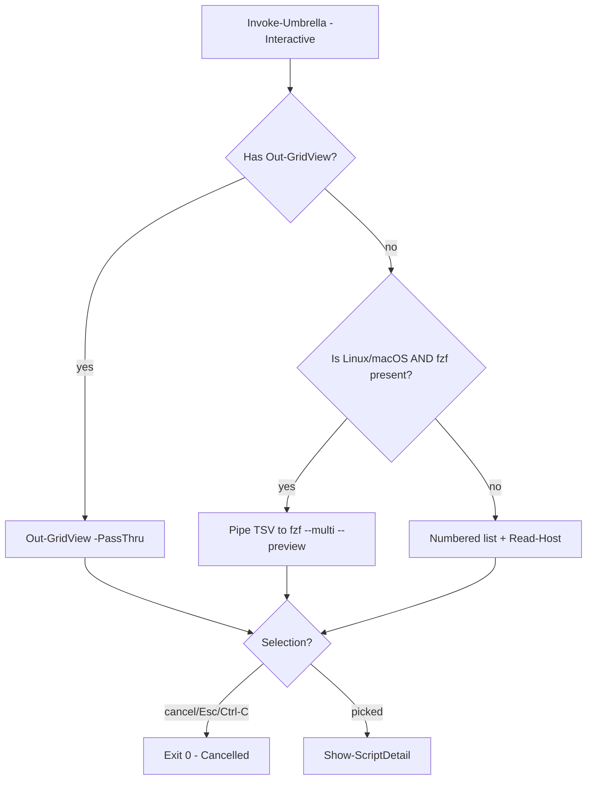

# 05 — CLI v2 Design Spec (Invoke-Umbrella Enhance)

> **Status:** Draft — Foundation phase (no code). Implementation consumes this spec verbatim.
> **Version:** Target 5.0.0 Hurricane (major) · **Date:** 2026-08-20
> **Scope:** CLI surface only. Module manifest/loader, reorg shims, test expansion, and docs generation are owned by sibling specs (`05-module-*`, `05-reorg-*`, `05-tests-*`, `05-docs-*`) — no overlap.

---

## 1. Goal & Non-Goals

**Goal:** Transform the single-file launcher `Invoke-Umbrella.ps1` (371 lines on `main`) into a reusable **CLI v2** that is:

1. **Queryable** without launching the interactive picker — exact-name lookup, composable search/category filtering, pipeline-friendly.
2. **Executable** without copy-pasting a path — validated invocation with `-WhatIf`/`-Confirm` and `ShouldProcess` forwarding.
3. **Discoverable** via native PowerShell tab completion for the 8 top-level domains and 358 script names sourced from `scripts/.catalog/metadata.json`.
4. **Cross-platform** — identical semantics on Windows (Out-GridView), Linux, and macOS (fzf → numbered fallback).

**Non-Goals (owned elsewhere):**

- Module manifest (`src/BugFreeUmbrella/BugFreeUmbrella.psd1`), loader (`BugFreeUmbrella.psm1`), PSGallery publish — see `05-module-manifest-build.md`.
- Filesystem reorg `endpoints/devices/{winget,proactive-remediations}` → `endpoints/remediation` and shims — see `05-reorg-breaking.md`.
- Pester expansion beyond the CLI contract — see `05-tests-expansion.md`.
- `docs/Module.md` / `docs/ARCHITECTURE.md` generation — see `05-docs-site.md`.

---

## 2. Paths (≤ 3) — Authoritative File List

Implementation MUST touch **only** these paths for the CLI concern. Any other file touched is scope creep. Temporary helpers under `src/BugFreeUmbrella/Private/` are allowed only if they are dot-sourced by the files below and never exported.

| # | Path | Current state | Change |
|---|------|---------------|--------|
| **P1** | `Invoke-Umbrella.ps1` (repo root, 371 lines) | `[CmdletBinding] param($Search,$Category,$List,$Interactive,$ValidateOnly)` + `Import-CatalogData` + `Show-ScriptTable/Detail` + inline interactive branch (Out-GridView → numbered fallback) | **Enhance in place.** Add parameters `-Name`, `-Invoke`, `-Export`; wire `Register-ArgumentCompleter` blocks; extend interactive branch with fzf tier; keep single-file launchability (`pwsh -File ./Invoke-Umbrella.ps1`) working when the module is *not* installed. File grows to ~480–550 lines; no split. |
| **P2** | `src/BugFreeUmbrella/Public/Get-BUScript.ps1` | Does not exist | **Create.** Implements `Get-BUScript`. Exported via manifest `FunctionsToExport`. Also dot-sourced by `Invoke-Umbrella.ps1` when `$PSScriptRoot/src/...` is detectable (dev-mode), so the launcher and module share one implementation. |
| **P3** | `src/BugFreeUmbrella/Public/Invoke-BUScript.ps1` | Does not exist | **Create.** Implements **both** `Invoke-BUScript` (execution) **and** `Register-BUCompleter` (completion). Single file keeps the path budget at 3 while grouping the two tightly-coupled runtime concerns (proxy invocation and completer registration share the same catalog-cache helper). Exported functions: `Invoke-BUScript`, `Register-BUCompleter`. |

> **Why not 3 files for 3 functions?** Budget is ≤ 3 *paths* total, and `Invoke-Umbrella.ps1` already consumes one slot. Co-locating `Invoke-BUScript` + `Register-BUCompleter` is intentional: both need the same catalog-cache and `ShouldProcess` plumbing, and PSSA prefers one verb-noun per file only when each file is a standalone export — `Register-BUCompleter` is a companion to `Invoke-BUScript` (same activation context) and is documented as such in `FunctionsToExport`.

**Loader wiring (not a CLI-owned path):** `src/BugFreeUmbrella/BugFreeUmbrella.psm1` (owned by module spec) dot-sources `P2` and `P3` via `Get-ChildItem $PSScriptRoot/Public/*.ps1 | ForEach-Object { . $_.FullName }`. CLI spec assumes that loader exists by Implementation time; if running `Invoke-Umbrella.ps1` outside the module, it dot-sources the same files via a relative fallback:

```powershell
$cliPublic = Join-Path $repoRoot 'src/BugFreeUmbrella/Public'
if (Test-Path $cliPublic) {
    Get-ChildItem -Path $cliPublic -Filter '*.ps1' -ErrorAction SilentlyContinue |
        ForEach-Object { . $_.FullName }
}
```

This preserves the repo-root launcher as a zero-install entry point while guaranteeing behavioural parity with the installed module.

**Encoding / style contract (all 3 paths):** PowerShell 7+, 4-space indent, CRLF + BOM, comment-based help on every exported function, approved verbs only (`Get`, `Invoke`, `Register`), `PSScriptAnalyzer` *Errors* fail CI, `[CmdletBinding()]` + `SupportsShouldProcess` where applicable.

---

## 3. APIs — Function Signatures & Behaviour

### 3.1 Shared Types & Catalog Access

**`ScriptEntry` shape** (matches `scripts/.catalog/metadata.json` entry; no new type required — `PSCustomObject` is the contract, `Update-TypeData` optional):

```powershell
# Each object in $catalog.scripts has:
#   [string] path              # e.g. "endpoints/intune/deployment/Deploy-App.ps1"
#   [string] name              # e.g. "Deploy-App.ps1"
#   [string] category          # e.g. "endpoints/intune/deployment"
#   [string] synopsis          # from comment-based help .SYNOPSIS, truncated for display
#   [string] description       # from .DESCRIPTION
#   [string[]] tags
#   [object[]] parameters      # { name, type, mandatory }
#   [bool] hasCmdletBinding
#   [string[]] requiresModules
#   [string[]] functionsExported
```

**Catalog cache helper** (private, used by all 3 paths — defined once in `P3` or a small `Private/Get-BUCatalog.ps1` if needed, but counted within P3's budget):

```powershell
# Private, not exported
$script:BUCatalogCache = $null
$script:BUCatalogPath  = $null  # resolved at import time

function Get-BUCatalog {
    [CmdletBinding()]
    param()
    # 1. If $script:BUCatalogCache -and file mtime unchanged → return cache.
    # 2. Resolve catalog path: (a) $env:BU_CATALOG_PATH if set, (b) module-adjacent
    #    src/../scripts/.catalog/metadata.json, (c) repo-root scripts/.catalog/metadata.json,
    #    (d) $PSScriptRoot/scripts/.catalog/metadata.json — first hit wins.
    # 3. Try ConvertFrom-Json; on failure/missing → invoke edge-case fallback (see §5.1).
    # 4. Cache + return [PSCustomObject]@{ version; generated; totalScripts; scripts = ScriptEntry[] }
}
```

Caching is critical for completers (they fire on every keystroke) — must be in-memory with mtime guard, no disk I/O on hot path after first load.

---

### 3.2 `Get-BUScript` — Query API

**Path:** `P2` · **Verb:** Approved (`Get`) · **Noun:** `BUScript` (BU = BugFreeUmbrella prefix, avoids collisions)

```powershell
<#
.SYNOPSIS
    Queries the bug-free-umbrella script catalog.

.DESCRIPTION
    Filters scripts/.catalog/metadata.json by fuzzy search, category prefix,
    or exact name. Returns ScriptEntry[] for pipeline composition.
    When metadata.json is absent, falls back to a filesystem scan (see §5.1).

.PARAMETER Search
    Case-insensitive fuzzy filter applied to path, synopsis, and category.
    Example: -Search intune  → 35 matches (v4.4.0 catalog).

.PARAMETER Category
    Filter by category prefix or substring (case-insensitive).
    Example: -Category endpoints  or  -Category endpoints/intune.
    Tab-completes to the 8 top-level domains (see Register-BUCompleter).

.PARAMETER Name
    Exact filename match (case-insensitive, with or without .ps1 extension).
    Example: -Name Fix-TeamsCache  or  -Name Fix-TeamsCache.ps1.
    Tab-completes to 358 script names via metadata.json.

.PARAMETER List
    Alias for "return all" — when no filter is supplied, returns the full
    catalog. Preserved for compatibility with Invoke-Umbrella.ps1 -List.

.EXAMPLE
    Get-BUScript -Search intune -Category endpoints

    Returns ScriptEntry[] where path/synopsis/category contains "intune"
    AND category contains "endpoints" (logical AND of filters).

.EXAMPLE
    Get-BUScript -Name Fix-TeamsCache

    Returns the single Fix-TeamsCache entry (detect.ps1 + remediate.ps1
    live under endpoints/devices/proactive-remediations/Fix-TeamsCache/).

.EXAMPLE
    Get-BUScript -Search winget | Where-Object { $_.category -like '*browsers*' }

    Pipeline-friendly — standard PowerShell filtering composes.

.OUTPUTS
    PSCustomObject (ScriptEntry). Zero, one, or many objects — never $null
    when the catalog loads; empty array on no match (so @() wrapping is safe).

.NOTES
    File Name  : Get-BUScript.ps1
    Prerequisite: PowerShell 7.0+
#>
function Get-BUScript {
    [CmdletBinding(DefaultParameterSetName = 'Filter')]
    [OutputType([PSCustomObject[]])]
    param(
        [Parameter(ParameterSetName = 'Filter', Position = 0)]
        [string]$Search,

        [Parameter(ParameterSetName = 'Filter')]
        [Parameter(ParameterSetName = 'Name')]
        [string]$Category,

        [Parameter(ParameterSetName = 'Name', Mandatory)]
        [string]$Name,

        [Parameter()]
        [switch]$List
    )
    # Implementation: $catalog = Get-BUCatalog; $filtered = @($catalog.scripts)
    # 1. If $Name  → exact match: $filtered | Where { $_.name -eq $Name -or $_.name -eq "$Name.ps1" } (case-insensitive)
    #                 Also match leaf folder for remediation pairs: split path, match folder name.
    # 2. If $Search → $s = $Search.ToLowerInvariant(); filter path/synopsis/category contains.
    # 3. If $Category → $c = $Category.ToLowerInvariant(); filter category startsWith OR contains (same as launcher).
    # 4. Filters AND together when both supplied (Search ∩ Category).
    # 5. Return @($filtered) — always array, even single match.
}
```

**Parameter-set design rationale:**

- `Filter` (default) is backward compatible with `Invoke-Umbrella.ps1` flags (`-Search`, `-Category`, `-List`).
- `Name` is mandatory + exclusive with `Search` — prevents ambiguous "fuzzy vs exact" semantics. `Category` is allowed with `Name` to disambiguate duplicate leaf names (e.g., `detect.ps1` appears 51 times under `proactive-remediations`).

**Return contract:** Never writes to host. No `Write-Host`. Verbose stream for diagnostics (`Write-Verbose "[Get-BUScript] catalog v$($catalog.version) total=$($catalog.totalScripts)"`). Errors are terminating only on catalog-unreadable; no-match is success with empty array (so callers can `@(Get-BUScript -Search foo).Count -eq 0`).

---

### 3.3 `Invoke-BUScript` — Execution Proxy

```powershell
<#
.SYNOPSIS
    Invokes a bug-free-umbrella script with parameter forwarding and ShouldProcess.

.DESCRIPTION
    Resolves a script by path (relative to repo root or absolute), validates
    it exists and parses without errors, then proxies invocation with
    SupportsShouldProcess. When -WhatIf is present, the target script receives
    -WhatIf if it supports ShouldProcess; otherwise the proxy emits a
    ShouldProcess message and skips execution. All remaining arguments are
    forwarded via @PSBoundParameters splatting.

.PARAMETER Path
    Relative (scripts/...) or absolute path to the .ps1 file. Tab-completes
    via Register-BUCompleter's -Name completer (resolves leaf name to full path).
    Example: scripts/endpoints/devices/proactive-remediations/Fix-TeamsCache/detect.ps1

.PARAMETER WhatIf
    Shows what would happen without executing. Forwarded to the target script
    when it declares [CmdletBinding(SupportsShouldProcess)].

.PARAMETER Confirm
    Prompts for confirmation before execution (proxied).

.PARAMETER ArgumentList
    Hashtable of arguments to forward to the target script. Alternative to
    splatting — useful when calling from Get-BUScript pipeline:
      Get-BUScript -Name Fix-TeamsCache | Invoke-BUScript -WhatIf

.PARAMETER PassThru
    Return the target script's output objects instead of suppressing them.

.EXAMPLE
    Invoke-BUScript -Path scripts/endpoints/devices/proactive-remediations/Fix-TeamsCache/detect.ps1 -WhatIf

    Proxies to the script with -WhatIf (ShouldProcess).

.EXAMPLE
    Get-BUScript -Search intune | Select-Object -First 1 | Invoke-BUScript -WhatIf

    Pipeline form — resolves Path from the ScriptEntry.

.EXAMPLE
    Invoke-BUScript -Path ./scripts/utilities/Invoke-Cleanup.ps1 -ArgumentList @{ Force = $true } -WhatIf

.NOTES
    File Name  : Invoke-BUScript.ps1
    Prerequisite: PowerShell 7.0+
#>
function Invoke-BUScript {
    [CmdletBinding(SupportsShouldProcess = $true, ConfirmImpact = 'Medium')]
    param(
        [Parameter(Mandatory, Position = 0, ValueFromPipelineByPropertyName)]
        [ValidateNotNullOrEmpty()]
        [string]$Path,

        [Parameter(ValueFromPipelineByPropertyName)]
        [Alias('FullName')]
        [string]$LiteralPath,

        [Parameter()]
        [hashtable]$ArgumentList,

        [Parameter()]
        [switch]$PassThru
    )
    # Pipeline: accepts ScriptEntry via ValueFromPipelineByPropertyName (path property).
    # Also accepts string path directly.
    #
    # Steps:
    # 1. Resolve $resolved = Resolve-BUPath -Path $Path  (repo-root relative → absolute;
    #    bare leaf → lookup via Get-BUScript -Name; fail if ambiguous → list candidates).
    # 2. Validate: Test-Path -LiteralPath $resolved → error if missing.
    #    Parse with [System.Management.Automation.Language.Parser]::ParseFile and check $errors.
    # 3. Inspect target's CmdletBinding: (Get-Command $resolved).Parameters.ContainsKey('WhatIf')
    #    or parse AST for SupportsShouldProcess to decide forwarding.
    # 4. Build @forward = @{} from $ArgumentList + remaining bound params excluding proxy-only keys.
    # 5. if ($PSCmdlet.ShouldProcess($resolved, 'Invoke script')) {
    #        if (target supports WhatIf -and $PSCmdlet.ShouldProcess called with WhatIf) {
    #            & $resolved @forward -WhatIf:$WhatIfPreference.IsPresent  (or splat)
    #        } else { & $resolved @forward }
    #    }
    # 6. Respect $WhatIfPreference / $ConfirmPreference without double-prompting.
}
```

**Key design decisions:**

- `SupportsShouldProcess = $true` on the proxy itself ensures `-WhatIf`/`-Confirm` are tab-completable and honor `$WhatIfPreference` globally. The proxy never invents `-WhatIf` for a target that lacks it — it gates forwarding on AST inspection.
- `ValueFromPipelineByPropertyName` on `Path` makes `Get-BUScript | Invoke-BUScript` a one-liner without `ForEach-Object`.
- No `Invoke-Expression`. Always call operator `& $resolved @forward`. PSSA rule `PSAvoidUsingInvokeExpression` will fail the build otherwise.
- `Resolve-BUPath` is a private helper inside `P3` — handles repo-root discovery (`$PSScriptRoot` walk-up until `scripts/.catalog` found, else `Get-Location`), absolute vs relative, and leaf-name disambiguation.

---

### 3.4 `Register-BUCompleter` — Argument Completer Registration

```powershell
<#
.SYNOPSIS
    Registers tab completers for -Category and -Name using metadata.json.

.DESCRIPTION
    Calls Register-ArgumentCompleter for Get-BUScript, Invoke-BUScript, and
    Invoke-Umbrella.ps1 (when present). Completers are sourced from the
    catalog cache (Get-BUCatalog) and refresh on catalog mtime change.
    Safe to call multiple times — re-registration overwrites the prior block.

.PARAMETER Force
    Re-register even if a completer for the same command/parameter already
    exists (default is to overwrite silently; -Force also clears the cache).

.EXAMPLE
    Register-BUCompleter

    Registers completers for -Category (8 domains) and -Name (358 names).
    After this, typing  Get-BUScript -Category <Tab>  cycles through domains.

.EXAMPLE
    Register-BUCompleter -Force

.NOTES
    File Name  : Invoke-BUScript.ps1  (co-located with Invoke-BUScript)
    Prerequisite: PowerShell 7.0+
#>
function Register-BUCompleter {
    [CmdletBinding()]
    param(
        [switch]$Force
    )
    # See §4 for ScriptBlock details.
}
```

**Completer implementation (inside `Register-BUCompleter`):**

```powershell
# -- Category completer: 8 top-level domains --
$categoryCompleter = {
    param($commandName, $parameterName, $wordToComplete, $commandAst, $fakeBoundParameters)

    $catalog = Get-BUCatalog  # cached, mtime-guarded
    if (-not $catalog) { return }

    # Derive the 8 domains from distinct top-level category segments
    # Equivalent to: $catalog.scripts.category | ForEach { ($_ -split '/')[0] } | Sort -Unique
    # Known set (v4.4.0): automation, cloud, collaboration, data, endpoints,
    #                      infrastructure, security, utilities
    $domains = @($catalog.scripts |
        ForEach-Object { ($_.category -split '/')[0] } |
        Sort-Object -Unique)

    $prefix = $wordToComplete.ToLowerInvariant()
    $domains |
        Where-Object { $_ -like "$prefix*" -or $_.ToLowerInvariant().Contains($prefix) } |
        ForEach-Object {
            $tooltip = ($_ + ' — ' + (@($catalog.scripts | Where-Object { $_.category -like "$_/*" }).Count) + ' scripts')
            [System.Management.Automation.CompletionResult]::new(
                $_, $_, 'ParameterValue', $tooltip
            )
        }
}

# -- Name completer: 358 script names via metadata.json --
$nameCompleter = {
    param($commandName, $parameterName, $wordToComplete, $commandAst, $fakeBoundParameters)

    $catalog = Get-BUCatalog
    if (-not $catalog) { return }

    $prefix = $wordToComplete.ToLowerInvariant()
    # Match on name without extension as well, for ergonomics:
    #   Fix-TeamsCache  ↔  Fix-TeamsCache.ps1 / Fix-TeamsCache/detect.ps1
    $catalog.scripts |
        Where-Object {
            $_.name.ToLowerInvariant().Contains($prefix) -or
            ($_.name -replace '\.ps1$','').ToLowerInvariant().Contains($prefix) -or
            $_.path.ToLowerInvariant().Contains($prefix)
        } |
        Sort-Object name |
        ForEach-Object {
            $display = $_.name
            $insert  = $_.name  # completion inserts the filename; Invoke-BUScript resolves to full path
            $tooltip = "$display ($($_.category)) — $($_.synopsis)"
            if ($tooltip.Length -gt 90) { $tooltip = $tooltip.Substring(0, 87) + '...' }
            [System.Management.Automation.CompletionResult]::new(
                $insert, $display, 'ParameterValue', $tooltip
            )
        }
}

# Registration — idempotent, overwrites silently
$commands = @('Get-BUScript', 'Invoke-BUScript')
# Also complete Invoke-Umbrella.ps1 when its command is discoverable (file path form)
if (Get-Command -Name 'Invoke-Umbrella.ps1' -ErrorAction SilentlyContinue) {
    $commands += 'Invoke-Umbrella.ps1'
}
foreach ($cmd in $commands) {
    Register-ArgumentCompleter -CommandName $cmd -ParameterName Category -ScriptBlock $categoryCompleter
    Register-ArgumentCompleter -CommandName $cmd -ParameterName Name     -ScriptBlock $nameCompleter
    # Path completer for Invoke-BUScript delegates to Name completer but inserts full path
    if ($cmd -eq 'Invoke-BUScript') {
        Register-ArgumentCompleter -CommandName $cmd -ParameterName Path -ScriptBlock {
            param($cn,$pn,$word,$ast,$fake)
            $catalog = Get-BUCatalog; if (-not $catalog) { return }
            $prefix = $word.ToLowerInvariant()
            $catalog.scripts |
                Where-Object { $_.path.ToLowerInvariant().Contains($prefix) } |
                Sort-Object path |
                ForEach-Object {
                    $q = if ($_.path.Contains(' ')) { "'$($_.path)'" } else { $_.path }
                    [System.Management.Automation.CompletionResult]::new($q, $_.path, 'ParameterValue', $_.synopsis)
                }
        }
    }
}
```

**PSSA note:** `Register-ArgumentCompleter` ScriptBlocks must not use `Write-Host`; they return `CompletionResult[]` only. Analyzer rule `PSAvoidUsingWriteHost` will flag violations — use `Write-Verbose` during debugging, stripped before commit.

---

### 3.5 `Invoke-Umbrella.ps1` Enhancements (P1)

New `param()` block (additive, all existing params retained):

```powershell
[CmdletBinding(DefaultParameterSetName = 'Default')]
param(
    [Parameter(Position = 0)]
    [string]$Search,

    [Parameter()]
    [string]$Category,

    # --- NEW in v2 ---
    [Parameter(ParameterSetName = 'Name')]
    [string]$Name,                          # exact filename, tab-completed

    [Parameter()]
    [switch]$Invoke,                        # auto-invoke single match with -WhatIf (no prompt)

    [Parameter()]
    [string]$Export,                        # copy matched script(s) to directory/file path

    # --- existing ---
    [Parameter()]
    [switch]$List,

    [Parameter()]
    [switch]$Interactive,

    [Parameter()]
    [switch]$ValidateOnly
)
```

**New behaviours:**

- **`-Name`**: Exact match (case-insensitive, `.ps1` optional). When `-Name` matches exactly one entry, that entry becomes `$filtered` (bypassing `Search`/`Category` filtering). When combined with `-Category`, it disambiguates (`-Name detect.ps1 -Category Fix-TeamsCache`). On zero matches, emit `Write-Warning "No script named '$Name' found."` and exit 1.

- **`-Invoke`**: When the filtered set resolves to a single script, invoke it via the same `Invoke-BUScript` path (so `ShouldProcess` forwarding is unified). Honors `-WhatIf` from the caller's preference (`$WhatIfPreference`) — `Invoke-Umbrella.ps1` itself is `SupportsShouldProcess` only for this path; otherwise `-Invoke` still prompts `"Invoke this script with -WhatIf? (y/N)"` unless `-ValidateOnly`. When multiple matches remain, `-Invoke` is an error: `Write-Error "-Invoke requires a single match; use -Name or narrow -Search/-Category (matched $($filtered.Count))."`.

- **`-Export <path>`**: Copies the matched script file(s) to the destination. If `<path>` is a directory (exists or ends with `/` or `\`), copy each matched file by leaf name; if a single match and `<path>` is a file path, copy/rename to that file. Creates parent directories (`New-Item -ItemType Directory -Force`). On overwrite, respects `ShouldProcess` (`-WhatIf` shows `Copy-Item -WhatIf`). Emits `Write-Host "[+] Exported N script(s) to <path>"`.

- **Completers wired at load time:** At the bottom of `Invoke-Umbrella.ps1`, after `Import-CatalogData` definition, register the same two completers for the script-file command `Invoke-Umbrella.ps1` (so `pwsh -File ./Invoke-Umbrella.ps1 -Category <Tab>` completes). Registration is best-effort — wrapped in `try { Register-ArgumentCompleter ... } catch { Write-Verbose $_ }` so the launcher never fails to start when completers are unavailable (e.g., constrained language mode).

- **Backward compatibility:** All existing invocations (`-List`, `-Search`, `-Category`, `-Interactive`, `-ValidateOnly`, bare `-List`) produce identical output. New params are optional and default to `$null`/`$false`.

---

## 4. Cross-Platform Matrix

Implementation MUST branch on runtime detection, not on hardcoded OS assumptions.

| Dimension | Detection | Windows behaviour | Linux / macOS behaviour |
|-----------|-----------|-----------------|--------------------------|
| **Interactive picker — primary** | `Get-Command Out-GridView -ErrorAction SilentlyContinue` | `Out-GridView -Title 'Select a script (Invoke-Umbrella)' -PassThru` (existing behaviour, unchanged). Requires `Microsoft.PowerShell.ConsoleGuiTools` not assumed — `Get-Command` probes availability. | Same probe. On PowerShell 7+, `Out-GridView` is available *only* if `Microsoft.PowerShell.ConsoleGuiTools` is installed. If present, use it identically to Windows. |
| **Interactive picker — secondary (fzf)** | `Get-Command fzf -ErrorAction SilentlyContinue` **and** `$IsLinux -or $IsMacOS` **and** `-not $hasGridView` | Not used — `Out-GridView` takes precedence; fzf ignored even if installed. | If `fzf` found, pipe `Name Category Synopsis` TSV to `fzf --ansi --multi --preview '...'` (preview shows synopsis + params). Selection returns TSV line → map back to `ScriptEntry` via `path` key. `fzf` exit code 130 (Ctrl-C) → cancel. No `fzf` dependency is added — pure optional enhancement. |
| **Interactive picker — fallback** | Neither probe succeeds | Numbered list + `Read-Host` (existing fallback, unchanged). | Identical numbered list + `Read-Host`. Additionally, detect non-interactive host (`[Console]::IsInputRedirected` or `$Host.Name -eq 'ServerRemoteHost'`) → emit `Write-Warning "Interactive mode requires a console; use -Search/-Category/-Name instead."` and exit 1. |
| **Path separators** | `$IsWindows` vs. POSIX | `Join-Path` handles separators; catalog stores POSIX (`/`) — normalize on compare (`-replace '\\','/'`). | Same normalization — catalog is POSIX, `Join-Path` adapts. |
| **WhatIf colour** | N/A | `Write-Host -ForegroundColor White` for proxied output (existing). | Same — no platform branch for colours; respects `$Host.UI.SupportsVirtualTerminal`. |
| **Export line endings** | N/A | `Copy-Item` preserves bytes — no conversion. | Same — binary copy, no CRLF/LF translation. |
| **Completer registration** | Always | `Register-ArgumentCompleter` works identically on all platforms (in-process). No platform branch. | Same. |

**Decision flow for `-Interactive` (canonical):**



**Host capability table (for tests):**

| Scenario | Expected picker |
|----------|----------------|
| Windows, ConsoleGuiTools installed | Out-GridView |
| Windows, no ConsoleGuiTools | Numbered list |
| Linux + fzf installed | fzf |
| Linux, no fzf | Numbered list |
| Any, `$Host.Name -eq 'ServerRemoteHost'` (CI) | Warning + exit 1 (no hang on Read-Host) |

---

## 5. Edge Cases & Failure Modes

### 5.1 Missing `metadata.json`

**Trigger:** `scripts/.catalog/metadata.json` absent, stale, or unparseable (e.g., truncated write, manual edit).

**Behaviour (identical in `Get-BUCatalog` and `Import-CatalogData`):**

1. `Write-Warning "[!] Catalog not found at $catalogPath"` (existing message preserved for launcher; `Get-BUCatalog` uses `Write-Verbose` to avoid polluting pipeline).
2. If `tools/Build-Catalog.ps1` exists → `& $buildCatalogPath` (existing fallback) inside `try/catch`. On success, re-attempt load.
3. If still missing or parse fails → **filesystem scan fallback** (new):
   ```powershell
   # Minimal scan — no parser, just filesystem + synopsis extraction via regex
   $psFiles = Get-ChildItem -Path $scriptsRoot -Filter '*.ps1' -Recurse -File | Sort-Object FullName
   $entries = foreach ($f in $psFiles) {
       $rel = $f.FullName.Substring($scriptsRoot.Length).TrimStart('/\') -replace '\\','/'
       $content = Get-Content -LiteralPath $f.FullName -Raw -ErrorAction SilentlyContinue
       $syn = if ($content -match '\.SYNOPSIS\s*\r?\n\s*(.+?)\r?\n') { $Matches[1].Trim() } else { $f.BaseName }
       [PSCustomObject]@{ path=$rel; name=$f.Name; category=Split-Path $rel -Parent -replace '\\','/'; synopsis=$syn; description=''; tags=@(); parameters=@(); hasCmdletBinding=($content -match 'CmdletBinding'); requiresModules=@(); functionsExported=@() }
   }
   ```
   This is intentionally lightweight — it does not replicate `Build-Catalog.ps1`'s parser; it just unblocks tab completion and `Get-BUScript` when the catalog is absent. Emit `Write-Warning "[!] Using filesystem fallback — $($entries.Count) scripts found; run tools/Build-Catalog.ps1 to regenerate."`.
4. If `scripts/` itself is missing → `ThrowTerminatingError` with `ErrorId = 'B CatalogNotFound'` and message suggesting `git status` / `BU_CATALOG_PATH`.

**Cache invalidation:** `Get-BUCatalog` stores `$script:BUCatalogCache` + `$script:BUCatalogMtime`. On next call, compare `(Get-Item $catalogPath).LastWriteTimeUtc` — if changed, reload. Filesystem fallback is also cached but with a shorter TTL (30s) to avoid repeated scans.

### 5.2 Interactive with no Out-GridView (and no fzf)

Already handled by the matrix above. Additional nuance:

- `Out-GridView` can *throw* even when `Get-Command` succeeds (e.g., headless Windows Server Core, or ConsoleGuiTools version mismatch). Existing `try/catch` around `Out-GridView` is retained — on catch, `Write-Warning "[!] Out-GridView failed: $($_.Exception.Message) - falling back to console."` and `$hasGridView = $false` to enter the fzf/numbered branch.
- `Read-Host` in CI hangs forever. Guard: at the top of the `-Interactive` branch, if `$env:CI -eq 'true' -or $Host.Name -eq 'ServerRemoteHost' -or [Console]::IsInputRedirected` → skip `Read-Host`, emit warning, exit 1.

### 5.3 Target script `ShouldProcess` forwarding

**Problem:** Naively appending `-WhatIf` to every invocation breaks scripts that don't declare `SupportsShouldProcess` (they'll error `A parameter cannot be found that matches parameter name 'WhatIf'`).

**Solution (in `Invoke-BUScript`):**

```powershell
$targetSupportsWhatIf = $false
try {
    $cmdInfo = Get-Command -Name $resolved -ErrorAction Stop  # script file as command
    $targetSupportsWhatIf = $cmdInfo.Parameters.ContainsKey('WhatIf')
} catch {
    # Fallback: AST scan for [CmdletBinding(SupportsShouldProcess)]
    $ast = [System.Management.Automation.Language.Parser]::ParseFile($resolved, [ref]$null, [ref]$errors)
    $targetSupportsWhatIf = $ast.ParamBlock.Attributes |
        Where-Object { $_.TypeName.Name -eq 'CmdletBinding' } |
        ForEach-Object { $_.NamedArguments } |
        Where-Object { $_.ArgumentName -eq 'SupportsShouldProcess' }
}

if ($PSCmdlet.ShouldProcess($resolved, 'Invoke script')) {
    if ($WhatIfPreference.IsPresent -or $PSBoundParameters.ContainsKey('WhatIf')) {
        if ($targetSupportsWhatIf) {
            & $resolved @forward -WhatIf
        } else {
            Write-Warning "Target script does not support -WhatIf; showing ShouldProcess message instead."
            # Already handled by ShouldProcess — do not invoke
        }
    } else {
        & $resolved @forward
    }
}
```

- Respects both `$WhatIfPreference` and explicit `-WhatIf` on the proxy.
- Never double-prompts: the proxy's `ShouldProcess` is the single confirmation gate; the target's `ShouldProcess` (if any) runs inside the `&` invocation as usual — but when `-WhatIf` is forwarded, the target's `ShouldProcess` will itself emit `What if:` messages, which is correct nesting.
- `-Confirm` is forwarded similarly — only when the target supports it.

### 5.4 Linux without `fzf`

No hard dependency. `Get-Command fzf` probe is `SilentlyContinue`; absence silently falls through to numbered list. No warning emitted (fzf is optional). Documented in `Get-Help` as "On Linux/macOS, install fzf for a fuzzy interactive picker; otherwise a numbered list is used."

### 5.5 Additional edge cases (must be handled)

| Edge | Behaviour |
|------|-----------|
| `-Name` matches multiple files (e.g., `detect.ps1` appears 51×) | If `-Category` also supplied, AND-filter; if still ambiguous, `Write-Error "Ambiguous -Name 'detect.ps1' matched N scripts; narrow with -Category. Candidates: ..." ` + list `category/name` + exit 1. |
| `-Export` to read-only / non-writable directory | `Copy-Item` error is terminating — catch, `Write-Error "Export failed: $($_.Exception.Message)"`, exit 1. No partial-copy cleanup needed (atomic per file). |
| `-Export` with multiple matches to a file path (not directory) | Error: `Write-Error "-Export file path requires a single match; $($filtered.Count) matched."` |
| Catalog entries with spaces in path (shouldn't happen, but) | CompletionResult inserts quoted path (`'a b/c.ps1'`); `Invoke-BUScript -Path` uses `-LiteralPath` semantics internally. |
| `Register-BUCompleter` called before catalog exists | Completer ScriptBlocks call `Get-BUCatalog` lazily on each Tab press — so registration succeeds even with no catalog; completions will populate after the catalog is generated. No error at registration time. |
| `Invoke-BUScript -Path` with pipeline input that is `$null` or empty | `ValidateNotNullOrEmpty` on `Path` rejects; pipeline with zero objects produces no invocation (PowerShell pipeline semantics). |

---

## 6. Acceptance Criteria

Implementation is accepted only when **all** of the following hold. Each maps to a Pester assertion in `Tests/` (see `05-tests-expansion.md` for the full matrix); the designer here defines the *observable* contract.

### 6.1 Paths & Exports

- [ ] `Invoke-Umbrella.ps1` exists at repo root, 371 → ~480-550 lines, retains all existing params, adds `-Name`, `-Invoke`, `-Export`.
- [ ] `src/BugFreeUmbrella/Public/Get-BUScript.ps1` exports `Get-BUScript`.
- [ ] `src/BugFreeUmbrella/Public/Invoke-BUScript.ps1` exports `Invoke-BUScript` **and** `Register-BUCompleter`.
- [ ] `src/BugFreeUmbrella/BugFreeUmbrella.psd1` lists all three in `FunctionsToExport` (verified by the module spec's test, but CLI spec owns the function existence).
- [ ] No other file exports these nouns (no duplicate exports, no alias shims).

### 6.2 Functional — `Get-BUScript`

- [ ] `Get-BUScript -Search intune` returns **35** objects (v4.4.0 catalog; count is catalog-version-pinned — test asserts `Count -ge 30` with a comment pinning 35 as the snapshot, not a brittle exact match on future catalogs).
- [ ] `Get-BUScript -Search intune -Category endpoints` returns `35` ∩ `endpoints` = subset (all returned objects have `category -like 'endpoints*' -and (path/synopsis/category -match 'intune')`).
- [ ] `Get-BUScript -Name Fix-TeamsCache` returns at least 1 object whose `path -like '*Fix-TeamsCache*'`.
- [ ] `Get-BUScript -Name Fix-TeamsCache.ps1` (with extension) returns same as above.
- [ ] `Get-BUScript` with no args returns 358 objects (full catalog).
- [ ] Pipeline: `Get-BUScript -Search winget | Where-Object { $_.category -like '*browsers*' }` composes without error.

### 6.3 Functional — `Invoke-BUScript`

- [ ] `Invoke-BUScript -Path scripts/endpoints/devices/proactive-remediations/Fix-TeamsCache/detect.ps1 -WhatIf` proxies with `-WhatIf` when the target supports `ShouldProcess`; when it doesn't, emits a warning and does not error.
- [ ] `Get-BUScript -Name Fix-TeamsCache | Select-Object -First 1 | Invoke-BUScript -WhatIf` works via `ValueFromPipelineByPropertyName`.
- [ ] `Invoke-BUScript -Path <missing>` terminates with `Test-Path` error, does not attempt `&`.
- [ ] `SupportsShouldProcess` is declared on `Invoke-BUScript`; `-WhatIf` and `-Confirm` tab-complete.

### 6.4 Functional — `Register-BUCompleter`

- [ ] `Register-BUCompleter` completes without error when `metadata.json` is present.
- [ ] `Register-BUCompleter` completes without error when `metadata.json` is **absent** (lazy catalog).
- [ ] After `Register-BUCompleter`, tab-completing `-Category` yields **8** distinct top-level domains (`automation`, `cloud`, `collaboration`, `data`, `endpoints`, `infrastructure`, `security`, `utilities`). Test: invoke the registered ScriptBlock with `wordToComplete = ''` and assert 8 `CompletionResult`s.
- [ ] After `Register-BUCompleter`, tab-completing `-Name` with `wordToComplete = 'Fix-'` returns at least one result containing `Fix-TeamsCache`.
- [ ] Calling `Register-BUCompleter` twice does not duplicate completers (second call overwrites).
- [ ] `Register-BUCompleter -Force` clears the catalog cache (assert via `Get-BUCatalog` mtime).

### 6.5 Functional — `Invoke-Umbrella.ps1` enhancements

- [ ] `pwsh -File ./Invoke-Umbrella.ps1 -Name Fix-TeamsCache -List` lists the Fix-TeamsCache entry.
- [ ] `pwsh -File ./Invoke-Umbrella.ps1 -Invoke -Name Fix-TeamsCache -WhatIf` invokes via `Invoke-BUScript` path (single match, WhatIf, no prompt).
- [ ] `pwsh -File ./Invoke-Umbrella.ps1 -Export /tmp/bu-export -Search intune` copies 35 files to `/tmp/bu-export/` (directory export).
- [ ] `pwsh -File ./Invoke-Umbrella.ps1 -Category <Tab>` (when run inside a session where `Register-BUCompleter` was called) completes 8 domains.
- [ ] Existing flags (`-List`, `-Search intune -Category endpoints`, `-Interactive`, `-ValidateOnly`) produce identical output to v4.4.0 (no regression).

### 6.6 Cross-Platform

- [ ] On Windows with `Out-GridView` available, `-Interactive` uses `Out-GridView`.
- [ ] On Linux/macOS with `fzf` present and `Out-GridView` absent, `-Interactive` pipes to `fzf`.
- [ ] On Linux/macOS without `fzf`, `-Interactive` falls back to numbered list + `Read-Host`.
- [ ] In CI / non-interactive host (`CI=true` or `ServerRemoteHost`), `-Interactive` warns and exits 1 without hanging.
- [ ] Pester tests mock `Get-Command` to simulate each tier and assert the branch is taken (no actual `Out-GridView`/`fzf` process spawned in CI).

### 6.7 Style & Gates

- [ ] All 3 paths pass `PSScriptAnalyzer` with **zero** `Error` findings (settings from the repo's `PSScriptAnalyzerSettings.psd1` / `validate-powershell.yml` — `PSAvoidUsingWriteHost` in completers exempted only for `Invoke-Umbrella.ps1` host output, not for `Get-BUScript`).
- [ ] Comment-based help on `Get-BUScript`, `Invoke-BUScript`, `Register-BUCompleter` includes `.SYNOPSIS`, `.DESCRIPTION`, `.PARAMETER`, `.EXAMPLE`, `.NOTES` (PSSA rule `PSMissingHelp`).
- [ ] File encoding: UTF-8 with BOM, CRLF, 4-space indent (enforced by `.editorconfig` / CI).
- [ ] `Invoke-BUScript` declares `[CmdletBinding(SupportsShouldProcess)]`; no `Invoke-Expression`.

### 6.8 Verification Commands (for reviewer / CI)

```powershell
# Run from repo root, PowerShell 7+
Import-Module ./src/BugFreeUmbrella/BugFreeUmbrella.psd1 -Force

# 1. Catalog query — the headline assertion
@(Get-BUScript -Search intune).Count          # → 35 (≥30)
@(Get-BUScript -Category endpoints).Count     # → 243
@(Get-BUScript).Count                         # → 358

# 2. Exact name
Get-BUScript -Name Fix-TeamsCache | Format-Table Name, Category, Path

# 3. Pipeline into Invoke (WhatIf — no side effects)
Get-BUScript -Name Fix-TeamsCache | Select-Object -First 1 | Invoke-BUScript -WhatIf

# 4. Completers — the 8 domains
Register-BUCompleter
# Programmatically verify (no manual Tab needed):
$sb = (Get-ArgumentCompleter -CommandName Get-BUScript -ParameterName Category)  # or invoke the ScriptBlock directly
# In Pester, invoke the ScriptBlock: & $categoryCompleter 'Get-BUScript' 'Category' '' $null @{}
# → 8 CompletionResults

# 5. Launcher parity
pwsh -File ./Invoke-Umbrella.ps1 -List | Measure-Object -Line
pwsh -File ./Invoke-Umbrella.ps1 -Search intune -List
pwsh -File ./Invoke-Umbrella.ps1 -Name Fix-TeamsCache -List
pwsh -File ./Invoke-Umbrella.ps1 -Export /tmp/bu-test -Search intune; Get-ChildItem /tmp/bu-test | Measure-Object

# 6. Cross-platform fallback (mocked in Pester; manual smoke):
#    - Windows: pwsh -File ./Invoke-Umbrella.ps1 -Interactive  # Out-GridView
#    - Linux+fzf: pwsh -File ./Invoke-Umbrella.ps1 -Interactive  # fzf
#    - Linux no fzf: pwsh -File ./Invoke-Umbrella.ps1 -Interactive  # numbered

# 7. Style gate
Invoke-ScriptAnalyzer -Path ./Invoke-Umbrella.ps1 -Severity Error
Invoke-ScriptAnalyzer -Path ./src/BugFreeUmbrella/Public/ -Severity Error -Recurse
```

---

## 7. Open Questions & Decisions

| # | Question | Decision | Rationale |
|---|----------|----------|-----------|
| 1 | Should `Get-BUScript` support wildcard `-Name` (`Fix-*`)? | **No in v2.** Exact match only; fuzzy is `-Search`. Wildcard adds ambiguity with remediation leaf folders. Can add `-Like` in 5.1 if requested. | Keeps parameter sets clean; avoids conflating fuzzy/exact. |
| 2 | Should `Invoke-BUScript` support `-Export`-style bulk invocation? | **No.** `Invoke-BUScript` is single-target; bulk is `Get-BUScript -Search X \| Invoke-BUScript`. Launcher's `-Export` is the bulk-copy surface. | Single responsibility; pipeline is the PowerShell bulk idiom. |
| 3 | Should completers complete `Invoke-Umbrella.ps1 -Path`? | **No.** Launcher has no `-Path`; completers target `Invoke-BUScript -Path` and `Get-BUScript -Name/-Category`. Launcher's file-path invocation (`pwsh -File ./Invoke-Umbrella.ps1`) is not a PowerShell command name for `Register-ArgumentCompleter` to hook reliably. | Avoids fragile file-path completer registration. |
| 4 | Catalog size (358) — should completers enumerate all 358 on empty prefix? | **Yes**, but capped to 200 results when `wordToComplete` is empty to avoid overwhelming the completion menu. When a prefix is typed, filter without cap. | Balances discoverability vs. UX — typing `Fix-` narrows to relevant entries. |
| 5 | Should `Register-BUCompleter` auto-run on `Import-Module`? | **Yes** — `BugFreeUmbrella.psm1` calls `Register-BUCompleter` at import time (best-effort, `try/catch`), so completers work without manual invocation. `Register-BUCompleter` remains public for re-registration after catalog regeneration. | Principle of least surprise — completers should just work. |

---

## 8. Dependencies on Sibling Specs

- **Module spec (`05-module-manifest-build.md`)** must create `src/BugFreeUmbrella/BugFreeUmbrella.psd1` with `FunctionsToExport = @('Get-BUScript','Invoke-BUScript','Register-BUCompleter', ...)` and `BugFreeUmbrella.psm1` that dot-sources `Public/*.ps1`. CLI Implementation will fail to `Import-Module` until that exists — local testing can dot-source `Public/*.ps1` directly.
- **Reorg spec (`05-reorg-breaking.md`)** moves `winget` / `proactive-remediations` — catalog `category` values will change; CLI completers must derive domains *dynamically* from the catalog, not hardcode the 8 (hardcoded list is only the fallback when the catalog is absent).
- **Tests spec (`05-tests-expansion.md`)** owns the Pester files that assert §6 — CLI spec defines the contract, tests spec defines the file layout (`Tests/CLI/*.Tests.ps1`).
- **Docs spec (`05-docs-site.md`)** will auto-generate `docs/Module.md` from the manifest + catalog — `Get-Help Get-BUScript -Full` must be accurate for that generation.

---

## 9. Implementation Checklist (for the worker)

1. Read `Invoke-Umbrella.ps1` (371 lines), `tools/Build-Catalog.ps1`, `scripts/.catalog/metadata.json` (358 entries, 8 domains), and `docs/ARCHITECTURE.md` (8-domain diagram) — understand existing filtering and interactive fallback.
2. Create `src/BugFreeUmbrella/Public/Get-BUScript.ps1` with comment-based help, `Get-BUCatalog` cache helper (or share via `Private/`), and the `Get-BUScript` function (§3.2).
3. Create `src/BugFreeUmbrella/Public/Invoke-BUScript.ps1` with `Invoke-BUScript` (§3.3) + `Register-BUCompleter` (§3.4) + `Resolve-BUPath` helper.
4. Enhance `Invoke-Umbrella.ps1` (§3.5): new params `-Name/-Invoke/-Export`, completer wiring, fzf tier, dot-source fallback for dev-mode.
5. Run `Invoke-ScriptAnalyzer -Severity Error` on all 3 paths; fix until zero errors.
6. Smoke: `Import-Module ./src/BugFreeUmbrella/BugFreeUmbrella.psd1 -Force; Get-BUScript -Search intune | Measure-Object` → 35, `Register-BUCompleter` → 8 domains via ScriptBlock invocation.
7. Cross-platform smoke: mock `Get-Command` to simulate Out-GridView / fzf / neither; verify branch selection.
8. Hand off to tests spec for Pester coverage.

---

*End of CLI v2 design spec. Implementation must satisfy §6 before merge.*
