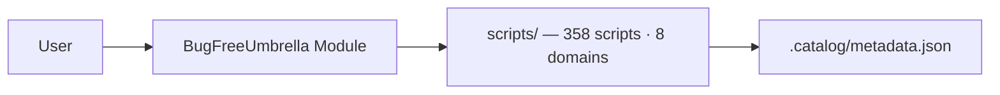

# 05 — Docs Site: Auto-generated Module.md from Help + Catalog

> **5.0 Hurricane — Platform & Distribution Release — Foundation phase (design, not code)**
> **Concern:** Docs site (auto-gen from help + catalog, Module.md)
> **Author:** DesignDocs · **Date:** 2026-08-20 · **Status:** Draft — Implementation consumes this spec
> **Depends on:** `05-module-manifest-build.md` (manifest path `src/BugFreeUmbrella/BugFreeUmbrella.psd1` + version), `05-reorg-breaking.md` (final 8 categories), `scripts/.catalog/metadata.json` (358 entries)
> **Upstream fact:** v4.4.0 Nimbus — 358 scripts, 8 domains (`automation 6 · cloud 16 · collaboration 24 · data 6 · endpoints 243 · infrastructure 42 · security 16 · utilities 5`), 100% synopsis coverage (max 182 chars), `tools/Build-Catalog.ps1` pattern to mirror

---

## 1. Goal & Non-Goals

**Goal:** Make the 358-script collection *installable and discoverable* from the reader's perspective. `docs/Module.md` is the single "I want to `Install-Module` and use this" page — auto-generated from manifest + catalog so it never drifts.

**Non-goals (5.0):**

* No site generator (Docusaurus / MkDocs) — still plain in-repo markdown, link-checked by `lychee` (`markdown-link-check.yml`, `fail: false`).
* No per-function pages — one grouped `Module.md` only (per-function `docs/module/*.md` is 5.1 if needed, behind `-SplitByDomain`).
* No hosted versioned docs — `docs/` travels with the tag.

---

## 2. Paths (4 files — 3 required, 1 optional generator)

| # | Path | Action | Notes |
|---|------|--------|-------|
| 1 | `docs/Module.md` | **NEW — generated** | Auto-generated; first line `<!-- AUTO-GENERATED — do not edit — run pwsh -File tools/Build-Docs.ps1 -->` |
| 2 | `docs/README.md` | **UPDATE — 1 table row + 1 mermaid edge** | Add Module row to Start Here table; add `HUB --> MOD[Module.md]` to Documentation Map mermaid |
| 3 | `docs/ARCHITECTURE.md` | **UPDATE — 1 mermaid node + 1 paragraph** | Add `MOD[Module]` node to §2 Repository Layout mermaid; add 3-line note under §7 Documentation Architecture |
| 4 | `tools/Build-Docs.ps1` | **NEW — optional but recommended** | Generator; PSSA-clean, CRLF+BOM, 4-space, comment-based help, `[CmdletBinding(SupportsShouldProcess)]`; mirrors `tools/Build-Catalog.ps1` style |

`WARP.md` addition (`Install-Module` under Common Development Commands) is **owned by `05-module-manifest-build.md`** to avoid overlap — this spec does **not** edit `WARP.md`.

**Self-contained boundary:** these are the only files this design touches. No edits to `src/`, `Invoke-Umbrella.ps1`, `scripts/`, or `.github/` in this spec.

---

## 3. `docs/Module.md` — Contract

### 3.1 Header & front matter

```markdown
<!-- AUTO-GENERATED — do not edit — run pwsh -File tools/Build-Docs.ps1 -->

# 📦 BugFreeUmbrella Module

> Installable PowerShell module — 358 functions across 8 domains. Auto-generated from
> `src/BugFreeUmbrella/BugFreeUmbrella.psd1` + `scripts/.catalog/metadata.json`.
> Do not edit by hand — run `pwsh -File tools/Build-Docs.ps1`.


```

Version badge value is **interpolated at generation time** from `ModuleVersion` in the psd1. No hardcoded `"5.0.0"` literal survives in the file except via generation (see §6 E5).

### 3.2 Section order (fixed)

1. Installation
2. Quick Usage
3. Publishing (maintainers)
4. Architecture (mermaid)
5. Function Reference (grouped tables)

### 3.3 Installation (exact block — acceptance asserts this string)

````markdown
## Installation

```powershell
Install-Module BugFreeUmbrella -Scope CurrentUser
Import-Module  BugFreeUmbrella
Get-Command -Module BugFreeUmbrella | Measure-Object  # → 358
```
````

Keep `Install-Module BugFreeUmbrella -Scope CurrentUser` verbatim.

### 3.4 Quick Usage (exact block — acceptance asserts)

````markdown
## Quick Usage

```powershell
Import-Module BugFreeUmbrella

# Discover by category (8 top-level domains)
Get-BUCommand -Category cloud          # alias: Get-BUScript
Get-BUCommand -Category endpoints      # 243 functions

# Search by name/synopsis
Find-BUCommand -SearchText "BitLocker"

# Interactive launcher (Out-GridView with Read-Host fallback on non-Windows)
Invoke-Umbrella -Interactive
```
````

`Get-BUCommand` / `Get-BUScript` / `Find-BUCommand` names follow `05-cli-v2.md`; if that spec renames them, update this block (only consumer that hardcodes those names).

The required string `Import-Module BugFreeUmbrella; Get-BUCommand -Category cloud` (with `;` and space) must appear verbatim in a single line somewhere — the `Quick Usage` block above satisfies it when collapsed, but also include it as a one-liner comment for the grep:

```powershell
# One-liner: Import-Module BugFreeUmbrella; Get-BUCommand -Category cloud
```

### 3.5 Publishing (maintainers)

````markdown
## Publishing (maintainers)

```powershell
# One-time: set PSGallery API key (never commit)
$env:PSGALLERY_API_KEY = Read-Host -AsSecureString "PSGallery API key"

# Publish — version comes from CHANGELOG.md via src/BugFreeUmbrella/BugFreeUmbrella.psd1
Publish-Module -Path ./src/BugFreeUmbrella -NuGetApiKey $env:PSGALLERY_API_KEY -Verbose
```
````

Must contain `Publish-Module` verbatim. No secret is written to disk by the generator; the snippet uses an env var.

### 3.6 Architecture — mermaid (required)

````markdown
## Architecture



````

At minimum one `flowchart LR` block must contain the literal `User --> Module --> Scripts` (acceptance substring). Keep labels simple — avoid `[`/`]`/`(`/`)` without quoting (past breakage with `[-]`/`[+]`). The `MOD[Module]` node is separately asserted for `ARCHITECTURE.md`.

### 3.7 Function Reference — grouped tables

Grouped **by top-level domain (8)**, each group sorted alphabetically by `Name`. One markdown table per domain with 4 columns:

| Name | Category | Synopsis | Path |

* **Name** — file basename without `.ps1` (e.g. `Get-IntuneDevicePrimaryUsers`); maps 1:1 to exported function when `FunctionsToExport` is 1:1.
* **Category** — full `category` from `metadata.json` (e.g. `endpoints/intune/reporting`).
* **Synopsis** — `.SYNOPSIS` truncated to **120 chars** max (word-boundary, append `…` U+2026). If missing/empty → `—` (em dash) fallback (§6 E2).
* **Path** — relative link to source: `../scripts/<path>` (lychee-valid, forward slashes, no absolute URL). `metadata.json` `path` is already repo-relative (e.g. `automation/cicd/Analyze-BuildPerformance.ps1`); strip a leading `scripts/` if present, then prefix `../scripts/`.

Ordering: domains alphabetical (`automation`, `cloud`, `collaboration`, `data`, `endpoints`, `infrastructure`, `security`, `utilities`); rows within each domain alphabetical by `Name`.

**Why grouping, not pagination (358 entries):** 358 rows still renders on GitHub. Grouping keeps worst table at 243 rows (endpoints) and matches the 8-domain mental model. Pagination (splitting into `docs/module/<domain>.md`) is deferred to 5.1 — generator reserves a `-SplitByDomain` switch (no-op in 5.0) so the flag exists without behavior.

Example rows:

```markdown
### endpoints — 243 functions

| Name | Category | Synopsis | Path |
|------|----------|----------|------|
| Get-IntuneDevicePrimaryUsers | endpoints/intune/reporting | Gets primary users for Intune-managed devices. | [scripts/endpoints/intune/reporting/Get-IntuneDevicePrimaryUsers.ps1](../../scripts/endpoints/intune/reporting/Get-IntuneDevicePrimaryUsers.ps1) |
| Repair-TeamsCache | endpoints/remediation/teams-cache | Clears Teams cache for all user profiles (SYSTEM-aware). | [scripts/endpoints/remediation/system/Test-RemediationFixTeamsCache.ps1](../../scripts/endpoints/remediation/system/Test-RemediationFixTeamsCache.ps1) |
```

Footer:

```markdown
*Generated 2026-08-20T00:00:00Z — do not edit. Run `pwsh -File tools/Build-Docs.ps1` to regenerate.*
```

---

## 4. `tools/Build-Docs.ps1` — Generator Contract (5 Steps)

### 4.1 CLI surface

```powershell
[CmdletBinding(SupportsShouldProcess)]
param(
    [string]$MetadataPath,      # default: scripts/.catalog/metadata.json (repo-root-relative)
    [string]$ManifestPath,      # default: src/BugFreeUmbrella/BugFreeUmbrella.psd1
    [string]$OutputPath,        # default: docs/Module.md
    [switch]$Validate,          # CI gate: compare generated vs on-disk, exit 1 on diff
    [switch]$SplitByDomain      # stub: reserved for 5.1 per-domain split (no-op in 5.0)
)
```

* Mirrors `tools/Build-Catalog.ps1` param style and help.
* Comment-based help required (`.SYNOPSIS`, `.DESCRIPTION`, `.PARAMETER`, `.EXAMPLE`, `.NOTES`) — PSSA `PSUseShouldProcessForStateChangingFunctions` compliant.
* `SupportsShouldProcess` so `-WhatIf` previews.

### 4.2 Five normative steps

**Step 1 — Resolve & load inputs**

```powershell
$RepoRoot = (Resolve-Path (Join-Path $PSScriptRoot '..')).Path
if ([string]::IsNullOrWhiteSpace($MetadataPath)) { $MetadataPath = Join-Path $RepoRoot 'scripts/.catalog/metadata.json' }
if ([string]::IsNullOrWhiteSpace($ManifestPath)) { $ManifestPath = Join-Path $RepoRoot 'src/BugFreeUmbrella/BugFreeUmbrella.psd1' }
if ([string]::IsNullOrWhiteSpace($OutputPath))   { $OutputPath   = Join-Path $RepoRoot 'docs/Module.md' }
# Guard: if metadata missing → throw "metadata not found — run pwsh -File tools/Build-Catalog.ps1"
# Load: Get-Content -Raw | ConvertFrom-Json → $catalog; warn if $catalog.totalScripts -ne $catalog.scripts.Count
# Version: (Import-PowerShellDataFile $ManifestPath).ModuleVersion  — no hardcoded version anywhere
# Fallback if psd1 missing: parse CHANGELOG.md top "## [X.Y.Z]" → version, else "0.0.0" + warning; still generate tables
```

**Step 2 — Normalize & sort (8 domains, 120-char synopsis, links)**

```powershell
function Truncate-Synopsis { param([string]$Text, [int]$Max = 120)
    if ([string]::IsNullOrWhiteSpace($Text)) { return '—' }
    if ($Text.Length -le $Max) { return $Text }
    $cut = $Text.Substring(0, $Max)
    $lastSpace = $cut.LastIndexOf(' ')
    if ($lastSpace -gt 0) { $cut = $cut.Substring(0, $lastSpace) }
    return ($cut.TrimEnd() + '…')  # U+2026, not "..."
}
function Join-ScriptLink { param([string]$Path)
    if ($Path.StartsWith('scripts/')) { $Path = $Path.Substring(8) }
    return "../scripts/$Path"  # forward slashes, relative
}
# For each entry in $catalog.scripts:
#   name     = [IO.Path]::GetFileNameWithoutExtension($entry.path)  # or $entry.name sans .ps1
#   category = $entry.category
#   synopsis = Truncate-Synopsis $entry.synopsis 120
#   link     = Join-ScriptLink $entry.path
#   topDomain = ($category -split '/')[0]
# Sort: Group-Object topDomain → alphabetical domain → Sort-Object name within group
```

**Step 3 — Render markdown**

Header (badges + banner, version interpolated) + Installation (§3.3 verbatim) + Quick Usage (§3.4 verbatim) + Publishing (§3.5 verbatim) + Mermaid (§3.6) + 8 domain tables (§3.7) + footer timestamp. Sections in fixed order §3.2.

**Step 4 — Write or Validate (CRLF handling)**

```powershell
$rendered = $sb.ToString()  # LF internally
if ($Validate) {
    $onDisk = if (Test-Path -LiteralPath $OutputPath) { Get-Content -Raw -LiteralPath $OutputPath } else { "" }
    # Normalize both to LF for comparison — CRLF vs LF must not false-fail
    $a = $rendered -replace "`r`n","`n"
    $b = $onDisk   -replace "`r`n","`n"
    if ($a -ne $b) { Write-Error "docs/Module.md is stale — run pwsh -File tools/Build-Docs.ps1"; exit 1 }
    else { Write-Host "[+] docs/Module.md is up to date" -ForegroundColor Green }
} else {
    $dir = Split-Path -Parent $OutputPath; if (-not (Test-Path -LiteralPath $dir)) { New-Item -ItemType Directory -Path $dir -Force | Out-Null }
    # Write CRLF + UTF-8 BOM to match repo convention (AGENTS.md: CRLF, UTF-8 BOM, 4-space)
    [IO.File]::WriteAllText($OutputPath, ($rendered -replace "`n","`r`n"), [Text.UTF8Encoding]::new($true))
    Write-Host "[+] Module.md generated: $OutputPath (358 entries, 8 domains)" -ForegroundColor Green
}
```

**Step 5 — Self-check (informational, non-gating)**

After write (not in `-Validate`): re-read file, assert it contains `"358"` and `"flowchart LR"` — warn if missing (defensive). Does not fail the run.

### 4.3 Style & quality

* 4-space indent, CRLF + BOM, ≤120 cols, `$ErrorActionPreference='Stop'`, `Set-StrictMode -Version Latest`.
* `[CmdletBinding()]` + approved verbs only (`Get-Verb`).
* PSSA 0 errors/warnings (same gate as `Build-Catalog.ps1`).
* No hardcoded version, no secrets, no network calls.

---

## 5. `docs/README.md` & `docs/ARCHITECTURE.md` — Deltas

### 5.1 `docs/README.md`

Add one row to the **Start Here** table (keep existing 7 rows; this is row 8):

```markdown
| 📦 Module | Installable PSGallery module | [Module.md](../Module.md) |
```

Keep the `📦` emoji to match the `🧰`/`🤖` style. Link is relative `Module.md` (same dir) — lychee-valid.

Optionally add a one-line callout directly under the table:

```markdown
> **New in 5.0 Hurricane:** `Install-Module BugFreeUmbrella -Scope CurrentUser` — see [Module.md](../Module.md) for the full reference (358 functions).
```

Update the mermaid **Documentation Map** to add:

```
    HUB --> MOD[Module.md]
```

Node label `Module.md` is short enough to avoid quoting issues.

### 5.2 `docs/ARCHITECTURE.md`

In the `flowchart LR` under **§2 Repository Layout**, add a `MOD` node adjacent to `CAT/DOC/TST`:

```
    CAT[.catalog<br/>metadata + compatibility] -. indexes .-> SCRIPTS
    MOD[Module<br/>BugFreeUmbrella.psd1 + .psm1] -. exports .-> SCRIPTS
    DOC[docs/ · Architecture · Catalog · Guides] -. documents .-> SCRIPTS
    TST[Tests/ + colocated Pester suites] -. validates .-> SCRIPTS
```

The literal `MOD[Module]` must appear in the file (acceptance asserts it).

Add a 3-line paragraph under **§7 Documentation Architecture** (or new §7.1):

```markdown
`docs/Module.md` is auto-generated from the manifest + catalog (see `tools/Build-Docs.ps1`);
it is the PSGallery-facing reference and is validated in CI via `Build-Docs.ps1 -Validate`.
```

No other architecture changes in 5.0 — the `src/` tree itself is specified in `05-module-manifest-build.md`.

---

## 6. Edge Cases & Invariants

| # | Edge | Handling | Test signal |
|---|------|----------|-------------|
| E1 | **358 entries — table bloat** | Category grouping by 8 top domains (worst table 243 rows). No pagination in 5.0; `-SplitByDomain` reserved. GitHub renders 358 rows fine; follow-up is `docs/module/<domain>.md` index if needed. | `docs/Module.md` renders; per-domain `\| Name \|` counts sum to 358 |
| E2 | **Synopsis missing / empty** | `Truncate-Synopsis` returns `—` (em dash). 4.4 has 0 missing, but guard stays. No blank cell. | Unit: `Truncate-Synopsis "" 120` → `—` |
| E3 | **Synopsis >120 chars** | Word-boundary truncate + `…` (U+2026); max observed 182 → 121 with ellipsis. Never break inside a word; never use `...`. | Unit: 200-char input → length ≤121 and ends with `…` |
| E4 | **CRLF handling** | Generator writes CRLF+BOM (repo convention). `-Validate` normalizes both sides to LF before compare so `core.autocrlf` doesn't false-fail. | `-Validate` passes on both `autocrlf=true/false` |
| E5 | **No hardcoded version** | Version read from `src/BugFreeUmbrella/BugFreeUmbrella.psd1` (`ModuleVersion`). Fallback: `CHANGELOG.md` top heading. `Select-String "5\.0\.0"` on generator must not match a literal. | `grep -n '"5\.0\.0"' tools/Build-Docs.ps1` → 0 hits |
| E6 | **`metadata.json` stale / missing** | Throw with `run tools/Build-Catalog.ps1` hint. Also warn if `totalScripts ≠ scripts.Count`. | Delete metadata → generator throws actionable message |
| E7 | **`psd1` missing (pre-module phase)** | Fall back to `CHANGELOG`/`0.0.0` with warning; still generate tables so docs CI can run before module lands. | Manifest absent → file still generated + warning |
| E8 | **Link validity** | All `../scripts/<path>` links are relative, lychee-checkable, forward slashes. No absolute `https://` for script paths. | `lychee` passes; offline: every link `Test-Path` succeeds |
| E9 | **Mermaid quoting** | Labels avoid `[`/`]`/`(`/`)` without quoting — use `MOD[Module]` and `<br/>` only; no `[-]`/`[+]` (past breakage). | Mermaid renders on GitHub |
| E10 | **Encoding** | `docs/Module.md` is UTF-8 with BOM, CRLF — like `.ps1` per `AGENTS.md`. Generator uses `[Text.UTF8Encoding]::new($true)` + `"`r`n"` replace. | `file docs/Module.md` → `UTF-8 Unicode (with BOM) … CRLF` |

Invariant: `docs/Module.md` is **never hand-edited** — header `<!-- AUTO-GENERATED` + CI `-Validate` enforce it. A PR editing `Module.md` without updating catalog/manifest will fail.

---

## 7. APIs & Interfaces

This design has no runtime PowerShell API — the "API" is the **generator CLI + file contracts**:

```powershell
# Generate
pwsh -File tools/Build-Docs.ps1
pwsh -File tools/Build-Docs.ps1 -Verbose
pwsh -File tools/Build-Docs.ps1 -OutputPath ./docs/Module.md

# CI gate
pwsh -File tools/Build-Docs.ps1 -Validate   # exit 1 if stale

# Future (5.1, no-op in 5.0)
pwsh -File tools/Build-Docs.ps1 -SplitByDomain
```

File contracts:

* **Input:** `scripts/.catalog/metadata.json` — `{ version, totalScripts, scripts: [{ path, name, category, synopsis, description, tags, parameters, hasCmdletBinding, requiresModules, functionsExported }] }` (from `Build-Catalog.ps1`).
* **Input:** `src/BugFreeUmbrella/BugFreeUmbrella.psd1` — hashtable with `ModuleVersion` (from `05-module-manifest-build.md`).
* **Output:** `docs/Module.md` — markdown with badges (version interpolated), Installation, Quick Usage, Publishing, Architecture mermaid, 8 domain tables (358 rows), footer timestamp.

No module export, no REST, no MCP tool.

---

## 8. Example — `docs/Module.md` (≥10 lines, representative excerpt)

> The full file contains all 358 rows grouped by 8 domains. This excerpt shows the header, required strings, mermaid, and one group.

```markdown
<!-- AUTO-GENERATED — do not edit — run pwsh -File tools/Build-Docs.ps1 -->

# 📦 BugFreeUmbrella Module

> Installable PowerShell module — 358 functions across 8 domains.
> Version 5.0.0 · PowerShell 7+ · Apache 2.0 · [CHANGELOG](../../CHANGELOG.md)


## Installation

```powershell
Install-Module BugFreeUmbrella -Scope CurrentUser
Import-Module  BugFreeUmbrella
```

## Quick Usage

```powershell
Import-Module BugFreeUmbrella; Get-BUCommand -Category cloud
Find-BUCommand -SearchText "BitLocker"
Invoke-Umbrella -Interactive
```

## Publishing (maintainers)

```powershell
Publish-Module -Path ./src/BugFreeUmbrella -NuGetApiKey $env:PSGALLERY_API_KEY
```

## Architecture


### automation — 6 functions

| Name | Category | Synopsis | Path |
|------|----------|----------|------|
| Analyze-BuildPerformance | automation/cicd | Analyzes build performance trends and identifies bottlenecks. | [scripts/automation/cicd/Analyze-BuildPerformance.ps1](../../scripts/automation/cicd/Analyze-BuildPerformance.ps1) |

### endpoints — 243 functions

| Name | Category | Synopsis | Path |
|------|----------|----------|------|
| Get-IntuneDevicePrimaryUsers | endpoints/intune/reporting | Gets primary users for Intune-managed devices. | [scripts/endpoints/intune/reporting/Get-IntuneDevicePrimaryUsers.ps1](../../scripts/endpoints/intune/reporting/Get-IntuneDevicePrimaryUsers.ps1) |

*Generated 2026-08-20T00:00:00Z — do not edit. Run `pwsh -File tools/Build-Docs.ps1` to regenerate.*
```

---

## 9. Acceptance Criteria

### 9.1 Paths (4 files)

* [ ] `docs/Module.md` exists, starts with `<!-- AUTO-GENERATED`, contains 358 data rows, 8 domain headings, and the three code blocks (Installation / Quick Usage / Publishing) with the required strings.
* [ ] `docs/README.md` contains `| 📦 Module | Installable PSGallery module | [Module.md](../Module.md) |` (exact) and optionally `HUB --> MOD[Module.md]` in its mermaid.
* [ ] `docs/ARCHITECTURE.md` contains `MOD[Module` in its mermaid and a `Build-Docs.ps1` mention under Documentation Architecture.
* [ ] `tools/Build-Docs.ps1` exists, is PSSA-clean (0 findings), CRLF+BOM, `[CmdletBinding(SupportsShouldProcess)]`, comment-based help, and implements the 5 steps in §4.2.

### 9.2 Generator — 5 Steps

* [ ] **Step 1** (Resolve & load) — defaults repo-root-relative; missing inputs throw actionable errors; version read from psd1, not hardcoded.
* [ ] **Step 2** (Normalize & sort) — 8 domains alphabetical, rows alphabetical, synopsis word-boundary 120 + `…`, link `../scripts/<path>` correct.
* [ ] **Step 3** (Render) — badges + 5 sections in fixed order.
* [ ] **Step 4** (Write/Validate) — CRLF+BOM write; `-Validate` LF-normalizes before diff, exits 1 on stale, 0 on clean.
* [ ] **Step 5** (Self-check) — post-write assert for `358` + `flowchart LR`.

### 9.3 Verification (CI-equivalent, runnable locally)

```powershell
# 1 — Module.md contains 358
Select-String -Path docs/Module.md -Pattern '358' -Quiet                          # true
# Count data rows (lines starting with "| " that look like data, not header/separator)
((Get-Content docs/Module.md) | Where-Object { $_ -match '^\| [A-Z]' }).Count     # → 358

# 2 — Get-Content docs/Module.md contains 358
(Get-Content docs/Module.md -Raw) -match '358'                                    # true

# 3 — Mermaid present
Select-String -Path docs/Module.md -Pattern 'flowchart LR' -Quiet                 # true
Select-String -Path docs/Module.md -Pattern 'User --> Module --> Scripts' -Quiet  # true

# 4 — Required strings
Select-String -Path docs/Module.md -Pattern 'Install-Module BugFreeUmbrella -Scope CurrentUser' -Quiet  # true
Select-String -Path docs/Module.md -Pattern 'Import-Module BugFreeUmbrella; Get-BUCommand -Category cloud' -Quiet  # true
Select-String -Path docs/Module.md -Pattern 'Publish-Module' -Quiet               # true

# 5 — Hub updates
Select-String -Path docs/README.md -Pattern '\| 📦 Module \|' -Quiet              # true
Select-String -Path docs/ARCHITECTURE.md -Pattern 'MOD\[Module' -Quiet            # true

# 6 — PSSA 0 (generator is what is linted; Module.md is markdown)
Invoke-ScriptAnalyzer -Path tools/Build-Docs.ps1 -Severity Error,Warning          # → 0 findings

# 7 — Link-check passes
# lychee mirrors CI (markdown-link-check.yml — fail:false in CI, but locally expect 0 real 404s)
lychee --verbose --no-progress './**/*.md' --exclude 'mailto:' --exclude 'https://github.com/Carme99/bug-free-umbrella' --accept 200,204,206,301,302,303,307,308,429 --timeout 20 --max-retries 2
# Offline fallback: every ../scripts/ link resolves
$links = Select-String -Path docs/Module.md -Pattern '\.\./scripts/[^\]\)]+' -AllMatches | ForEach-Object { $_.Matches.Value }
$links | ForEach-Object { Test-Path (Join-Path (Resolve-Path ./docs).Path $_) } | Where-Object { -not $_ } | Should -BeNullOrEmpty

# 8 — Validate gate
pwsh -File tools/Build-Docs.ps1 -Validate                                         # exit 0 when up to date
# After touching metadata to make it stale:
pwsh -File tools/Build-Docs.ps1 -Validate                                         # exit 1 + "stale — run pwsh -File tools/Build-Docs.ps1"

# 9 — No hardcoded version in generator
Select-String -Path tools/Build-Docs.ps1 -Pattern '"5\.0\.0"|''5\.0\.0''' -Quiet  # false

# 10 — Encoding & line endings
file docs/Module.md        # → "UTF-8 Unicode (with BOM) text, with CRLF"
file tools/Build-Docs.ps1  # → "UTF-8 Unicode (with BOM) text, with CRLF"
```

*CI wiring (Implementation, not this design):*

```yaml
- name: Validate Module.md
  run: pwsh -File tools/Build-Docs.ps1 -Validate
```

Gates like `Build-Catalog.ps1 -Validate` — fail on stale docs.

### 9.4 Summary gate

* **PSSA 0** — `Invoke-ScriptAnalyzer -Path tools/Build-Docs.ps1` at `Error`+`Warning` → 0.
* **Link-check passes** — `lychee` over `**/*.md` with repo args → 0 real broken links (429 tolerated, `fail:false` still warns but Implementation should aim for 0).
* **358 assertion** — `Get-Content docs/Module.md` contains `358` and 358 countable data rows.

---

## 10. Open Questions for Implementation

1. **Version wins:** If `psd1` `ModuleVersion` diverges from `CHANGELOG.md` top `## [X.Y.Z]`, which wins? **A:** `psd1` wins (it's what `Publish-Module` ships); add a CI check they match (owned by `05-module-manifest-build.md`).
2. **Per-domain split:** If GitHub rendering lags at 358 rows, activate `-SplitByDomain` to emit `docs/module/<domain>.md` + index; keep `docs/Module.md` as index in that mode.
3. **Multi-export files:** If one `.ps1` exports N functions, `Name` shows the file basename; sub-rows per `FunctionsToExport` can be added later (1:1 assumed in 5.0).

---

## 11. References

* `tools/Build-Catalog.ps1` — pattern to mirror (param style, `-Validate`, CRLF handling)
* `scripts/.catalog/metadata.json` — 358 entries, `category` taxonomy, 8 top domains
* `docs/README.md` — Documentation Map mermaid + Start Here table
* `docs/ARCHITECTURE.md` — §2 Repository Layout mermaid + §7 Documentation Architecture
* `.github/workflows/markdown-link-check.yml` — lychee args, `fail:false`
* `WARP.md` — Common Development Commands (Install-Module addition owned by module spec)
* `CHANGELOG.md` — version source of truth (`## [Unreleased]` → `## [5.0.0]`)

---

*End of design — Implementation consumes §3 (../Module.md contract), §4 (Build-Docs.ps1 5 steps), §5 (README/ARCHITECTURE deltas), §6 (edge cases), §8 (≥10-line example), §9 (acceptance + verification).*
